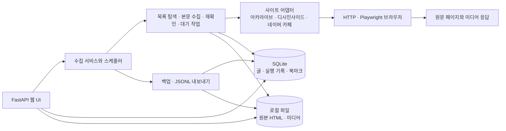
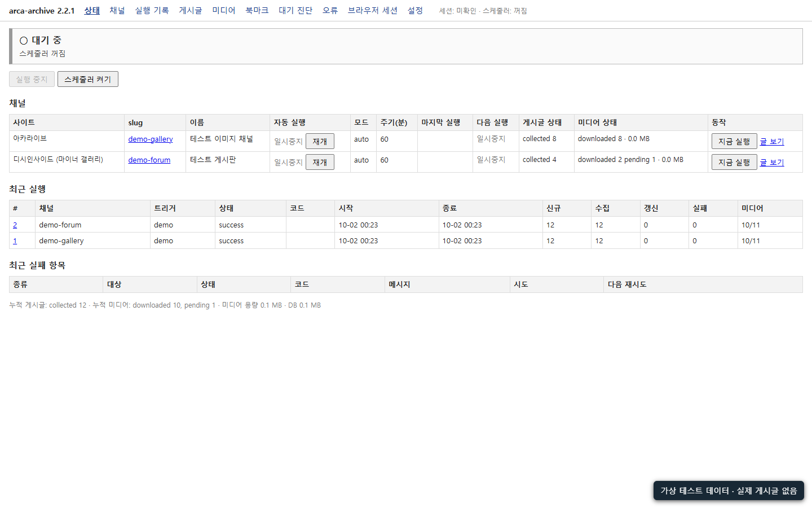
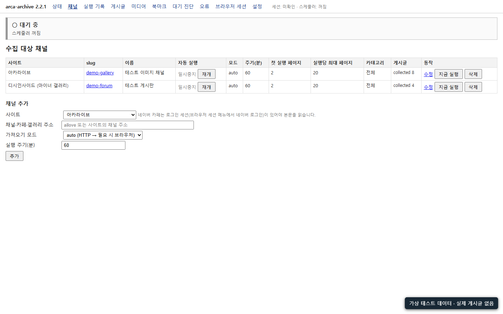
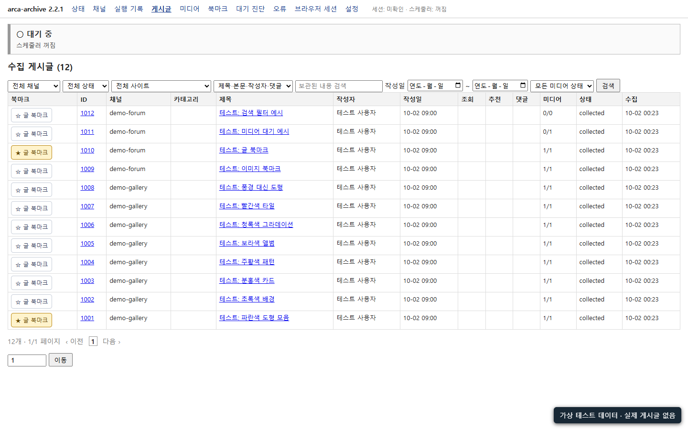
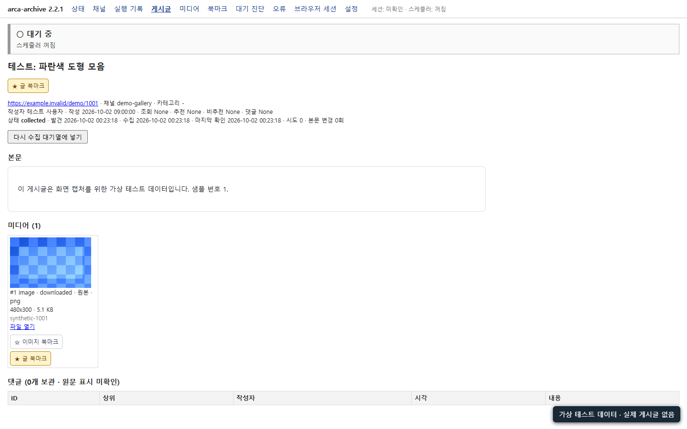
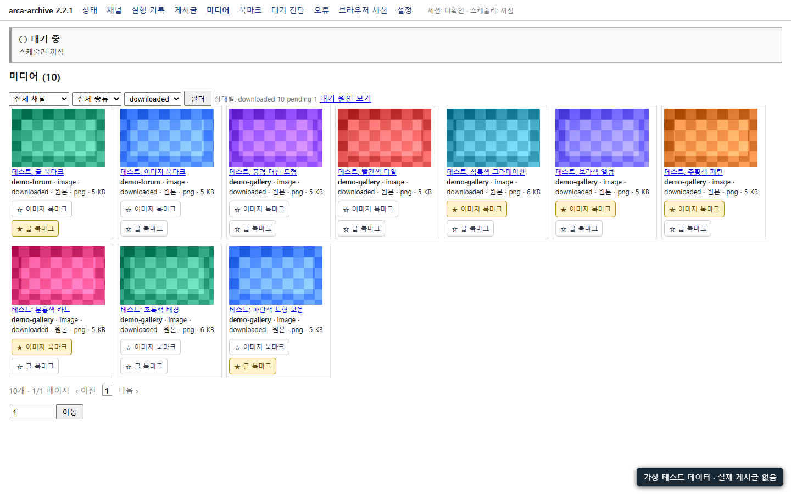
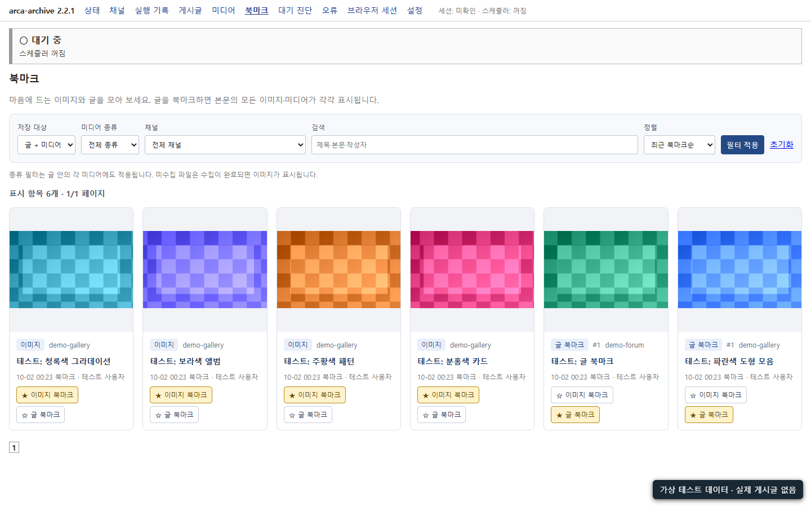
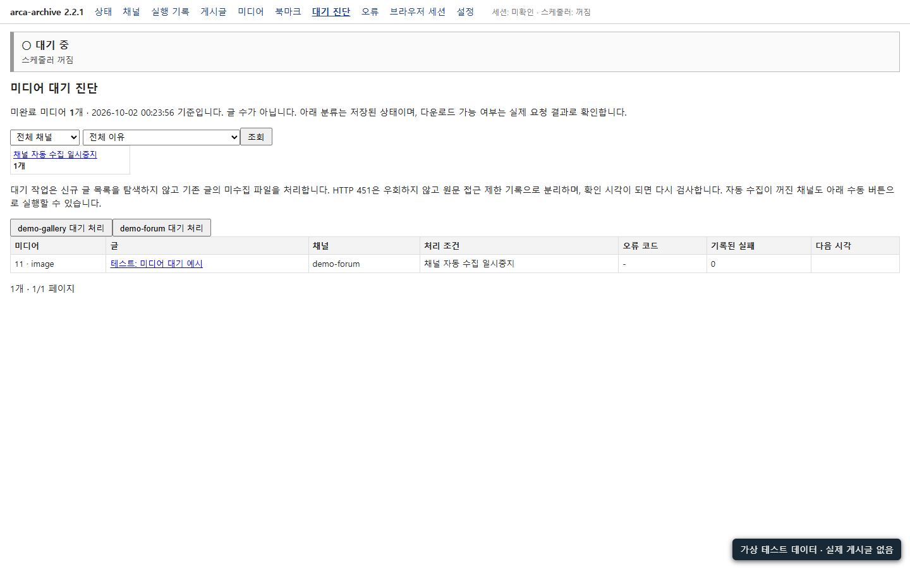
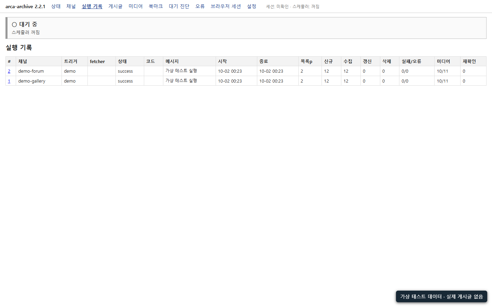

# arca-archive 2.2.1

아카라이브, 디시인사이드 공개 마이너 갤러리, 네이버 카페의 게시글과 미디어를 로컬에 보관하는 Windows용 프로그램입니다. 이 공개본에는 소스와 설치 파일이 들어 있으며 수집한 DB·미디어·로그·로그인 세션은 포함하지 않았습니다.

## 다운로드

- [공유 ZIP](releases/arca-archive-2.2.1-share-20261002.zip)
- [압축 해제된 소스 `arca-archive/`](arca-archive/) — ZIP 내용 그대로(89개 파일). 내려받지 않고 코드를 볼 때 사용하세요.
- [SHA-256 검사값](SHA256SUMS.txt)
- ZIP을 풀고 `install.bat`를 실행한 뒤 `start.bat`로 서버를 시작합니다. Python 3.11 이상과 Chrome이 필요합니다.

## 시스템 구조

접근 제한 응답(HTTP 451)은 별도 상태로 기록합니다. 다운로드 대기는 다운로드 불가 판정이 아니며, 원문 재확인과 재시도 작업에서 처리합니다.

## 실제 실행 화면

2026-10-02 격리된 테스트 인스턴스(2.2.1)에서 촬영했습니다. **가상 게시글 12개와 코드로 만든 도형 이미지**만 사용했습니다. 운영 DB·실제 게시글·원본 미디어는 화면과 ZIP에 포함하지 않았습니다. 화면의 집계는 테스트 데이터의 값입니다.

| 상태 화면 | 채널 관리 |
| --- | --- |
|  |  |
| 게시글 목록 | 게시글 상세 |
|  |  |
| 미디어 | 북마크 |
|  |  |
| 대기 진단 | 실행 기록 |
|  |  |

## 배포 범위

ZIP에는 프로그램 소스, 예제 설정, 일부 설계·릴리스 문서, 가상 데이터 화면 캡처가 포함됩니다. 실제 페이지 HTML이 들어 있는 테스트 fixture와 테스트 코드는 제외했습니다. 개인 설정 파일 `config/settings.json`, `data/`의 DB·원본·미디어·브라우저 프로필, 가상환경, 로그도 제외했습니다. 새 설치는 빈 데이터베이스에서 시작합니다. 네이버 회원 전용 본문은 실제 수집 검증이 완료되지 않았습니다.
