# 자동차 동호회 모니터링 · Version 1.0

네이버 자동차 동호회의 게시글을 자동으로 수집하고, 품질 관련 내용을 AI로 구조화 분석한 뒤 PowerPoint 보고서를 생성하여 Outlook으로 전달하는 **Windows 기반 로컬 모니터링 프로그램**입니다.

이 프로젝트의 목적은 단순한 웹 크롤링이 아닙니다.

**게시글 수집 → 원문 보존 → AI 분석 → 검증 → 보고서 생성 → 메일 전달 → 실행 이력 관리**를 하나의 운영 흐름으로 연결하여, 반복적으로 발생하는 커뮤니티 모니터링 업무를 자동화하는 것이 핵심입니다.

> Version 1.0은 내부 개발 버전 V10을 기준으로 배포한 첫 운영 버전입니다.

---

## 실제 사용 화면

주요 탭·설정·관리 창을 **총 18장**으로 소개합니다. 이미지를 클릭하면 원본 크기로 볼 수 있습니다.

**아래 14장**은 2026년 10월 1일 저장소와 동일한 Version 1.0 배포 소스를 로컬 서버에서 실행하고, 각 탭과 창을 직접 열어 촬영한 기능 화면입니다. 새 DB를 사용했으므로 게시글·실행 이력·통계·PPT는 초기 상태이며, 실제 운영 실적을 나타내지 않습니다. 수집·AI 요청·Office 작업·메일 발송은 실행하지 않았습니다. 운영 화면의 실제 결과는 이어지는 **기존 Windows 캡처 4장**에서 확인할 수 있습니다.

| 기능 영역 | 포함 화면 |
| --- | --- |
| 운영·대상 관리 | 운영 탭, 카페 관리, 키워드 관리 |
| 수집·자동 실행 | 기간 지정, 예약 도움말, 작업 단계 선택, 실행 확인 |
| AI·보고·전달 | OpenAI 설정, PPT 구성, Outlook 발송 범위 |
| 데이터 관리 | DB 관리와 V9 이관, 실행 이력 |
| 누적 데이터 분석 | 분석 탭, 기간 필터, Excel 내보내기 |

### 운영 탭 · Version 1.0

대상 카페·검색 키워드·실행 설정을 왼쪽에서 관리하고, 오른쪽에서 실행 상태·처리 단계·PPT 미리보기·게시글 검토 영역을 확인합니다.


### 카페 관리 창

카페 이름·구분명·메인 주소로 대상을 추가하고, 등록 카페의 표시 이름을 수정하거나 수집을 중단합니다. 과거 수집 데이터는 유지합니다.


### 키워드 관리 창

검색 키워드를 추가·검색하고, 등록된 키워드의 사용 여부를 관리합니다. 검색 중단 후에도 기존 게시글과 실행 이력의 기록은 보존합니다.


### 수집 기간 지정

최근 24·48시간 또는 이전 실행 이후 방식과 별도로 시작·종료 시각을 직접 지정할 수 있습니다. 오른쪽에는 현재 설정에 따른 수집 범위를 표시합니다.


### 예약 실행과 도움말

예약 사용 여부, 한국 시간 기준 실행 시각, 주말 제외를 설정합니다. 도움말에서 서버 실행 창과 PC가 켜져 있어야 예약이 동작한다는 조건을 확인할 수 있습니다.


### AI 공급자 · OpenAI API 설정

Codex 또는 OpenAI API 방식을 선택합니다. 이 화면은 OpenAI API 입력란을 표시한 상태이며, 키는 입력하지 않았습니다.


### PPT 구성과 Outlook 발송 옵션

캡처 이미지 PPI, 카페별 요약 슬라이드, 원문 본문 노트 저장을 설정합니다. 메일은 전체 보고서 또는 요약 슬라이드만 첨부하도록 선택할 수 있으며, 화면의 주소는 빈 입력란에 표시되는 예시 문구입니다.


### DB 관리 · 기존 자료 이관

게시글·원문 버전·실행 건수를 확인하고, 기존 V9 자료 이관·DB 백업·Outlook 발신 계정 확인 기능에 접근합니다. 초기 DB이므로 표시 건수는 모두 0입니다.


### 실행 이력 탭

실행 ID·유형 검색과 달력으로 과거 실행을 찾는 화면입니다. 실행을 선택하면 당시 설정과 결과를 확인할 수 있습니다. 이 캡처는 실행 기록이 없는 초기 상태입니다.


### 데이터 분석 탭

카페별 수집 게시글 수, 키워드별 매칭 수, 기간별 추이, 수집 데이터 목록과 게시글 상세 영역을 함께 제공합니다. 초기 DB의 화면이므로 집계는 0건입니다.


### 분석 조회 조건 · 기간 직접 지정

기간·카페·키워드 조건을 지정한 뒤 조회에 적용합니다. 달력 및 일별·주별·월별 추이 제어도 함께 배치되어 있습니다.


### Excel 내보내기 메뉴

현재 조회 조건에 맞춘 전체 데이터와 집계를 함께 내보내거나, 게시글 수 등 집계값만 내보내는 방식을 선택합니다. 캡처에서는 메뉴만 열었습니다.


### 전체 실행 확인 창

전체 실행 전 확인 창을 표시합니다. 선택한 작업과 발송 범위를 확인한 뒤 실행할 수 있으며, 이 캡처에서는 취소하여 실제 작업을 시작하지 않았습니다.


### 처리 단계 선택과 원문·분석 검토 영역

웹 수집·AI 분석·PPT 생성 단계를 선택하는 설정입니다. 오른쪽 아래에는 수집된 게시글의 원문과 AI 분석을 검토하는 영역이 배치되어 있으며, 초기 상태에서는 선택할 게시글이 없습니다.


---

### 기존 Windows 운영·검증 캡처

아래 이미지는 2026년 9월 30일 Windows 환경에서 프로그램을 실제 사용하며 캡처한 화면입니다. 내부 개발 명칭인 **V10**이 표시되어 있으며, 배포용 **Version 1.0**의 개발·검증 과정에서 촬영했습니다. 화면의 예약 시각, 키워드 및 실행 옵션은 당시 테스트 설정입니다.

#### 운영 화면 · 다크 모드

카페와 검색 키워드를 선택하고, 수집 범위·병렬 수·예약·AI·PPT·메일 옵션을 한 화면에서 설정합니다. 오른쪽에서는 실행 상태와 처리 단계를 확인할 수 있습니다.

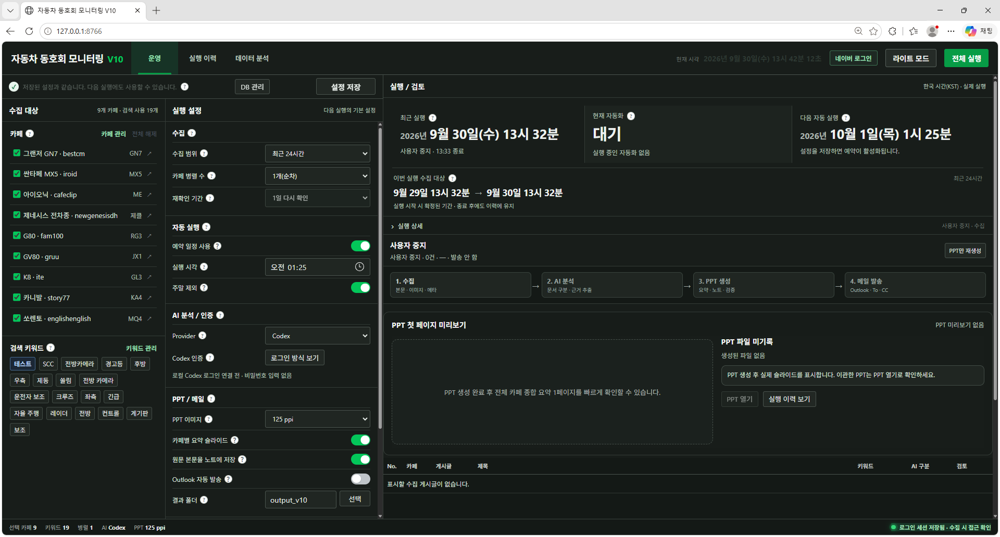

#### 운영 화면 · 라이트 모드

동일한 운영 화면을 밝은 테마로 볼 수 있습니다. 수집 결과 목록과 게시글 원문·AI 분석 영역, 실시간 로그 영역이 함께 배치되어 있습니다. 이 캡처는 첫 실행 전 화면입니다.

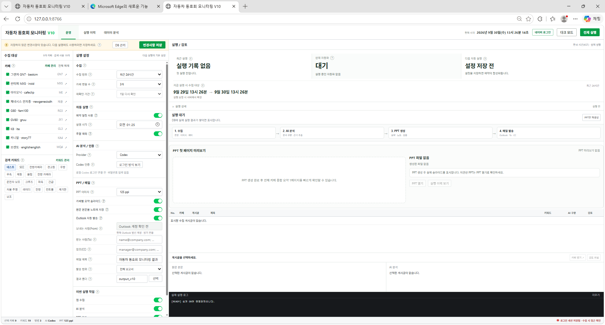

#### 실제 수집 완료와 실행 로그

9개 카페에서 총 14건을 수집한 실행의 완료 화면입니다. 카페별 수집 로그와 완료 상태를 확인할 수 있습니다. 당시에는 웹 수집만 선택했으므로 AI 분석·PPT 생성·메일 발송은 수행하지 않았습니다.


#### Codex 인증 안내

AI 분석 설정에서 Codex 로그인 방식 안내를 확인하는 화면입니다. 이 캡처의 안내 문구는 촬영 당시 개발 빌드 기준이며, 최신 로그인 방법은 아래 설치·실행 안내 및 프로그램의 인증 버튼을 확인해 주세요.

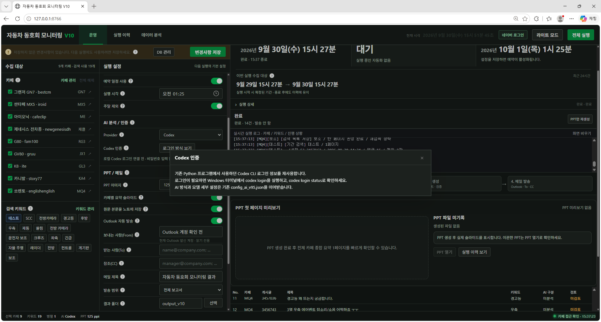

---

## 1. 프로그램이 하는 일

전체 흐름은 다음과 같습니다.

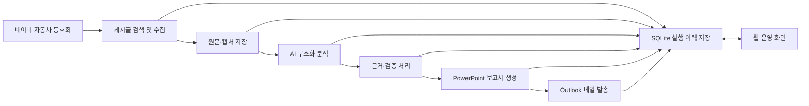

사용자는 웹 화면에서 대상 카페, 검색 키워드, 수집 기간, 병렬 처리 수, AI 분석 여부, PPT 생성 여부, 메일 발송 여부 등을 설정합니다.

실행이 시작되면 프로그램은 설정값을 하나의 실행 단위로 고정하고, 별도 Worker 프로세스가 실제 수집·분석·보고 작업을 수행합니다.

---

## 2. 전체 시스템 아키텍처

Version 1.0은 단일 Python 스크립트가 아니라 여러 계층으로 구성되어 있습니다.

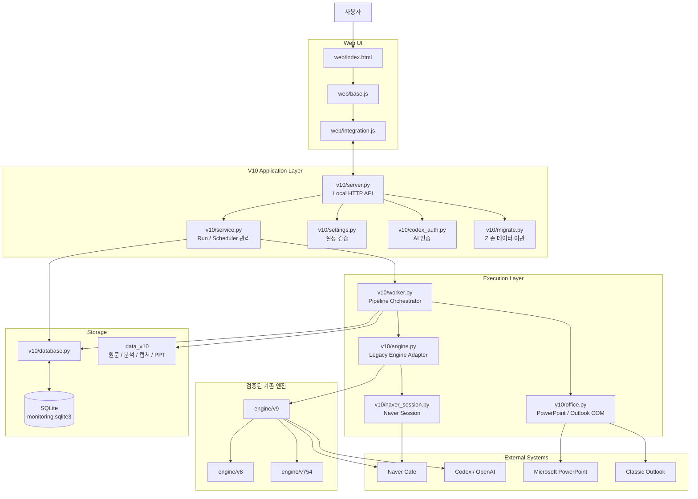

### 구조의 핵심

V10은 기존 V9 계열 코드를 전부 새로 작성한 엔진이 아닙니다.

기존 버전에서 검증해 온 수집·AI 분석·PPT 처리 기능을 재사용하고, 그 위에 다음 기능을 추가한 **Application Layer**입니다.

- 웹 운영 화면
- SQLite 영속 저장
- 실행 이력
- 설정 Snapshot
- 예약 실행
- 네이버 로그인 상태 관리
- AI 로그인 관리
- Worker 프로세스
- 데이터 이관
- PPT 재생성
- 산출물 관리

즉 기존 엔진을 버리는 대신, 검증된 기능을 운영 가능한 프로그램 구조 안에 넣는 방식으로 발전했습니다.

---

## 3. 실행 과정

사용자가 웹 화면에서 **전체 실행**을 누르면 내부에서는 다음 순서로 동작합니다.

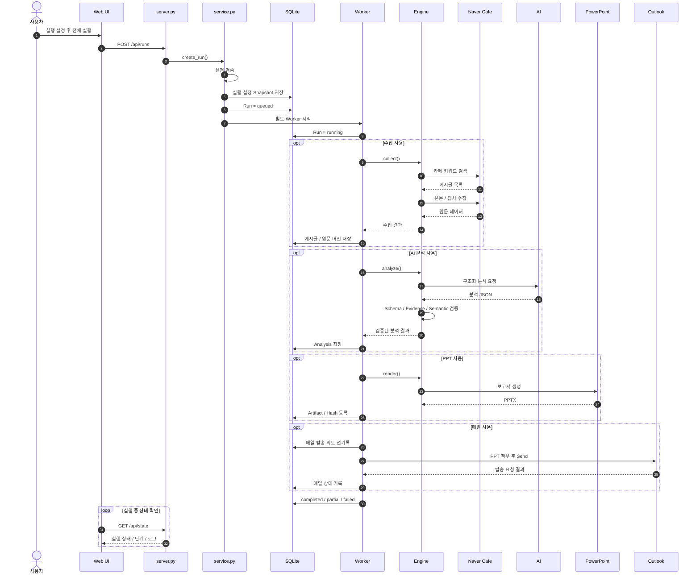

웹 서버 자체와 실제 작업 Worker가 분리되어 있기 때문에 수집·AI 분석·PPT 생성이 오래 걸려도 실행 관리와 UI 상태 조회를 별도로 유지할 수 있습니다.

---

## 4. 수집 구조

수집 대상은 설정된 네이버 자동차 동호회와 검색 키워드입니다.

수집 과정에서는 카페 단위 병렬 처리와 네이버 요청 제어를 동시에 사용합니다.

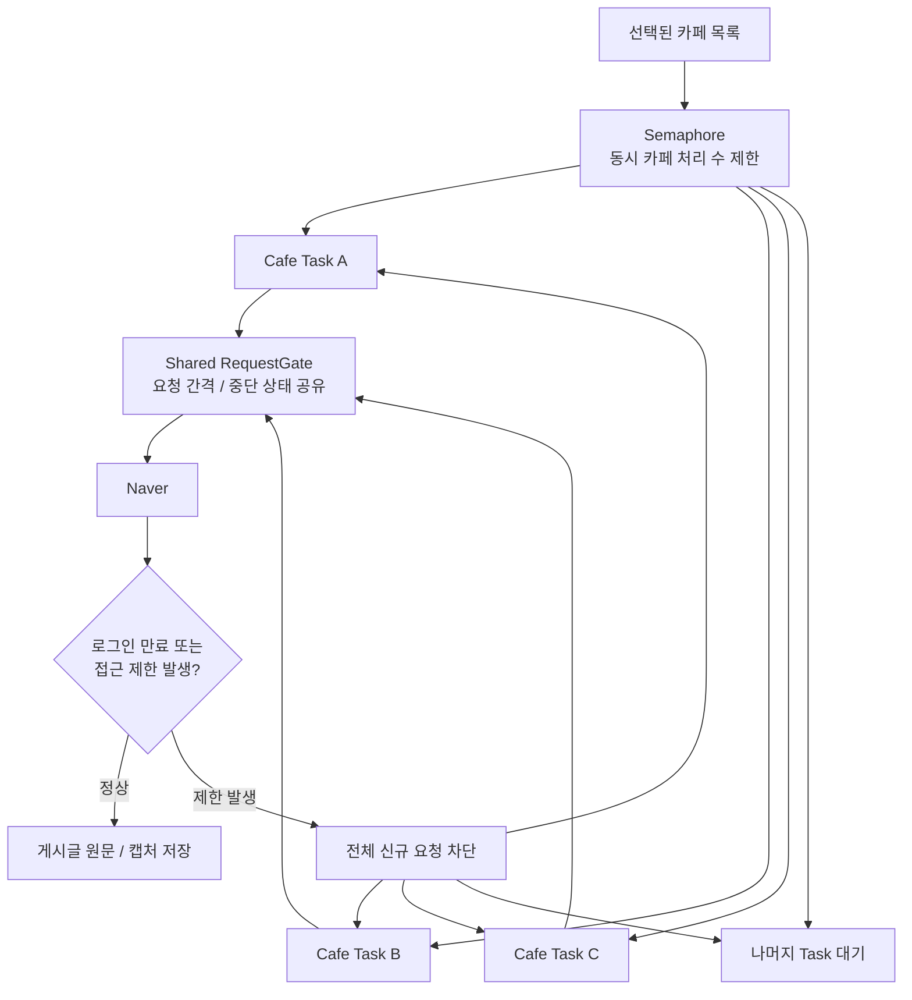

병렬 처리 수를 늘리더라도 실제 네이버 요청을 제한 없이 동시에 보내는 방식이 아닙니다.

공유 RequestGate가 요청 간격과 접근 제한 상태를 관리하기 때문에 한 Task에서 로그인 만료나 접근 제한을 감지하면 다른 수집 Task에도 중단 상태를 공유합니다.

---

## 5. 증분 수집과 중복 제거

매 실행마다 모든 과거 글을 다시 긁는 것이 아니라, 카페별 마지막 정상 수집 지점을 기준으로 다음 검색 범위를 계산합니다.

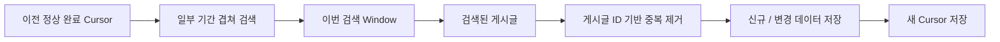

일부 기간을 겹쳐 검색하는 이유는 실행 시각 경계에서 게시글을 놓치는 가능성을 줄이기 위해서입니다.

중복된 게시글은 DB에서 동일 게시글로 관리하고, 본문 내용이 달라졌을 때만 새로운 원문 버전을 생성합니다.

---

## 6. 게시글과 원문 버전 관리

Version 1.0에서는 게시글 자체와 게시글의 본문 버전을 분리합니다.

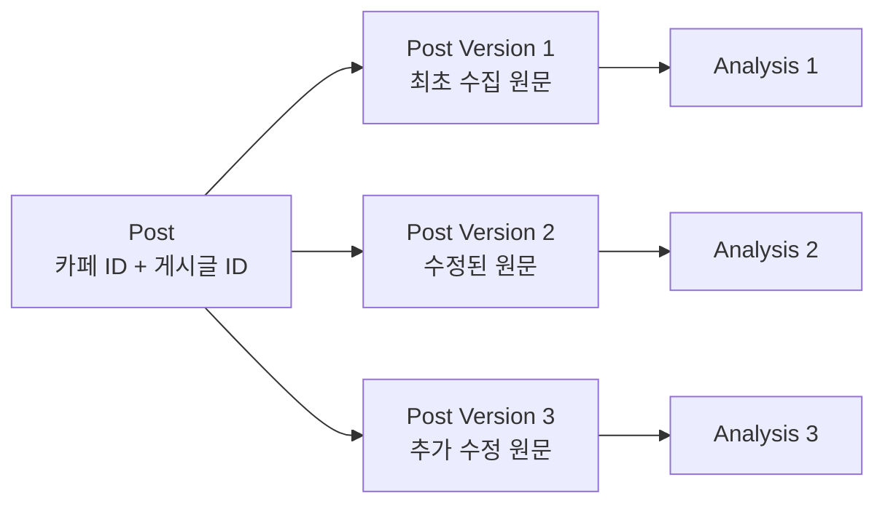

같은 게시글이라도 작성자가 내용을 수정하면 Fingerprint가 달라지고 새로운 `post_version`으로 저장됩니다.

이 구조를 사용하면 다음 질문에 답할 수 있습니다.

> 특정 AI 분석은 정확히 어떤 시점의 어떤 원문을 기준으로 생성되었는가?

따라서 단순 최신 데이터 저장보다 추적성과 재현성이 높습니다.

---

## 7. 데이터 모델

주요 DB 관계는 다음과 같습니다.

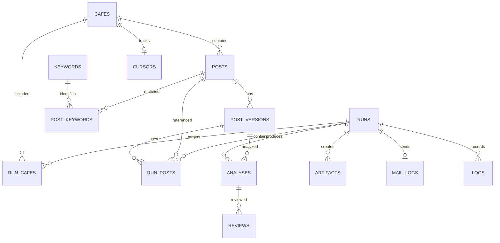

핵심 개념은 다음과 같습니다.

| 데이터 | 역할 |
| --- | --- |
| `posts` | 네이버 게시글 자체 |
| `post_versions` | 본문 변경 이력 |
| `keywords` / `post_keywords` | 어떤 키워드로 발견됐는지 |
| `runs` | 한 번의 프로그램 실행 |
| `run_posts` | 해당 실행에서 사용된 게시글 |
| `analyses` | AI 구조화 분석 |
| `reviews` | 사람 검토 상태 |
| `artifacts` | PPT·미리보기 등 산출물 |
| `mail_logs` | Outlook 발송 상태 |
| `cursors` | 증분 수집 기준점 |
| `logs` | 실행 로그 |

---

## 8. AI 분석 구조

AI는 원문을 단순 요약하는 역할만 하지 않습니다.

게시글에서 품질 관련 정보를 구조화하여 추출하고, 결과에 원문 근거를 연결하며, 프로그램 내부 검증을 추가로 수행합니다.

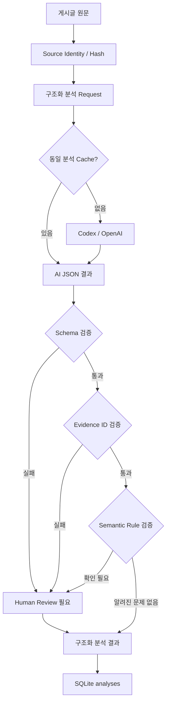

검증 단계는 크게 다음을 구분합니다.

- JSON / 필수 필드 구조가 올바른지
- Evidence ID가 실제 입력 근거와 연결되는지
- 내부 Semantic Rule에서 의심되는 결과가 있는지
- 사람의 의미 검토가 아직 필요한지

즉 Schema 검증 통과와 실제 의미의 정확성을 동일한 개념으로 취급하지 않습니다.

---

## 9. PPT 보고 구조

AI 분석 결과만 보여주는 것이 아니라 실제 게시글을 사람이 다시 확인할 수 있도록 보고서를 구성합니다.

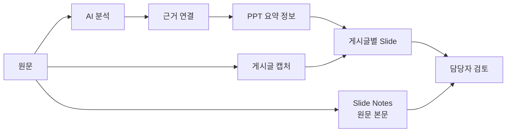

각 게시글 슬라이드는 분석 결과와 캡처를 제공하고, 슬라이드 노트에는 수집 당시의 원문 본문을 보존합니다.

따라서 담당자는 AI 요약만 보는 것이 아니라 필요할 경우 보고서 안에서 원문까지 다시 확인할 수 있습니다.

---

## 10. 실행 상태 관리

실행은 단순 성공/실패 두 상태가 아니라 여러 단계와 종료 상태를 가집니다.

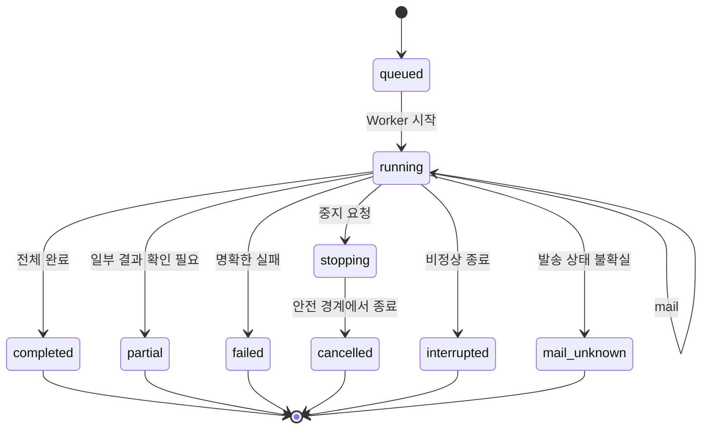

특히 Outlook 자동 발송에서는 중복메일을 방지하기 위해 발송 의도를 먼저 DB에 저장한 후 `Send()`를 호출합니다.

프로그램이 발송 직후 비정상 종료되어 실제 발송 여부가 불명확한 경우 자동 재발송하지 않고 `mail_unknown` 상태로 남겨 사람이 확인하도록 설계되어 있습니다.

---

## 11. 네이버 로그인

네이버 세션은 일반 JSON 파일에 그대로 저장하지 않습니다.

Windows 환경에서는 네이버 로그인 쿠키를 추출한 뒤 Windows DPAPI를 이용해 현재 Windows 사용자 계정에 종속된 형태로 저장합니다.

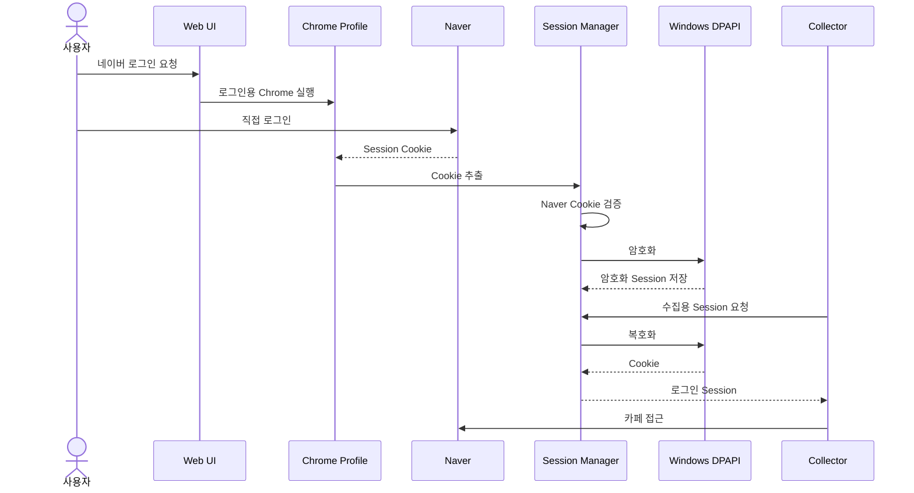

실제 쿠키 값을 SQLite 실행 이력이나 일반 로그에 직접 저장하지 않는 것이 기본 구조입니다.

---

## 12. 예약 실행

예약 실행은 프로그램 서버 내부 Scheduler가 관리합니다.

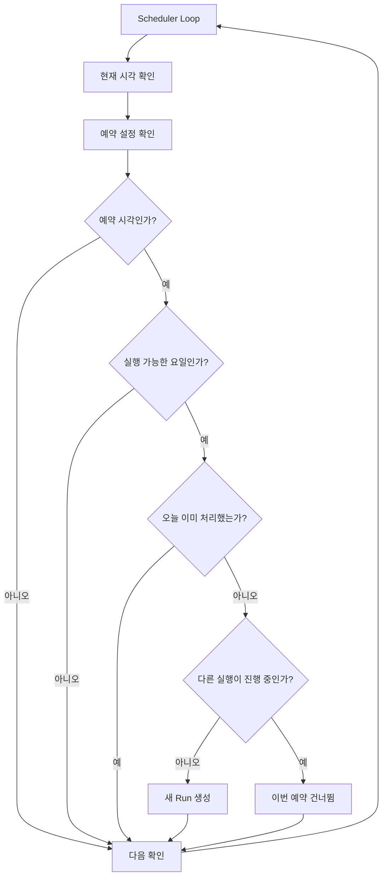

예약 실행을 사용하려면 프로그램 서버와 PC가 실행 중이어야 합니다.

서버가 예약 시각 이후에 실행되었다고 해서 과거 예약을 자동으로 소급 실행하지 않습니다.

---

## 13. PPT만 다시 생성하기

이미 수집과 AI 분석이 끝난 실행은 저장된 데이터를 이용해 PPT만 다시 만들 수 있습니다.

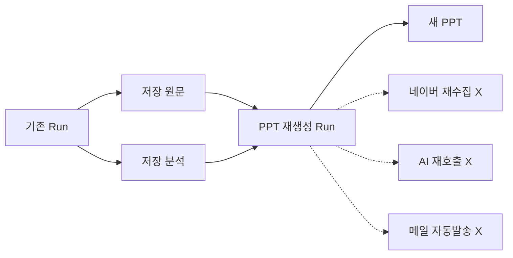

PPT 레이아웃이나 출력 결과만 다시 확인할 때 웹 수집과 AI 비용을 반복해서 발생시키지 않기 위한 기능입니다.

---

## 14. 주요 기술

| 영역 | 기술 |
| --- | --- |
| 언어 | Python, JavaScript, HTML/CSS |
| 웹 수집 | Playwright + Chrome |
| AI | Codex CLI / OpenAI API |
| 데이터베이스 | SQLite |
| 웹 UI | 로컬 HTML / JavaScript |
| API | Python Local HTTP Server |
| 병렬 처리 | asyncio / Semaphore / Thread Pool |
| PPT | Microsoft PowerPoint COM |
| 메일 | Classic Outlook COM |
| 이미지 처리 | Pillow |
| 인증 정보 보호 | Windows DPAPI |
| 데이터 무결성 | SHA-256 / Content Fingerprint |
| 운영 제어 | Worker Process / File Lock / Scheduler |

---

## 15. 주요 설계 패턴

### Incremental Crawling

마지막 정상 완료 지점부터 다음 범위를 계산하여 수집합니다.

### Idempotency

같은 요청 ID로 실행 요청이 반복되더라도 동일 Run을 재사용하여 중복 실행을 방지합니다.

### Content Fingerprinting

게시글 ID가 같아도 본문이 변경되면 새로운 원문 버전으로 저장합니다.

### Optimistic Concurrency

두 브라우저에서 동시에 설정을 수정했을 때 오래된 설정이 최신 설정을 덮어쓰는 것을 방지합니다.

### Bounded Concurrency

수집과 AI 처리의 동시 실행 개수를 제한합니다.

### Evidence-grounded AI

AI 결과를 원문 Evidence와 연결하여 저장합니다.

### Hash-verified Artifact

PPT 등 생성 산출물에 SHA-256을 기록하여 이후 변경 여부를 확인할 수 있습니다.

### Mail Send Intent Logging

Outlook 발송 전에 발송 의도를 DB에 먼저 Commit하여 비정상 종료 후 중복발송 위험을 줄입니다.

---

## 16. 디렉터리 구조

```text
20261001_cafe_monitoring_v1.0/
├─ README.md
├─ cafe_monitoring/
│  ├─ 00_README_KO.md
│  ├─ 00_실행순서.png
│  ├─ 01_setup_v10.bat
│  ├─ 02_start_v10.bat
│  ├─ 03_verify_v10.bat
│  ├─ requirements.txt
│  ├─ package_manifest.json
│  │
│  ├─ v10/
│  │  ├─ __main__.py
│  │  ├─ server.py
│  │  ├─ service.py
│  │  ├─ worker.py
│  │  ├─ database.py
│  │  ├─ schema.sql
│  │  ├─ settings.py
│  │  ├─ engine.py
│  │  ├─ naver_session.py
│  │  ├─ codex_auth.py
│  │  ├─ office.py
│  │  └─ migrate.py
│  │
│  ├─ web/
│  │  ├─ index.html
│  │  ├─ base.js
│  │  └─ integration.js
│  │
│  ├─ engine/
│  │  ├─ v5/
│  │  ├─ v6/
│  │  ├─ v7/
│  │  ├─ v754/
│  │  ├─ v8/
│  │  └─ v9/
│  │
│  ├─ tests/
│  └─ docs/
│
├─ docs/
└─ releases/
```

`v10/`은 현재 운영 Application Layer이며, `engine/`에는 이전 버전에서 발전해 온 검증된 엔진 코드가 포함되어 있습니다.

---

## 17. 설치 및 실행

### 요구 환경

기본 운영 환경은 Windows입니다.

필요한 구성은 다음과 같습니다.

- Python 3.11 이상
- Chrome
- 네이버 계정 및 대상 카페 접근 권한
- AI 분석 사용 시 Codex CLI 또는 OpenAI API 환경
- PPT 생성 시 데스크톱 Microsoft PowerPoint
- 메일 발송 시 Classic Outlook

### 최초 설치

`cafe_monitoring` 폴더에서:

```text
01_setup_v10.bat
```

을 실행합니다.

이 과정에서 Python 가상환경과 필요한 패키지를 설치하고 기본 검증을 수행합니다.

### 프로그램 실행

설치 이후에는:

```text
02_start_v10.bat
```

를 실행합니다.

브라우저에서 로컬 운영 화면이 열리면 다음 순서로 사용합니다.

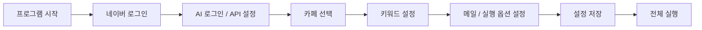

검증만 별도로 수행하려면:

```text
03_verify_v10.bat
```

을 사용할 수 있습니다.

---

## 18. 운영 데이터

프로그램 실행 후 생성되는 운영 데이터는 주로 `data_v10/` 아래에 저장됩니다.

이 데이터에는 다음 정보가 포함될 수 있습니다.

- SQLite DB
- 네이버 로그인 Session
- 실행 로그
- 수집 원문
- 게시글 캡처
- AI 분석 결과
- PowerPoint 결과물
- PPT 미리보기

프로그램을 다른 위치로 이동하거나 업데이트할 때는 코드뿐 아니라 운영 데이터의 보존 여부도 함께 확인해야 합니다.

---

## 19. Version 1.0의 의미

이 프로젝트는 처음부터 현재 구조로 시작한 것이 아닙니다.

```mermaid
flowchart LR
    V1["V1<br/>게시글 1개 수집"]
    V2["V2<br/>키워드 검색"]
    V3["V3<br/>N개 / 페이지 처리"]
    V4["V4<br/>다중 키워드 / 중복 제거"]
    V5["V5<br/>증분 수집 / 예약 / 복구"]
    V6["V6<br/>AI 구조화 분석"]
    V7["V7<br/>PPT 자동화"]
    V8["V8<br/>운영 안정화"]
    V9["V9<br/>병렬화 / 성능 / 보고 자동화"]
    V96["V9.5~V9.6<br/>원문 노트 / 용량 / 리팩터링"]
    V10["V10 = Version 1.0<br/>운영 Application"]

    V1 --> V2 --> V3 --> V4 --> V5 --> V6 --> V7 --> V8 --> V9 --> V96 --> V10
```

초기 버전의 중심 문제가 **“게시글을 어떻게 안정적으로 가져올 것인가”**였다면, Version 1.0에서는 다음 문제가 중심이 되었습니다.

- 실행을 어떻게 재현할 것인가
- 원문과 AI 분석을 어떻게 연결할 것인가
- 데이터를 어떻게 누적하고 추적할 것인가
- 사람이 어떻게 검토할 것인가
- 보고서를 어떻게 자동 생성할 것인가
- 중복 실행과 중복 메일을 어떻게 방지할 것인가
- 기존 결과를 어떻게 재사용할 것인가
- 장기 운영 시 프로그램 상태를 어떻게 관리할 것인가

따라서 Version 1.0은 단순 크롤러의 완성 버전이라기보다, **장기 운영 가능한 모니터링 소프트웨어의 기준점**에 해당합니다.

---

## 20. 검증

Version 1.0 배포 소스에는 Python 및 JavaScript 테스트가 포함되어 있습니다.

현재 코드 리뷰 시 확인한 범위:

- V10 Python 테스트: **75개 중 74 PASS**
- Windows DPAPI 전용 테스트: **1 SKIP**
- 기존 V9 회귀 테스트: **54 / 54 PASS**
- JavaScript API/UI 계약 테스트: **49 / 49 PASS**

Windows 전용 기능인 PowerPoint COM, Outlook COM, Chrome 로그인 및 DPAPI 실동작은 실제 Windows 운영 환경에서 별도 확인이 필요합니다.

---

## 21. 참고 문서

- [프로그램 폴더](cafe_monitoring/)
- [상세 사용 안내](cafe_monitoring/00_README_KO.md)
- [실행 순서 이미지](cafe_monitoring/00_실행순서.png)
- [프로그램 내부 문서](cafe_monitoring/docs/)
- [결과보고서](docs/)
- [배포 파일](releases/)

---

## 22. 요약

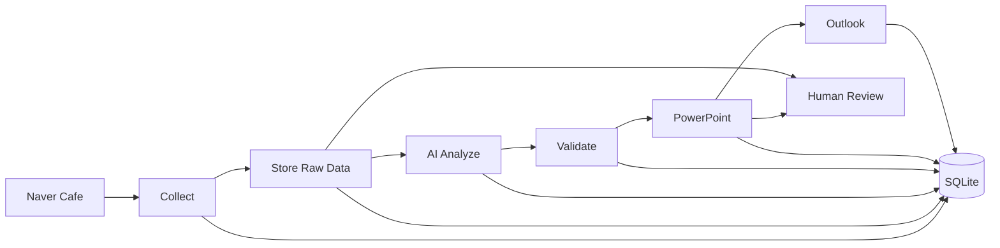

**자동화의 목적은 사람이 보지 않아도 되게 만드는 것이 아니라, 사람이 확인해야 할 정보를 더 빠르게 수집·정리·추적할 수 있게 만드는 것입니다.**

Version 1.0은 이 전체 흐름을 하나의 웹 기반 로컬 운영 프로그램으로 통합한 첫 기준 버전입니다.
