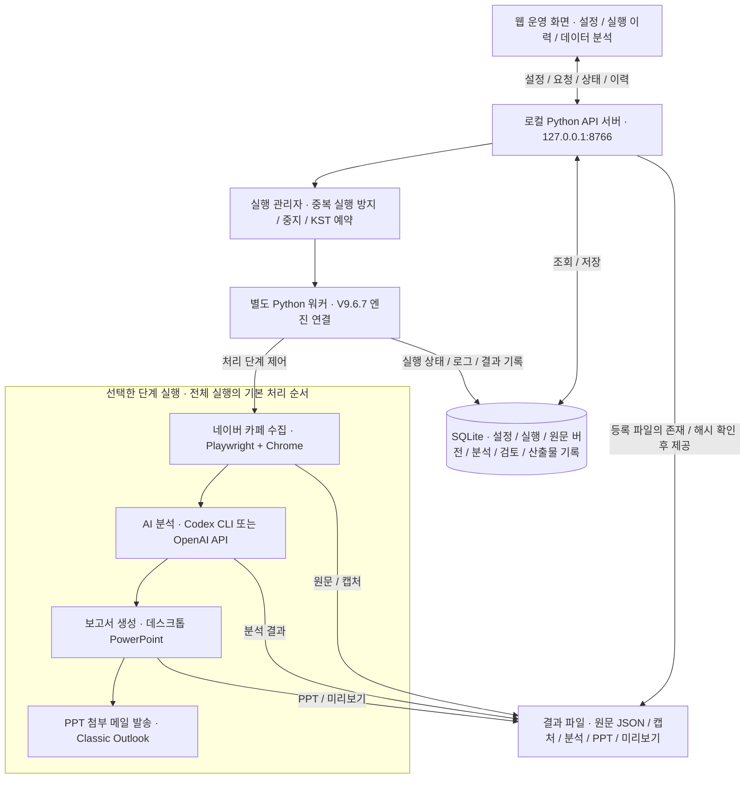

# 자동차 동호회 모니터링 · Version 1.0

네이버 자동차 동호회 게시글의 **수집 → AI 분석 → PowerPoint 보고서 생성 → Outlook 메일 발송**을 웹 운영 화면과 SQLite 실행 이력으로 관리하는 Windows용 프로그램입니다.

| 항목 | 내용 |
| --- | --- |
| 배포 버전 | **1.0** |
| 내부 개발 버전 | V10 / 10.0.0 |
| 원본 배포일 | 2026-09-30 |
| 저장소 등록일 | 2026-10-01 |
| 프로그램 폴더 | [`cafe_monitoring/`](cafe_monitoring/) |
| 원본 배포 ZIP | [`cafe_monitoring_1.0_20260930.zip`](releases/cafe_monitoring_1.0_20260930.zip) |
| 결과보고서 | [자동차동호회 모니터링 V10 결과보고서](docs/자동차동호회_모니터링_V10_결과보고서.docx) |

## 주요 기능

- 카페·키워드·수집 기간·병렬 처리·AI·PPT·메일 설정과 실행·중지·예약 관리
- Playwright와 Chrome을 이용한 네이버 카페 게시글 수집
- Codex CLI 또는 OpenAI API를 이용한 분석
- 게시글 원문 버전, 분석·검토, 실행 당시 설정과 산출물의 SQLite 저장
- 실행 이력 조회, 저장된 자료로 PPT 재생성, 데이터 조회·통계·Excel 내보내기
- PowerPoint 보고서와 미리보기 생성, Classic Outlook을 통한 메일 발송

## 시스템 구조

웹 운영 화면은 로컬 Python API 서버를 통해 설정과 실행 이력을 조회합니다. 실행 관리자는 별도 워커 프로세스를 실행하며, 워커가 기존 엔진을 연결해 수집·분석·PPT·메일 처리를 수행합니다.

수집·AI·PPT·메일 단계는 실행 설정에 따라 선택합니다. **PPT만 재생성**하는 경우에는 저장된 실행의 원문·분석을 재사용하며, 새 수집·AI 분석·메일 발송은 수행하지 않습니다. 실제 수집과 Office 연동은 Windows PC에서 실행합니다.

## 실행 방법

Windows에서 Python 3.11 이상(`py` 실행기 포함)과 Chrome을 준비합니다. Codex 분석에는 Codex CLI와 본인 ChatGPT 로그인이, PPT 생성에는 데스크톱 PowerPoint가, 메일 발송에는 Classic Outlook과 계정 설정이 필요합니다. 네이버 대상 카페 접근 권한도 필요합니다.

1. `cafe_monitoring/01_setup_v10.bat`로 의존성을 설치하고 오프라인 검사를 실행합니다.
2. `cafe_monitoring/02_start_v10.bat`로 프로그램을 시작합니다.
3. 열린 브라우저 화면에서 네이버·AI 로그인을 연결하고 카페·키워드·수신자를 설정합니다.
4. 설정을 저장하고 실행합니다. 메일이 필요 없으면 Outlook 발송을 끕니다.

실행 및 예약 중에는 서버 콘솔과 PC를 켜 둡니다. 프로그램은 `data_v10/`에 운영 DB·로그인 프로필·결과 파일을 생성합니다. 업데이트 시 이 폴더를 보존해야 하며, DB 백업과 별도로 PPT·캡처 결과 파일도 보관해야 합니다.

자세한 사용 방법은 [원본 사용 안내](cafe_monitoring/00_README_KO.md), [실행 순서 이미지](cafe_monitoring/00_실행순서.png), [시스템 구조](cafe_monitoring/docs/ARCHITECTURE_KO.md), [기존 검증 기록](cafe_monitoring/docs/VALIDATION_KO.md)을 참고하세요.

## 원본 보존과 확인 범위

프로그램 소스 356개 파일, 배포 ZIP과 결과보고서를 원본 그대로 보관합니다. 배포 버전 **1.0**과 내부 버전 **10.0.0**은 구분합니다.

- 패키지 매니페스트의 355개 파일 크기·SHA-256이 ZIP 내용과 일치합니다. 매니페스트 자체를 포함한 프로그램 파일은 356개입니다.
- ZIP SHA-256: `43961f71bf8deb098da72e602908924284965af2f05f33fcba4e88926fa07b63`
- 이번 등록 시 Linux / Python 3.12.14에서 `python -m unittest discover -s tests -v`를 수행해 75개 중 74개 통과·Windows DPAPI 검사 1개 건너뜀을 확인했습니다. Node.js 24.19.0의 `node tests/test_ui_contract.cjs`는 49개 모두 통과했습니다. 두 명령의 작업 폴더는 `cafe_monitoring/`입니다.
- 보고서의 Windows 검사와 실제 운영 결과는 기존 기록입니다. 이번 등록 시 수행한 검증과 별도로 판단해야 합니다.
- 실제 수집·AI·PowerPoint·Outlook 처리는 Windows가 필요합니다. Linux의 오프라인 검사는 외부 서비스와 Office의 실제 동작을 입증하지 않습니다.
