# 자동차 동호회 모니터링 · Version 1.0

네이버 자동차 동호회 게시글을 수집하고, AI로 품질 관련 내용을 분석한 뒤 **PowerPoint 보고서 생성과 Outlook 메일 발송까지 연결하는 Windows용 로컬 프로그램**입니다. 여러 카페에서 차량 이상 증상을 찾고 원문을 캡처해 보고서를 만드는 반복 업무를 줄이기 위해 개발했습니다.

사용자는 브라우저에서 카페·키워드·기간과 실행 옵션을 설정하고, 진행 상태·게시글·AI 분석·실행 이력을 확인합니다. Python 서버와 실제 작업은 사용자 PC에서 실행하며, 네이버 접속과 AI 분석에는 외부 서비스 연결을 사용합니다.

**Version 1.0은 내부 개발 버전 V10을 배포용으로 정리한 이름입니다.** 내부 모듈과 실행 파일의 `v10`, 내부 버전 `10.0.0`은 유지합니다. 필요한 엔진이 포함되어 있어 신규 설치에 예전 `naver_cafe_v5` 폴더는 필요하지 않습니다.

[배포 ZIP 다운로드](releases/cafe_monitoring_1.0_20260930.zip?raw=true) · [압축 해제된 프로그램](cafe_monitoring/) · [실행 순서 이미지](cafe_monitoring/00_실행순서.png) · [전체 화면 안내](docs/SCREENSHOTS.md)

## 화면과 주요 기능

README에서 **운영·설정·이력·분석 화면과 Windows 수집 결과까지 총 15장**을 바로 볼 수 있습니다. 아래 운영 화면은 Version 1.0의 새 DB로 실행한 초기 상태입니다. 촬영 시점과 기존 개발 화면을 포함한 전체 18장은 [전체 화면 안내](docs/SCREENSHOTS.md)에도 정리했습니다.

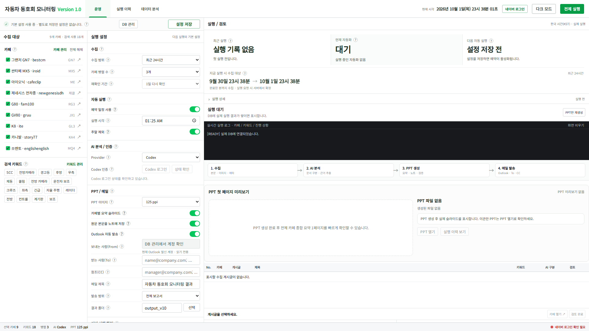

| 기능 | 실제 동작 |
| --- | --- |
| 카페·키워드 관리 | 기본 9개 카페·18개 키워드에서 시작하며, 대상을 추가하거나 사용을 중단할 수 있습니다. 실행 당시 목록은 이력에 별도로 보존합니다. |
| 웹 수집 | 카페의 **제목 키워드 검색**으로 글을 찾고, 해당 게시글의 본문·메타데이터·캡처를 수집합니다. 카페 동시 처리 수는 1~3개로 설정합니다. |
| 수집 기간 | 최근 24시간·48시간, 이전 실행 이후, 시작·종료 시각 직접 지정을 지원합니다. |
| AI 분석 | Codex CLI 또는 OpenAI API로 게시글을 분류하고, 차량 정보·증상·조치·보고된 원인·결과 등을 구조화하며 원문 근거를 연결합니다. |
| 원문과 검토 | 게시글과 원문 버전을 구분하고, 분석별 검토 기록을 저장합니다. 새 원문 버전에 이전 검토 완료 상태를 자동 승계하지 않습니다. |
| PPT 보고서 | 전체 요약, 선택한 카페별 요약, 게시글별 분석·캡처를 구성합니다. 원문 노트 옵션을 켜면 기존 검토 정보 뒤에 `[원문 본문]`을 추가합니다. |
| PPT만 재생성 | 선택한 과거 실행의 저장 원문·분석을 재사용합니다. 이 전용 기능은 재수집·새 AI 분석·메일 발송 없이 동작합니다. |
| Outlook 발송 | 전체 보고서 또는 요약 슬라이드만 첨부하고 To·CC 수신자에게 전송을 요청합니다. |
| 실행 이력 | 실행 ID, 당시 설정과 기간, 카페별 결과, 단계·로그·산출물·메일 상태를 조회하고 JSON으로 내보냅니다. |
| 데이터 분석·Excel | 누적 게시글을 카페·키워드·기간으로 조회하고, 상세 데이터와 집계 또는 집계값만 `.xlsx`로 내보냅니다. |
| 예약 실행 | 저장한 설정을 한국 시간 기준으로 실행하며 주말 제외를 지원합니다. 프로그램 서버와 PC가 켜져 있어야 합니다. |

AI 분석은 고객이 보고한 문제를 정리하는 자료입니다. 게시글이나 분석 결과만으로 특정 부품의 불량·원인을 확정하지 않으며, 담당자가 원문과 근거를 검토합니다.

## 기능별 화면

아래 13장은 위 운영 화면과 같은 **Version 1.0 초기 DB 화면**입니다. 각 기능을 펼친 모습이며, 실제 수집·AI·PPT·메일 작업의 완료 결과는 아닙니다.

### 카페 관리

수집할 카페를 추가하고 이름·구분명·주소와 사용 여부를 관리합니다.

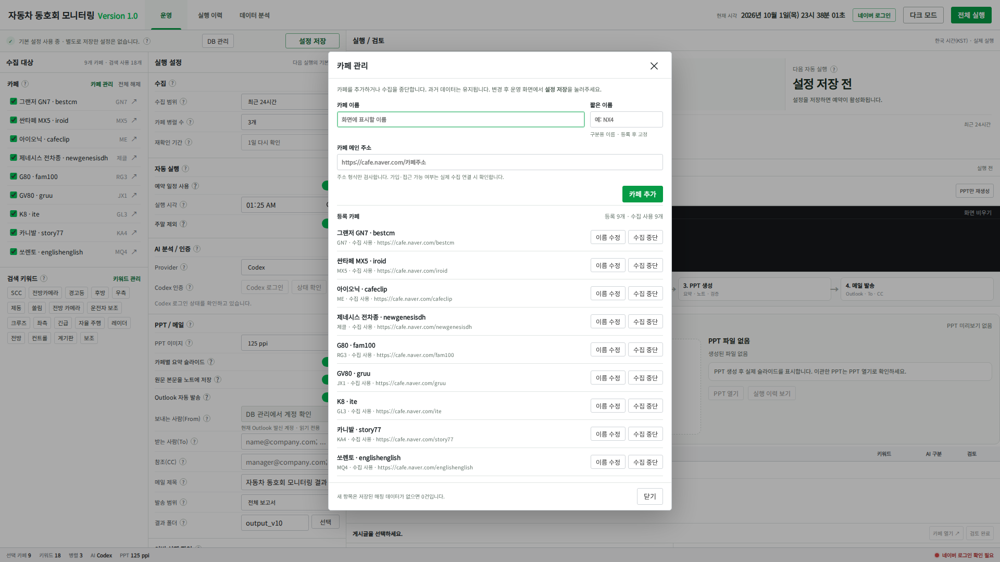

### 키워드 관리

검색 키워드를 추가하고 필요한 키워드만 사용하도록 설정합니다.

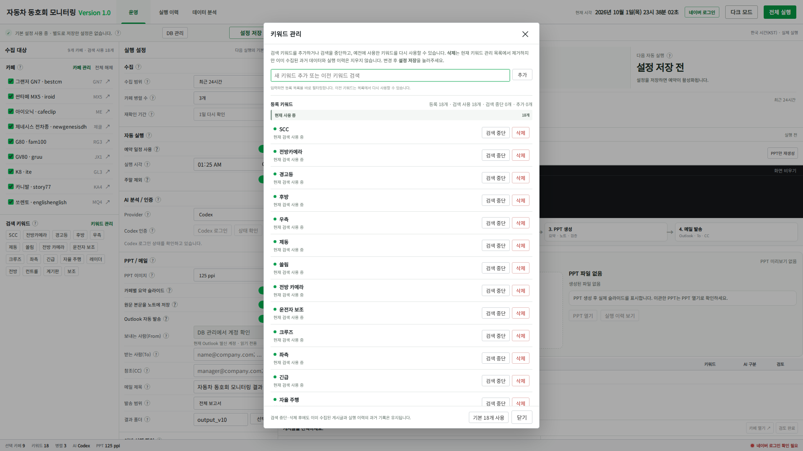

### 수집 기간 지정

최근 24/48시간, 이전 실행 이후 또는 시작·종료 시각 직접 지정을 선택합니다.

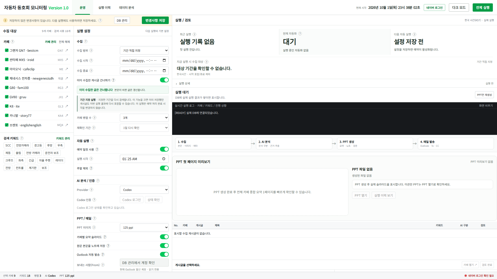

### 예약 실행 설정

한국 시간 기준 실행 시각과 주말 제외를 설정합니다. 프로그램 서버와 PC가 켜져 있어야 동작합니다.

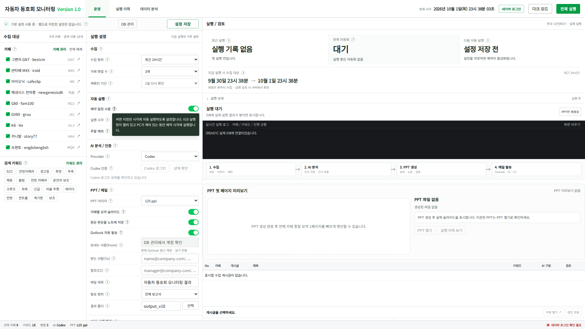

### AI 공급자와 OpenAI API 설정

Codex 또는 OpenAI API를 선택합니다. 아래는 API 입력란을 연 화면이며 실제 키는 입력하지 않았습니다.

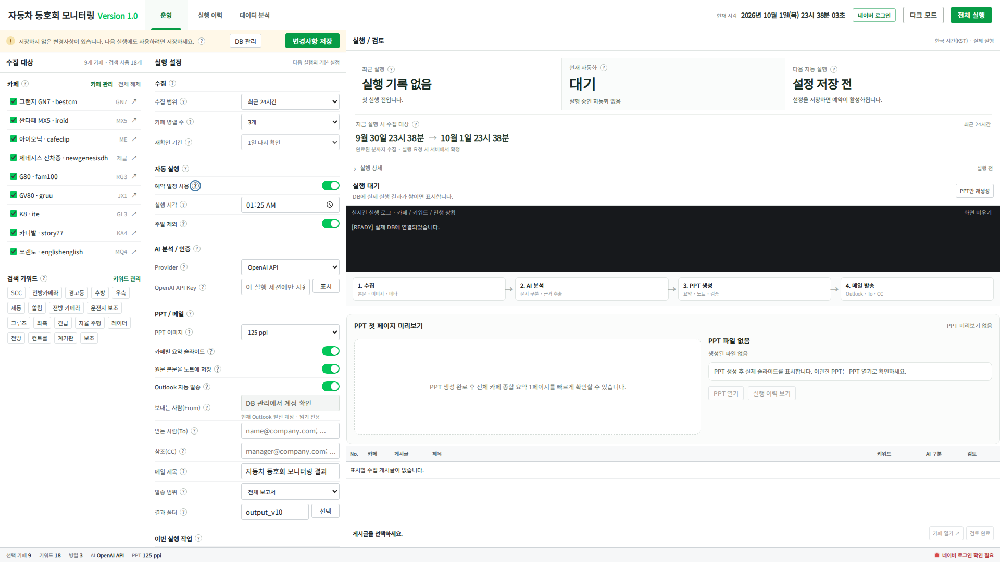

### PPT 구성과 Outlook 발송 설정

캡처 이미지 PPI, 카페별 요약, 원문 노트, 수신자와 전체·요약 보고서 발송 범위를 지정합니다. 주소 입력란은 예시 문구입니다.

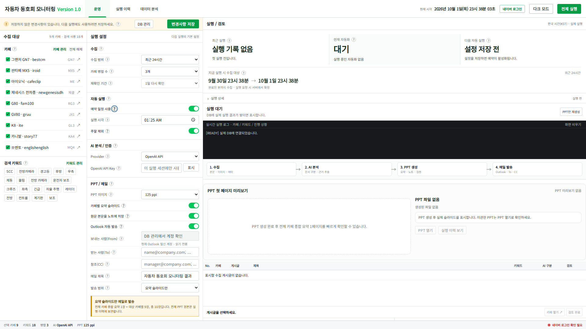

### 실행할 단계 선택

웹 수집·AI 분석·PPT 생성 단계를 선택합니다. 새 수집 결과로 PPT를 만들 때는 AI 분석도 함께 켭니다.

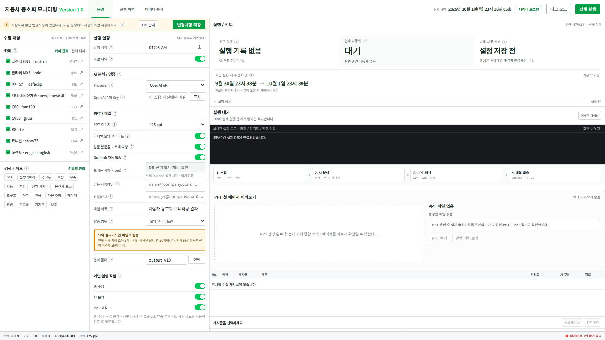

### 전체 실행 확인

선택한 작업과 발송 범위를 확인하는 창입니다. 이 캡처에서는 실제 작업을 시작하지 않았습니다.

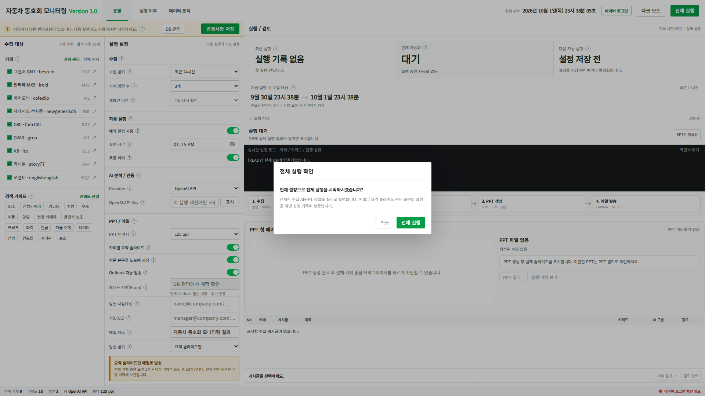

### 실행 이력

과거 실행을 검색하고 당시 설정·진행 결과·산출물을 확인합니다. 아래는 실행 기록이 없는 초기 상태입니다.

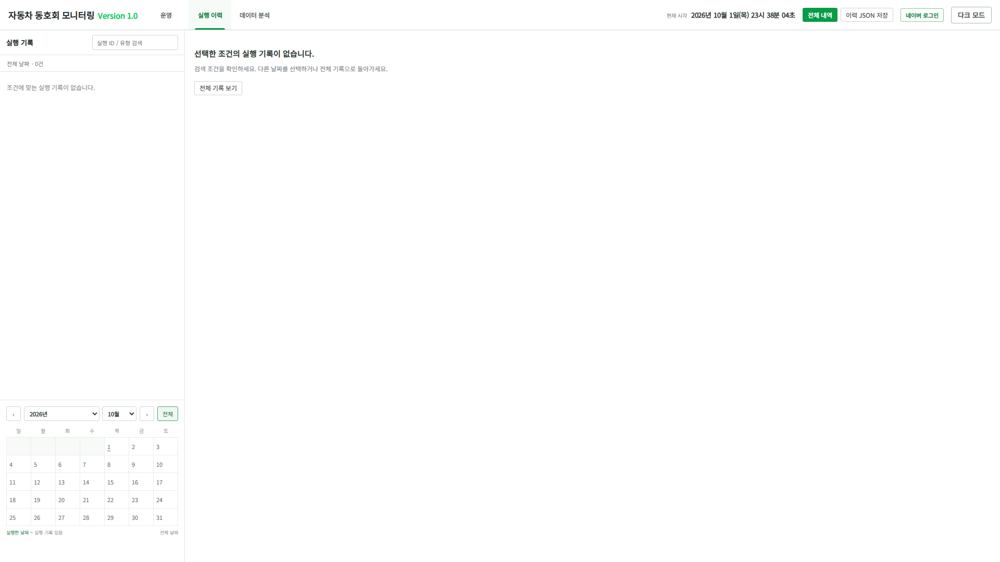

### 데이터 분석

카페별 게시글 수, 키워드 매칭 수, 기간별 추이와 게시글 상세를 확인합니다. 새 DB이므로 집계는 0건입니다.

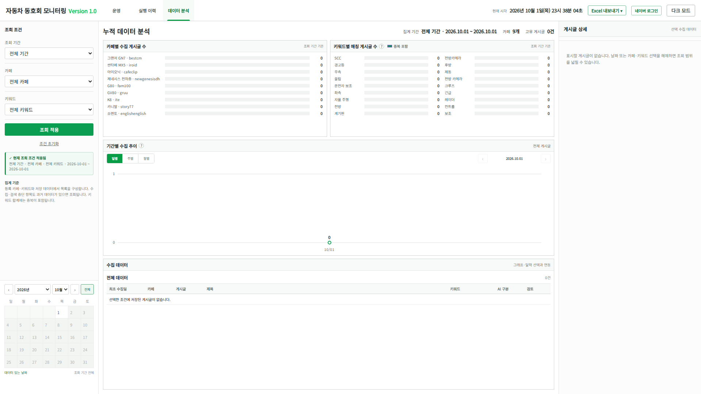

### 분석 기간과 조회 조건

기간·카페·키워드 조건을 지정하고 조회에 적용합니다. 통계의 날짜 기준은 최초 수집일(KST)입니다.

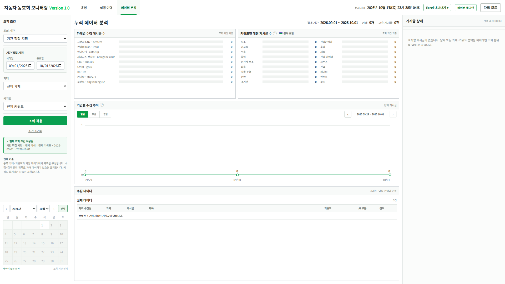

### Excel 내보내기

상세 데이터와 집계를 함께 저장하거나 집계값만 저장하는 방식을 선택합니다.

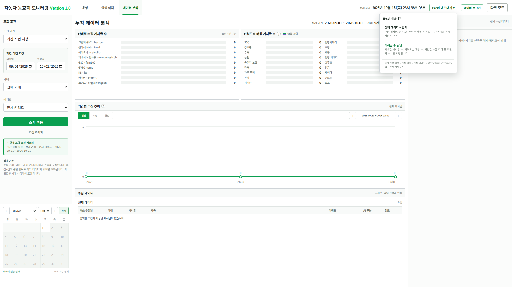

### DB 관리와 기존 자료 이관

DB 건수, 백업, 기존 V9 자료 이관과 Outlook 발신 계정 확인 기능을 제공합니다. 신규 사용자는 이관을 건너뜁니다.

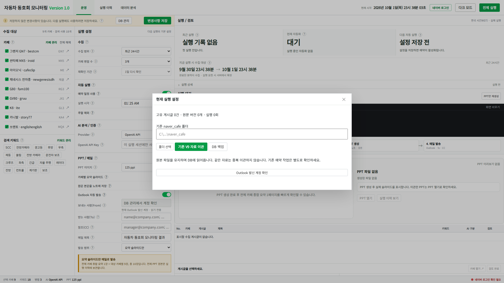

### 실제 Windows 수집 완료 화면

개발 당시 Windows에서 **9개 카페·게시글 14건**을 수집한 화면입니다. 이 실행은 웹 수집만 수행했으며, 아래 검증 표의 **16건·PPT 30장 통합 실행과는 별도 기록**입니다. 화면에는 당시 내부 개발명 V10이 표시됩니다.

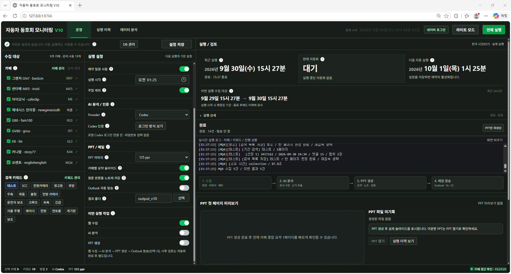

## 사용자가 진행하는 작업

처음에는 필요한 자료를 수집하고, 이후에는 실행 이력에 저장된 자료를 다시 활용합니다. 아래는 **전체 처리**와 **PPT만 재생성**의 차이입니다.

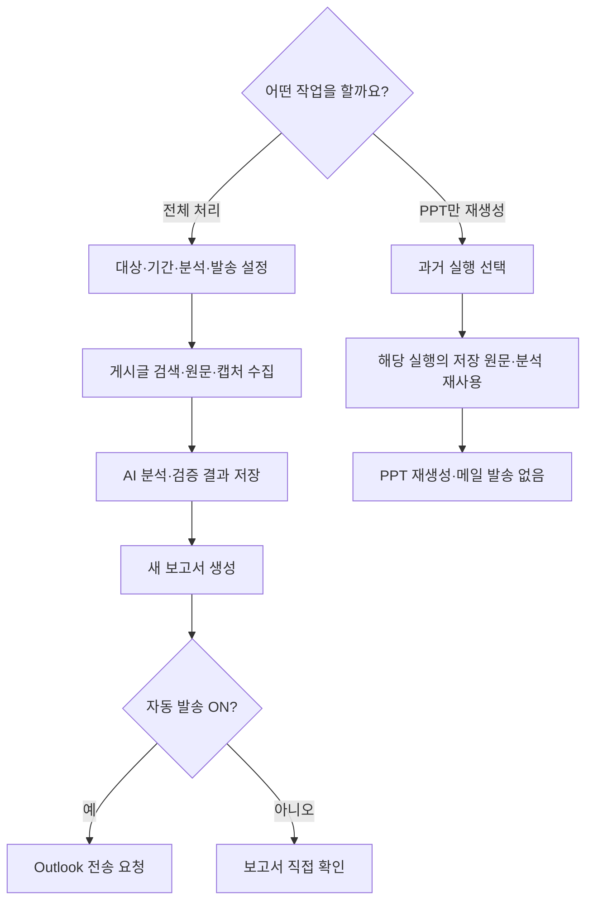

전체 처리 외에 **웹 수집만** 또는 **웹 수집 + AI 분석**도 선택할 수 있습니다. 새로 수집한 글의 PPT를 만들 때는 AI 분석을 함께 켜야 합니다. 모든 단계를 매번 다시 실행할 필요는 없습니다.

## 내부 시스템 구조

웹 화면은 조작과 조회를 담당하고, Python 서버가 설정·예약·작업 시작을 관리합니다. 시간이 오래 걸리는 수집·분석·PPT·메일 작업은 별도 Python 프로세스가 실행합니다.

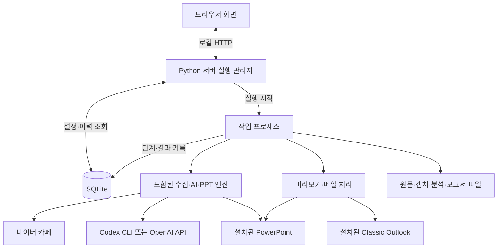

SQLite에는 실행·게시글·분석·파일 연결 정보를 저장하고, 캡처와 PPT 등 산출물은 파일로 보관합니다. 따라서 실행이 끝나도 당시 설정과 결과를 다시 확인할 수 있습니다. 웹 화면을 새로고침해도 진행 중인 작업 자체가 새로 시작되지는 않습니다.

## 설치와 실행

### 준비 사항

| 구성 | 필요한 용도 |
| --- | --- |
| Windows, Python 3.11 이상 및 `py` 실행기 | 프로그램 실행과 가상환경 생성 |
| 설치된 Chrome, 네이버 계정, 대상 카페 열람 권한 | 로그인·게시글 수집 |
| Codex CLI와 본인 ChatGPT 로그인 | Codex 방식 AI 분석. 설치 BAT가 CLI를 설치하지는 않습니다. |
| OpenAI API 키 | OpenAI 방식을 선택할 때 사용합니다. Codex 방식과 선택 관계입니다. |
| 데스크톱 Microsoft PowerPoint | PPT 생성·미리보기·요약본 작성 |
| Classic Outlook과 메일 계정 | 자동 메일 발송. New Outlook을 대상으로 한 구현이 아닙니다. |

설치 시 Python 패키지 다운로드를 위한 인터넷 연결이 필요합니다. PowerPoint와 Outlook은 해당 단계를 사용할 때 필요하며, 웹 수집만 실행할 때는 Office를 호출하지 않습니다. Linux에서 웹 화면·오프라인 테스트를 확인할 수 있어도 실제 수집·AI·Office 통합 실행은 Windows용입니다.

### 처음 사용하는 경우

1. 위 **배포 ZIP**을 내려받아 모두 압축 해제합니다. 예: `C:\CafeMonitor\cafe_monitoring`. 저장소를 통째로 내려받았다면 `20261001_cafe_monitoring_v1.0\cafe_monitoring`이 같은 프로그램 폴더입니다.
2. 그 폴더에서 **`01_setup_v10.bat`**를 실행합니다. `.venv`를 만들고 의존성을 설치한 뒤 Python 오프라인 검사 75개를 실행합니다.
3. 설치가 끝나면 **`02_start_v10.bat`**를 실행합니다. 이후에도 이 파일로 시작합니다. 브라우저에서 `http://127.0.0.1:8766`이 열립니다. `web/index.html`을 직접 여는 방식이 아닙니다.
4. 화면에서 **네이버 로그인**을 누릅니다. 전용 Chrome에서 로그인하고 그 창을 닫은 뒤, 안내창의 **로그인했습니다**를 누릅니다. 이미 로그인 상태라면 재로그인 여부를 먼저 묻습니다.
5. AI 공급자를 선택합니다. Codex는 **Codex 로그인** 버튼으로 로그인하고 **상태 확인**으로 인증을 확인합니다. OpenAI는 환경변수 `OPENAI_API_KEY` 또는 화면 입력을 사용합니다. 화면에 입력한 키는 서버 메모리에 보관하므로 서버 재시작 후 다시 입력해야 합니다.
6. 카페·키워드·기간·작업 단계·PPT·수신자를 확인하고 **설정 저장 → 전체 실행**을 누릅니다. 최초 사용자는 V9 자료 이관을 건너뜁니다.

**초기값은 예약과 Outlook 발송이 ON입니다.** 발송하지 않을 때는 Outlook 발송을 끄고, 예약을 원하지 않을 때는 예약도 끈 뒤 저장하세요. 발송을 켜면 To 수신자와 PPT 생성이 필요합니다. 예약은 설정을 저장한 이후 활성화됩니다.

검사만 다시 실행하려면 `03_verify_v10.bat`를 사용합니다. 이 BAT는 Python 오프라인 검사를 수행하며 JavaScript 검사는 별도입니다.

## 사용 시 알아둘 동작

### 기간·중복·원문 버전

- **최근 24/48시간**은 실행 시점에 계산한 범위를 수집합니다. **이전 실행 이후**를 선택했을 때만 카페별 마지막 정상 수집 완료 시각과 재확인 기간 0~2일로 시작점을 계산합니다. 처음 수집하는 카페는 최근 24/48시간으로 먼저 실행해야 합니다.
- 자동 기간은 현재 진행 중인 분을 제외한 `[시작, 종료)` 범위입니다. 예를 들어 13:29:54에 실행하면 종료 경계는 13:29:00이며 그 시각은 포함하지 않습니다. 기간 직접 지정도 분 단위입니다.
- 게시글은 카페 ID와 게시글 ID로 식별합니다. **기간 직접 지정 + 중복 제외 ON**일 때는 직전 저장 내용과 같은 글을 이번 결과에서 제외합니다. 모든 실행이 항상 신규 글만 처리하는 것은 아닙니다.
- 원문 버전의 지문은 **제목·raw 본문·게시 시각·미디어 정보**로 계산합니다. 이 값이 달라진 글을 다시 수집하면 변경을 기록하고 기존 원문을 보존합니다. 동일 지문은 재사용하며, 과거의 모든 글을 상시 재방문해 수정을 감시하는 기능은 아닙니다.
- 카페별 수집 완료 시각은 이후 AI·PPT·메일 실패와 분리해 유지합니다. 직접 지정한 기간의 실행은 정규 수집 완료 시각을 갱신하지 않습니다.

### 분석·보고·발송

- AI 결과에 형식·근거 연결·의미 규칙 검사를 적용합니다. 검사 통과는 모든 내용의 사실성을 보증하지 않습니다. 동일 원문·AI 공급자·모델·지침 등의 캐시 조건을 만족하면 저장 분석을 재사용합니다.
- PPT는 **전체 요약 1장 + 선택 카페별 요약 + 게시글 상세**로 구성합니다. 카페별 요약을 끄면 전체 요약 1장은 유지합니다. 요약본 장수는 선택 카페 수와 설정에 따라 달라집니다.
- 원문 노트는 기본 ON이며, **해당 실행의 분석에 연결된 수집 원문**을 요약 없이 보존합니다. PPT 이미지 PPI는 표시 크기를 기준으로 캡처 해상도를 조절하는 값으로, 기본값은 125입니다.
- **검토 완료는 자동 발송의 필수 승인 단계가 아닙니다.** 발송을 켜면 처리 흐름에서 Outlook 전송을 요청합니다. 먼저 검토하려면 자동 발송을 끄고 실행하세요.
- `Outlook 전송 요청 수락`은 `Send()` 호출이 성공했다는 뜻이며 수신자에게 배달됐다는 증명은 아닙니다. 발송 도중 종료 등으로 상태가 불확실하면 `메일 발송 확인 필요`로 남기고 자동 재발송하지 않습니다.
- `완료(일부 확인 필요)`는 일부 카페 실패, 분석 검토 항목, 캡처 또는 미리보기 문제 등으로 표시될 수 있습니다. 실행 상세와 로그에서 실제 사유를 확인합니다.

### 예약·통계·백업

- V10 예약은 **로컬 서버 내부 예약 기능**입니다. 기존 V9의 Windows 작업 스케줄러 작업을 자동 수정하지 않습니다. 중복 예약 여부를 확인하세요.
- PC가 깨어 있고 서버 실행 창이 열려 있어야 예약됩니다. 서버 시작 전 놓친 예약은 소급 실행하지 않으며, 예약 시각에 다른 작업이나 로그인이 진행 중이면 그 예약을 건너뜁니다.
- 브라우저 탭을 닫아도 서버·작업 프로세스는 별개로 동작합니다. 중지는 저장 경계에서 처리하므로 현재 진행 중인 호출이 끝날 때까지 기다릴 수 있습니다.
- 데이터 분석 탭과 Excel의 날짜 기준은 **최초 수집일(KST)**입니다. 게시 시각은 별도 항목입니다. 한 글이 여러 키워드에 해당할 수 있어 키워드 매칭 수의 합과 고유 게시글 수는 다릅니다.
- 운영 자료는 기본적으로 `data_v10/`에 생성됩니다. DB는 `monitoring.sqlite3`, 결과는 `output_v10/실행ID/` 아래에 저장합니다. 화면의 DB 백업은 PPT·캡처 파일을 포함하지 않으므로 결과 폴더도 함께 보관하세요.

## 저장소 구성과 기술

| 위치 | 내용 |
| --- | --- |
| [`cafe_monitoring/`](cafe_monitoring/) | **배포 ZIP을 그대로 푼 프로그램 356개 파일**. 내부 폴더 재배치나 리팩터링 없이 공개합니다. |
| [`releases/`](releases/) | 전달·신규 설치용 원본 ZIP |
| [`screenshots/`](screenshots/) | Version 1.0 초기 화면 및 기존 Windows 검증 캡처 |
| [`docs/`](docs/) | 결과보고서, 화면 안내, 이번 README 검토 기록 |
| [`SHA256SUMS.txt`](SHA256SUMS.txt) | 원본 배포 ZIP의 SHA-256 체크섬 |

2026-10-02 문서 검토 시 ZIP 내부 356개 파일과 `cafe_monitoring/`의 파일을 바이트 단위로 대조해 누락·내용 차이·추가 파일이 없음을 확인했습니다. ZIP과 압축 해제본 중 하나로 설치하면 됩니다.

| 구성 | 구현과 역할 |
| --- | --- |
| 웹 화면 | HTML/CSS·JavaScript. 운영, 실행 이력, 데이터 분석 탭 |
| 로컬 API·실행 관리 | Python 표준 라이브러리 HTTP 서버, 별도 작업 프로세스, 잠금·예약 관리 |
| 저장 | SQLite에 이력·원문 버전·분석·검토·파일 정보를 기록하고 산출물은 파일로 보관 |
| 수집 | Playwright + Chrome, asyncio 기반 카페 병렬 처리와 공통 요청 간격 제어 |
| AI | Codex CLI / OpenAI API, 결과 검증과 캐시 |
| Office·이미지 | PowerPoint COM, Classic Outlook COM, Pillow. COM은 설치된 Windows Office를 프로그램에서 제어하는 방식 |
| 인증 | 네이버 세션 사본은 Windows DPAPI로 보호하고 Codex 인증은 CLI 저장소에서 관리 |

`v10/`은 웹 화면과 DB를 기존 엔진에 연결하는 운영 코드입니다. `engine/`에는 V5~V9 계열에서 발전한 수집·분석·PPT 코드와 의존 모듈이 포함되어 있습니다. **현재 사용에 필요한 코드를 묶은 구성으로, 과거의 모든 배포 버전 전체를 보관한 것은 아닙니다.**

개발자는 [구현 구조·DB·API 설명](cafe_monitoring/docs/ARCHITECTURE_KO.md), [`v10/`](cafe_monitoring/v10/), [`engine/`](cafe_monitoring/engine/)을 참고하세요. 서버는 기본적으로 `127.0.0.1`에만 연결하는 로컬 도구입니다.

## 확인된 실행 결과와 검증 범위

| 확인 구분 | 결과 | 범위 |
| --- | --- | --- |
| 2026-09-30 사용자 Windows 오프라인 검사 | RC1.7 Python **75개 통과** | 개발 당시 실행 로그와 배포 안내 기록 |
| 같은 날 Windows 통합 실행 | **9개 카페 완료, 게시글 16건, PPT 30장, 30분 45초** | 실행 이력 화면과 같은 실행 ID의 PPT 첨부 메일을 Outlook 보낸 편지함에서 확인 |
| 배포 전 Linux 검사 | Python **74개 통과·Windows DPAPI 1개 제외**, JavaScript **49개 통과** | 외부 수집·AI·Office 호출은 테스트 대역으로 검사 |
| 2026-10-02 문서 정비 시 Linux 재검사 | Python **74개 통과·Windows 전용 1개 제외**, JavaScript **49개 통과** | 공개 소스에서 재실행. 실제 네이버·AI·Office 작업은 수행하지 않음 |
| 초기 RC1 기존 엔진 회귀 검사 | **54개 통과** | 당시 기록. 이번 문서 수정에서 새로 실행한 검사 결과와 구분 |

Windows 실사용 결과는 RC1.7 기준입니다. 정식 Version 1.0은 그 기능을 유지하고 제목·버전·배포 안내를 정리한 버전입니다. 당시 `완료(일부 확인 필요)`의 구체적인 사유, 전체 분석·PPT의 내용 품질, 새 PC 최초 설치와 장시간 예약은 별도 확인 대상입니다. 프로그램 검사를 통과했다는 사실과 모든 환경에서의 운영 검증을 구분합니다.

## 관련 자료

- [사용·업데이트·기존 V9 이관 상세 안내](cafe_monitoring/00_README_KO.md)
- [전체 화면 안내 — 18장](docs/SCREENSHOTS.md)
- [V10 결과보고서](docs/자동차동호회_모니터링_V10_결과보고서.docx)
- [개발 당시 검증 기록](cafe_monitoring/docs/VALIDATION_KO.md)
- [이번 README 검토·정정 기록](docs/README_REVIEW_20261002.md)

Version 1.0은 수집부터 보고·전달까지를 실제로 연결한 첫 배포 기준점입니다. 이후 운영 결과와 사용자 피드백을 바탕으로 안정성과 분석 품질을 개선해 나갑니다.
