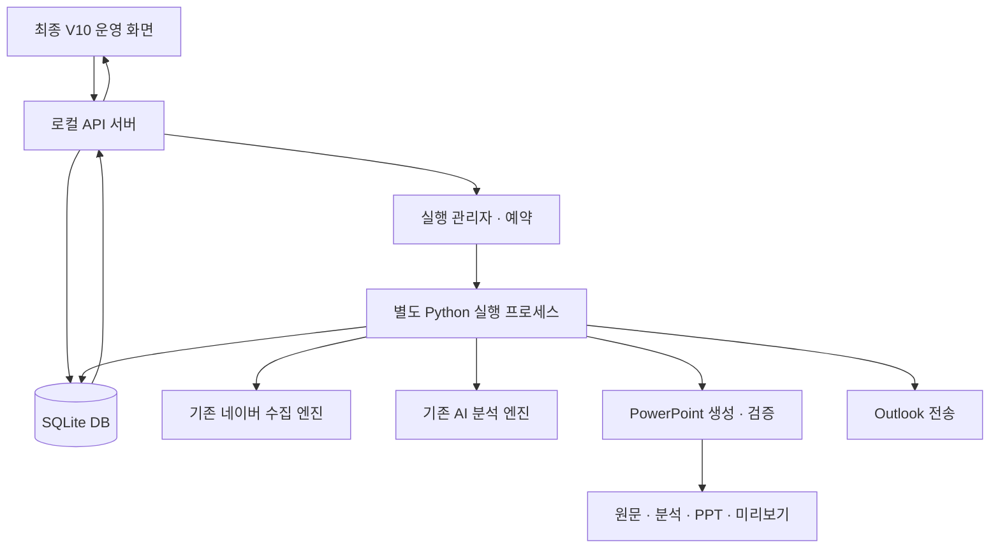

**V10 구현 구조 — 2026-09-30**

운영 화면은 웹 프론트엔드, Python은 구현 언어입니다. 실제 처리 기능은 Python으로 작성된 API 서버·실행 관리자·수집/분석/PPT 엔진으로 나눕니다.

| 코드 | 책임 |
|---|---|
| `web/index.html` | 제공된 최종 화면 구조와 스타일 |
| `web/base.js` | 기존 카탈로그·검색·달력·통계·Excel·화면 전환 |
| `web/integration.js` | 실제 API 요청, 상태 동기화, 실제 PPT 미리보기, DB 관리 |
| `v10/codex_auth.py` | 기존 분석 어댑터로 Codex 로그인·상태 확인, 백그라운드 실행과 종료 관리 |
| `v10/server.py` | 루프백 HTTP API, 요청 검증, 파일 전달 |
| `v10/service.py` | 실행 요청 멱등성, 프로세스 관리, KST 예약 |
| `v10/worker.py` | 수집 → 분석 → PPT → 메일 실행 흐름과 중지 처리 |
| `v10/engine.py` | V9.6.7 수집·AI·PPT 기능 연결 |
| `v10/database.py`, `schema.sql` | 트랜잭션, DB 스키마, 이력·원문·검토·산출물 |
| `v10/settings.py` | 설정 검증, 고정 정책, 기본 카탈로그 |
| `v10/migrate.py` | 기존 실행 폴더 검증·이관·경로 재연결 |
| `v10/office.py` | 실제 PPT 이미지·요약본 생성, Outlook 계정 확인과 전송 |
| `engine/` | 전달 소스 + V9.6.7 R2 + 필요한 V10 확장 |

외부 웹 서버 프레임워크는 추가하지 않았습니다. API 서버와 DB는 Python 표준 라이브러리로 동작합니다. 실제 수집·AI·Office는 기존 의존성을 사용합니다. 수집은 기존의 접근 제한 중단·간격 제어·프로필 잠금을 유지합니다.

**데이터 관계**

| 테이블 | 저장 내용 |
|---|---|
| `cafes`, `keywords` | 안정적인 ID, 현재 사용 상태, 네이버 숫자 ID |
| `posts` | 카페·게시글 고유 관계, 최초 수집, 마지막 확인 |
| `post_versions` | 내용 지문별 원문 버전. 이전 원문 보존 |
| `post_keywords` | 누적 키워드 매칭 관계 |
| `runs` | 실행 상태·설정 스냅샷·요청 ID·원본 실행 ID |
| `run_cafes` | 실행별 카페 기간·성공·실패 |
| `run_posts` | 실행에 포함/제외된 게시글 버전, 키워드, 기존 엔진 입력 |
| `analyses` | 원문 버전별 분석. 최초 분석과 PPT 표시 보정 결과 구분 |
| `reviews` | 분석별 검토 이벤트 |
| `artifacts` | 결과 파일, SHA-256, 실행 연결 |
| `mail_logs` | 전송 요청 전 기록과 결과·불확실 상태 |
| `cursors` | 카페별 정상 수집 완료 시각 |
| `settings` | 저장 설정, 예약 상태, 비밀값이 아닌 연결 상태 |
| `logs`, `imports` | 실행 로그와 반복 이관 방지 기록 |

동시 실행은 SQLite의 단일 활성 실행 인덱스와 프로세스 파일 잠금으로 제한합니다. 같은 실행 요청 ID를 재전송해도 새 작업을 중복 생성하지 않습니다. API 키는 DB·브라우저 저장소에 저장하지 않습니다. 루프백 Host·Origin·변경 요청 토큰을 검증합니다.

**주요 API**

| 메서드·경로 | 역할 |
|---|---|
| `GET /api/state` | 저장 설정·실행 이력·활성 실행·다음 예약·DB 건수 |
| `POST /api/settings` | 설정 저장. `expectedRevision`으로 동시 수정 충돌 확인 |
| `POST /api/runs` | 이번 실행 설정과 `requestId`로 실제 실행 시작 |
| `GET /api/runs/{id}` | 특정 실행의 원문·분석·파일·설정 |
| `POST /api/runs/{id}/stop` | 안전한 저장 경계에서 중지 요청 |
| `GET /api/runs/{id}/logs` | 증가분 실행 로그 |
| `GET /api/posts` | DB의 고유 게시글 목록. ID 기준 최대 500개씩 반환 |
| `POST /api/reviews` | 분석 ID에 대한 검토 완료/대기 이벤트 |
| `GET /api/artifacts/{id}` | 등록된 파일의 존재·해시 검증 후 반환 |
| `POST /api/open-artifact` | Windows PPT/탐색기 열기 |
| `POST /api/artifacts/link` | 사용자가 선택한 기존 PPT 연결 |
| `POST /api/import` | 기존 V9 실행 자료 이관 |
| `POST /api/backup` | 일관된 SQLite 백업 |
| `POST /api/login` | 동일 프로필의 전용 Chrome 로그인 창 |
| `POST /api/secrets` | 현재 서버 세션의 API 키 설정 |
| `POST /api/outlook-account` | Outlook 기본 발신 계정 확인 |
| `POST /api/mail/resolve` | 사용자가 확인한 발송 여부 기록, 재전송 없음 |

변경 요청은 JSON이며 `X-V10-Token` 헤더가 필요합니다. 토큰은 로컬 서버가 제공하는 화면에 주입합니다. 다른 웹사이트에 대한 CORS 허용은 없습니다.

**유지한 기준과 구현 선택**

- 카페/키워드의 현재 사용 상태와 과거 실행 스냅샷은 분리합니다. 저장하지 않은 설정으로 실행해도 기존 저장 설정을 바꾸지 않습니다.
- 제목 키워드 검색은 기존 수집 엔진의 규칙을 유지합니다. 시안의 제목+본문 예시 검색은 실행하지 않습니다.
- 카페당 완료 시각을 저장하며 직접 지정한 과거 기간은 정규 완료 시각을 갱신하지 않습니다.
- 상세·요약 PPT를 따로 보관합니다. 요약본에서 제거된 상세 슬라이드 링크는 해제하고 전체본 참고로 표시합니다.
- 화면 통계는 DB에서 가져온 고유 게시글에 기존 필터 동작을 적용합니다. 대규모 자료에 필요한 서버 측 통계 집계·가상 스크롤은 후속 최적화 대상입니다.
- 최초 수집일 기준으로 통계 날짜와 Excel 날짜를 통일했습니다. 게시 시각은 별도 보존합니다.
- 예약은 로컬 서버 프로세스에서 실행합니다. 기존 Windows 작업 스케줄러의 작업을 자동 수정하거나 대체 등록하지 않습니다.

V10용 엔진 수정은 `v9/dashboard_data.py`의 동적 카페 입력, `v9/powerpoint.py`의 요약 장수, `v9/dashboard_ppt.py`의 카페 요약 선택, `v9/ppt_notes.py`의 원문 노트 선택입니다. 기존 V9 호출의 기본 동작은 회귀검사로 확인했습니다. V9.6.8 폴더 재배치 코드는 적용하지 않았습니다.

**Codex 인증 연결 (RC1.6)**

- `POST /api/codex/login`: 이 PC에서 공식 `codex login` 실행. 완료 후 같은 실행 파일·인증 저장 옵션으로 `codex login status` 확인.
- `POST /api/codex/check`: 로그인 상태만 비동기로 확인. 추론 호출 없음.
- `/api/state`의 `codexAuth`: 상태·안내·확인 시각·진행 여부만 전달. DB에 다른 변경이 없어도 인증 상태는 반환.
- 인증 정보는 기존 CLI 저장소가 관리. V10은 토큰·계정 비밀번호를 DB/API/실행 로그로 복사하지 않음.
- 중복 로그인은 하나의 프로세스만 실행. 로그인 중 수동·예약 실행 시작 제한, 실행 중 계정 변경 제한.
- 로그인 대기 10분 제한. 정상 서버 종료 시 V10이 시작한 인증 프로세스만 정리.

**네이버 로그인 안내 (RC1.6)**

- `POST /api/login`: 기존 인증이 있으면 needsConfirmation 반환. `{confirm:true}`를 받은 경우만 새 로그인 시작. 열려 있는 같은 로그인 작업은 재사용.
- `POST /api/login/confirm`: 전용 창이 닫혔고 세션 저장 상태인 경우 완료 응답. 상태를 임의 승격하지 않음.
- `POST /api/login/cancel`: 자신의 네이버 로그인 워커에 정상 종료 요청. 수집 워커는 대상에서 제외.
- `/api/state`의 naverAuth.browserOpen은 DB 변경 유무와 관계없이 갱신.
