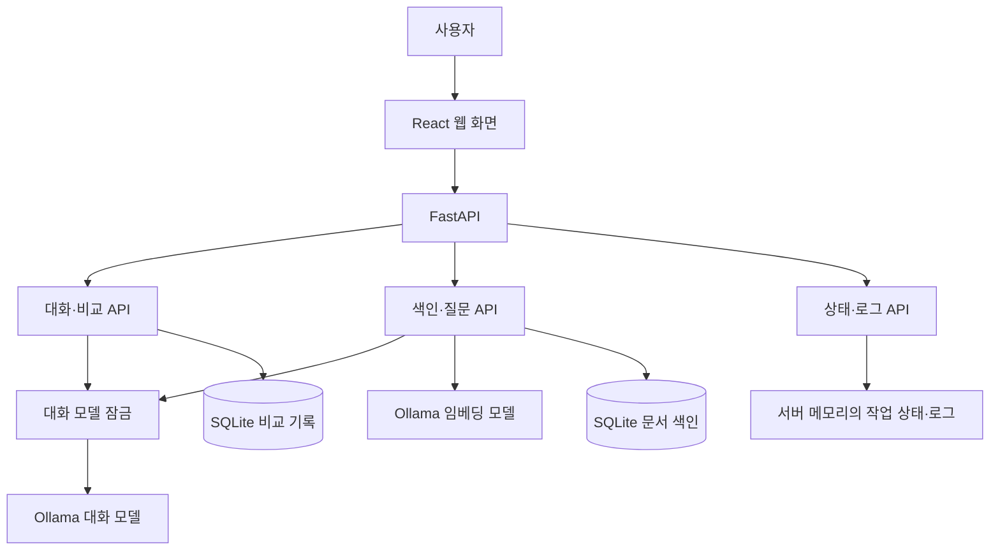
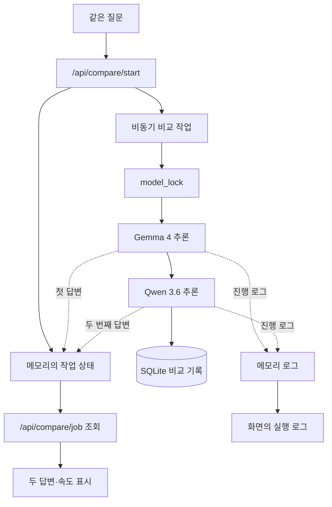
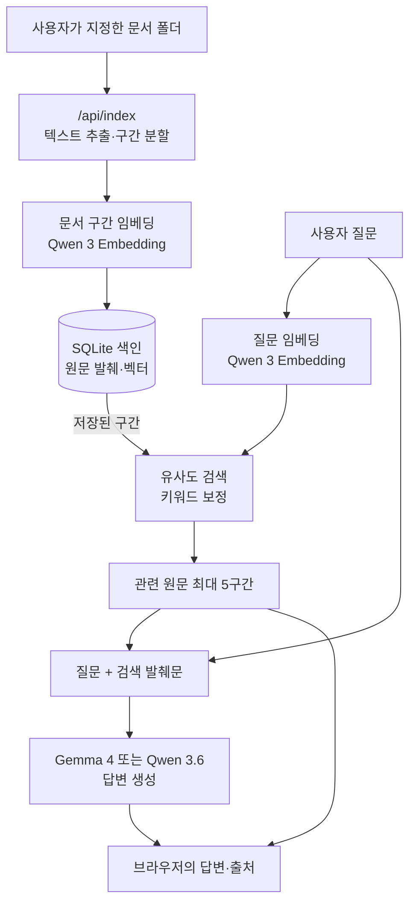

# 로컬 AI 작업대

설치된 Ollama 모델로 일반 대화를 하거나, 두 모델을 같은 질문으로 비교하고, 선택한 폴더의 문서를 검색해 출처와 함께 질문할 수 있는 로컬 웹 앱입니다.

## 시스템 구조

화살표는 기능 사이의 호출·데이터 의존 관계를 나타냅니다. 아래 세 그림은 작업 순서 한 줄이 아니라, **여러 기능이 같은 모델과 저장소를 공유하는 구조**를 보여 줍니다.

### 1. 전체 구성 요소

웹 서버(`127.0.0.1:8768`)와 Ollama(`127.0.0.1:11434`)는 이 PC에서 동작합니다. 대화 모델은 Gemma 4·Qwen 3.6·선택적 Qwen 3 8B이고, 임베딩 모델은 Qwen 3 Embedding입니다. `model_lock`은 대화·비교·문서 답변의 대화 모델 호출을 직렬화합니다. 색인과 비교 기록은 `%LOCALAPPDATA%\LocalAIWorkbench`에 저장되고, 작업 상태와 최근 500건의 로그는 서버 메모리에만 남습니다.

### 2. 모델 비교: 추론·화면 갱신·기록의 분기

두 모델은 메모리 사용량을 고려해 순서대로 실행하지만, 브라우저의 작업 상태 조회와 로그 표시는 별도로 진행됩니다. 비교 화면의 GPU 적재 비율은 Ollama가 해당 모델에 대해 보고한 값입니다.

### 3. 문서 질문: 색인 경로와 질문 경로의 합류

색인 경로는 원본 문서를 읽어 로컬 SQLite에 저장합니다. 질문 경로는 같은 임베딩 모델로 질문을 변환한 뒤 색인과 합류합니다. 답변 모델은 검색된 발췌문을 근거로 답하고, 화면에는 원문 출처도 따로 표시합니다. 진행 로그에는 질문 문장과 문서 본문을 싣지 않습니다.

## 공유본 준비 사항

ZIP에는 앱 소스와 예제 문서만 들어 있습니다. 개인 문서, 색인·비교 기록, 가상환경, `node_modules`, Ollama 모델은 포함하지 않습니다. Windows에서 Python, Node.js/npm, Ollama를 설치한 뒤 아래 모델을 Ollama에 준비해야 합니다. 대형 모델은 RAM과 저장 공간을 많이 사용하며, 작은 GPU에서는 CPU와 함께 추론하므로 응답이 느릴 수 있습니다.

## 실행

Windows PowerShell에서 이 폴더의 `start.ps1`을 실행하세요. 최초 실행에는 Python 패키지 설치와 프런트엔드 빌드가 포함됩니다. 브라우저에서 `http://127.0.0.1:8768`이 열립니다. 서버를 종료하려면 `stop.ps1`을 실행하세요.

Ollama와 다음 모델이 미리 설치되어 있어야 합니다.

- `gemma4:26b-a4b-it-qat`
- `qwen3.6:27b-coding`
- `qwen3-embedding:0.6b`

## 사용

1. **일반 대화:** 기본 Gemma 4, 코딩용 Qwen 3.6, 빠른 초안용 Qwen 3 8B 중 설치된 모델을 선택합니다. 한 모델만 실행하고 Gemma/8B는 마지막 요청 뒤 2분, Qwen 3.6은 1분간 메모리에 유지하므로 같은 모델의 다음 질문은 적재 시간을 줄일 수 있습니다. Qwen 3 8B는 선택 기능이며 설치되어 있지 않으면 표시되지 않습니다. 모델을 바꾸면 이전 모델을 메모리에서 해제합니다.
2. **모델 비교:** 공통 질문을 입력하고 실행합니다. 두 큰 모델을 순서대로 호출하며 첫 모델이 완료되면 답변을 먼저 표시합니다. 첫 토큰 시간, 총 시간, 토큰 속도와 Ollama가 보고한 모델 적재 비율을 표시합니다. 적재 비율은 시스템 전체 GPU 사용률이 아닙니다.
3. **폴더 질문:** Windows 폴더 경로를 입력한 뒤 색인을 생성합니다. 완료되면 질문과 답변 모델을 선택합니다. AI 답변과 실제 검색된 원문 발췌가 함께 표시됩니다. 답변 모델 유지 시간은 일반 대화와 같습니다.

이 PC의 6GB GPU 메모리에는 15~17GB급 모델 전체가 들어가지 않아 CPU와 GPU를 함께 사용합니다. 모델을 처음 적재하는 시간과 Qwen 3.6의 낮은 생성 속도는 유지 기능으로 완전히 없앨 수 없습니다. 비교 기능은 두 모델을 순차 실행하므로 한 모델로 대화하는 것보다 오래 걸립니다. 폴더 질문의 검색 모델은 답변 모델과 동시에 유지하면 이 PC의 메모리 여유가 작아져 요청마다 사용 후 내립니다. 따라서 같은 답변 모델을 유지해도 검색 단계의 대기 시간은 남습니다.

화면 오른쪽의 **실행 로그**는 비교, 색인, 질문의 실제 진행 단계를 약 0.8초 간격으로 갱신합니다. 모델 요청 대기, 첫 토큰 수신, 생성 완료 시간과 색인 구간 수 등을 볼 수 있습니다. 로그에는 질문 문장과 문서 본문을 싣지 않습니다. 로그는 서버 메모리에 최근 500건만 유지되며 서버를 재시작하면 초기화됩니다. `화면 지우기`는 현재 브라우저 표시만 비웁니다.

`examples` 폴더를 넣어 기능을 시험할 수 있습니다. 원본 문서는 읽기만 합니다. 색인과 비교 기록은 `%LOCALAPPDATA%\LocalAIWorkbench`에 저장됩니다. Ollama API 및 웹 서버는 `127.0.0.1`에서만 사용합니다.

지원 형식은 TXT, MD, 코드·설정 텍스트, CSV, JSON, HTML, PDF, DOCX입니다. 이미지 PDF의 OCR은 지원하지 않습니다. 한 번에 200개 파일, 600개 발췌 구간, 파일당 5MB까지 읽습니다. 색인은 자동 갱신되지 않으므로 원본을 수정했다면 다시 생성하세요. DOCX의 표·그림과 일부 PDF 레이아웃은 텍스트 추출에서 빠질 수 있습니다.

인용 번호는 모델이 작성한 것이므로 오른쪽 원문과 대조해 주세요. 출처 목록은 검색 결과이며 답변의 사실 여부를 자동 판정한 결과가 아닙니다.
