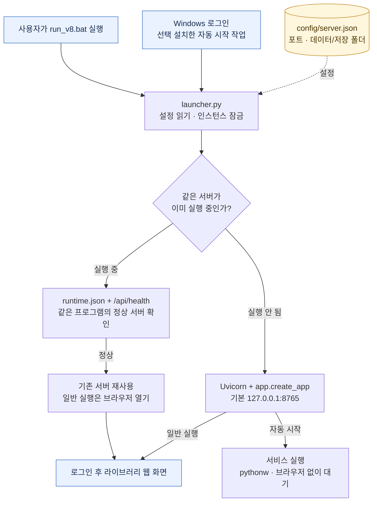
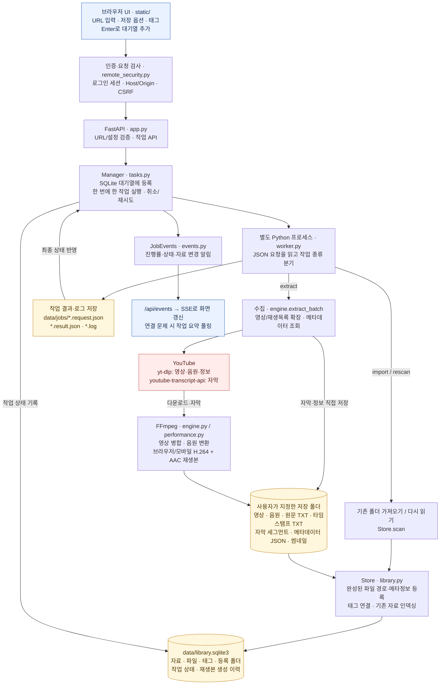
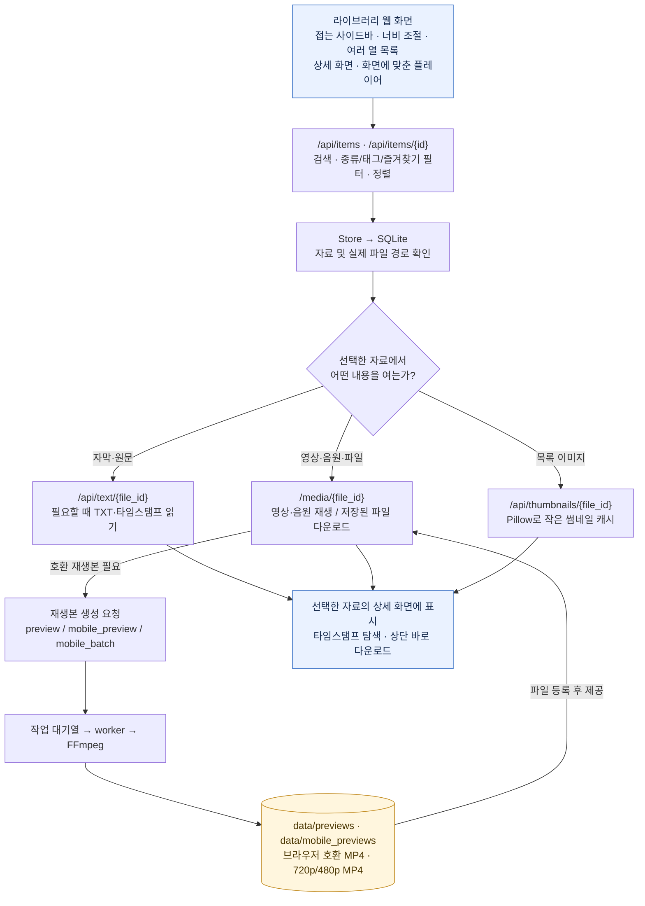
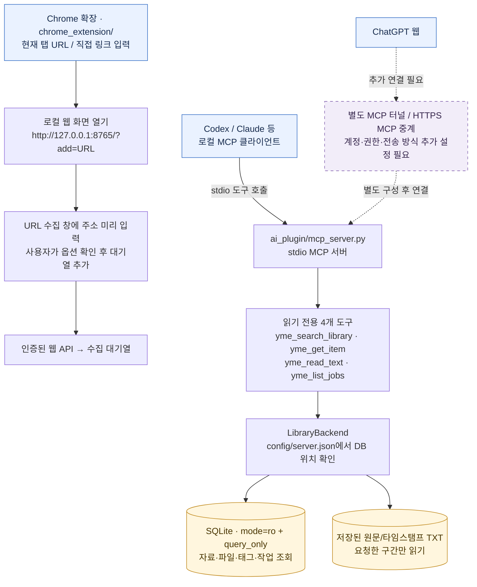

# YouTube Media Library V8 beta.2 공유 패키지

Windows에서 YouTube 영상·음원·자막을 수집하고 태그·검색·재생으로 관리하는 로컬 웹 프로그램입니다.

[공유 ZIP 다운로드](./youtube_media_library_v8_beta2_share_20261001.zip?raw=true) · [구글 드라이브](https://drive.google.com/file/d/137JBAKkslnAyF3WR0fbidHYgGM0LLibW/view?usp=drivesdk) · [SHA-256](./SHA256SUMS.txt)

## 설치

1. Python 3.10 이상을 설치합니다.
2. ZIP을 쓰기 가능한 폴더에 압축 해제합니다.
3. `01_setup_beta.bat`으로 의존성과 본인의 로그인 계정을 설정합니다.
4. `run_v8.bat`으로 실행하고 `http://127.0.0.1:8765`에서 로그인합니다.
5. Windows 로그인 후 자동 시작은 `OPTIONAL_logon_only.bat`, 종료는 `stop_v8_beta.bat`입니다.

ZIP의 `SHARE_START.md`에 첫 실행 안내가 있습니다. Chrome 확장은 `chrome_extension`, 읽기 전용 AI MCP 서버는 `ai_plugin`에 포함됩니다. ChatGPT 웹 연결은 별도의 터널/HTTPS MCP 설정이 필요합니다.

## 포함된 수정

- 이미 켜진 자동 시작 서버를 BAT에서 재사용하고 브라우저 열기.
- URL 입력 Enter 제출 / Shift+Enter 줄바꿈.
- 목록·상세 사이 너비 조절, 넓은 목록에서 여러 열 표시, 사이드바 접기.
- 화면 크기에 맞춘 플레이어, 상단 다운로드 링크, 태그 및 패널 접기 개선.
- Chrome 현재 탭 전송 / 직접 링크 입력, AI MCP 검색·조회·자막 읽기.

개인 계정 설정·API 키·DB·영상·음원·자막·로그·가상환경은 포함하지 않습니다. Python 의존성은 첫 설치 때 다운로드합니다. 다운로드할 권한이 있는 자료에 사용하세요.

Windows/Python 3.13 회귀 검사: 76 passed, 5 skipped. ZIP CRC·파일별 SHA-256·새 폴더 압축 해제와 Python 문법 검사 통과. 패키지 80개 파일 / 168,328 bytes.

## 시스템 구조

실제 배포 코드 기준 구조입니다. 세로 모니터에서도 읽기 쉽도록 **모든 다이어그램을 위에서 아래로(TB)** 배치하고, 실행·수집·열람·연동을 각각 자세히 그렸습니다.

### 1. Windows 실행과 서버 재사용

잠금은 있는데 서버가 응답하지 않거나 다른 프로그램이 포트를 쓰는 경우에는 오류를 표시합니다. 이미 실행 중인 정상 서버를 새로 띄우는 대신 재사용합니다.

### 2. 웹 서버, 작업 대기열과 수집 저장

수집은 별도 프로세스에서 실행됩니다. 웹 서버는 검색·재생·대기열 조작 요청을 계속 처리하고, 작업 관리자는 진행률과 결과를 기록해 UI에 알립니다. 기존 폴더 가져오기는 실제 파일을 이동하지 않고 등록합니다.

### 3. 검색, 영상 재생과 파일 다운로드

재생본은 원본과 별도로 만듭니다. 실제 영상·자막은 파일 시스템에 있고 SQLite는 검색·관리용 인덱스와 작업 상태를 보관합니다. 목록·텍스트 응답에는 ETag를 사용하고, 썸네일과 재생본은 다시 사용할 수 있도록 관리합니다.

### 4. Chrome 확장과 AI MCP 연결

- Chrome 확장은 수집 창에 URL을 전달합니다. 다운로드를 시작하는 단계는 웹 화면의 대기열 추가입니다.
- AI MCP는 웹 서버를 경유하지 않고 로컬 DB와 자막 파일을 직접 읽습니다. 현재 제공 도구로 다운로드를 실행하거나 파일을 변경하지 않습니다.
- ChatGPT 웹용 계정·터널 설정은 공유 패키지에 포함되지 않습니다. 점선은 추가 연결이 필요한 경로입니다. HTTPS 방식을 쓰려면 별도 HTTP MCP 구성이 필요합니다.
- 선택 가능한 원격 웹 접속은 Tailscale HTTPS 또는 Cloudflare 중계 설정으로 구성합니다. Cloudflare 경로는 관리 기능용이며 영상·음원 전송과 5 MB 초과 파일이 차단됩니다.

### 주요 코드 위치

ZIP 안에서 아래 파일을 확인할 수 있습니다.

| 구성 | 코드 | 역할 |
| --- | --- | --- |
| 실행·서버 재사용 | `launcher.py` | 설정, 잠금, 정상 서버 확인, Uvicorn 실행 |
| 웹 API·보안 | `app.py`, `yme/remote_security.py` | 로그인, 요청 검사, 자료·작업·파일 API |
| 작업 관리 | `yme/tasks.py`, `yme/worker.py`, `yme/events.py` | 대기열, 프로세스, 취소·재시도, SSE 알림 |
| 수집·변환 | `yme/engine.py`, `yme/performance.py` | YouTube 수집, FFmpeg, 썸네일·재생본 |
| 자료 저장소 | `yme/library.py` | SQLite, 파일 등록, 태그, 검색 |
| 웹 화면 | `static/index.html`, `static/app.js`, `static/styles.css` | 목록, 상세, 재생, URL 창, 너비·접기 |
| 브라우저 연동 | `chrome_extension/` | 현재 탭/직접 입력 URL 전달 |
| AI 연동 | `ai_plugin/mcp_server.py`, `ai_plugin/library_backend.py` | 읽기 전용 stdio MCP, DB·TXT 조회 |
