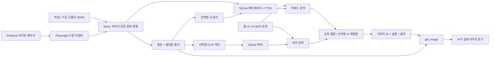

# Pin Archive 1.1.0 구조

## 모듈 경계

`store.py`는 영구 저장과 데이터 검증, `network.py`는 제한된 원격 다운로드, `collector.py`는 Pinterest 화면 해석을 담당합니다. `sources.py`는 보드별 수집 설정, 발견한 핀, 상세 정보 변경 이력과 실패 재시도 상태를 SQLite에 기록합니다. 목록이나 상세 화면 구조가 바뀌면 `EXTRACT_JS`와 `PIN_DETAIL_JS`를 확인합니다.

`search.py`는 메타데이터 키워드 검색과 선택형 의미 검색을 제공하며, 임베딩은 모델 ID와 함께 저장합니다. 다른 모델 벡터가 섞이지 않도록 쿼리 시 같은 모델 조합을 사용합니다. 벡터 스캔은 개인 라이브러리용으로 단순 구현했으며 ANN 엔진이 아닙니다.

`ai.py`는 공급자별 요청과 구조화 응답 검증을 담당합니다. AI 결과는 원문/수동 값과 분리합니다. 메타데이터와 이미지 속 텍스트는 지시가 아닌 입력 자료로 처리하라는 안내를 프롬프트에 넣었지만, 이것만으로 모든 프롬프트 주입 공격이 차단된다고 보장하지 않습니다.

`jobs.py`는 단일 작업자와 보드별 예약 실행기를 사용합니다. 한 번에 여러 Pinterest 브라우저가 같은 로그인 프로필을 점유하지 않도록 순차 실행합니다. 반복 수집은 창 없는 Chrome으로 보드 탐색, 상세 수집, 미완료 이미지 저장을 순서대로 진행합니다. 작업 중단은 강제 스레드 종료가 아니라 협력적 취소입니다. 네트워크/모델 요청이 끝난 뒤 중단되며 저장된 결과는 유지됩니다.

`main.py`는 로컬 HTTP API와 보안 헤더, `web/`는 번들러 없는 HTML/CSS/JavaScript, `mcp_bridge.py`는 읽기 전용 stdio 연결입니다.

## 실행 포트 발견

`run.py`는 localhost 소켓을 선점한 채 첫 빈 포트를 선택하고 Uvicorn에 그 소켓을 전달합니다. 선택한 포트, 프로세스 ID와 실행별 식별값을 `data/runtime.json`에 원자적으로 기록하며 정상 종료 시 자기 식별값과 일치할 때만 제거합니다. `app/runtime.py`는 상태 파일의 형식과 실제 `/api/health` 식별값을 확인한 뒤 주소를 반환합니다. MCP와 크롤러 가져오기 예제는 기본적으로 이를 사용하며, 별도 데이터 폴더 또는 명시적 로컬 URL을 지정할 수 있습니다. 상태 파일이 오래되었거나 다른 서버를 가리키면 임의 포트로 연결하지 않고 오류를 반환합니다.

## 저장과 추론의 구분

파일 SHA-256은 바이트가 같은 파일, RGBA 픽셀 해시는 디코딩 결과가 같은 정지 이미지를 병합합니다. 색 보정/크롭/재압축으로 픽셀이 바뀐 유사 이미지는 자동 삭제하지 않습니다. dHash는 후보 참고용입니다. 애니메이션은 전체 바이트 해시를 사용해 다른 후속 프레임을 가진 파일을 잘못 병합하지 않습니다.

모든 이미지 원본은 로컬에 보존합니다. AI 분석은 크기를 줄인 JPEG, MCP는 WebP 썸네일을 전달합니다. 이는 원본 해상도를 그대로 모델에 전달하는 설계가 아닙니다. 상세 분석에는 원본 확인이 필요할 수 있습니다.

## 다음 확장 지점

별도 작업자로 수집 병렬화, SQLite 후보 전량 로딩 제거, ANN 벡터 인덱스, 키워드 정규화·동의어 사전, 안전한 원격 MCP 인증/전송을 모듈 단위로 추가할 수 있습니다. 예약 실행기는 로컬 서버가 켜져 있는 동안에만 작동합니다.
