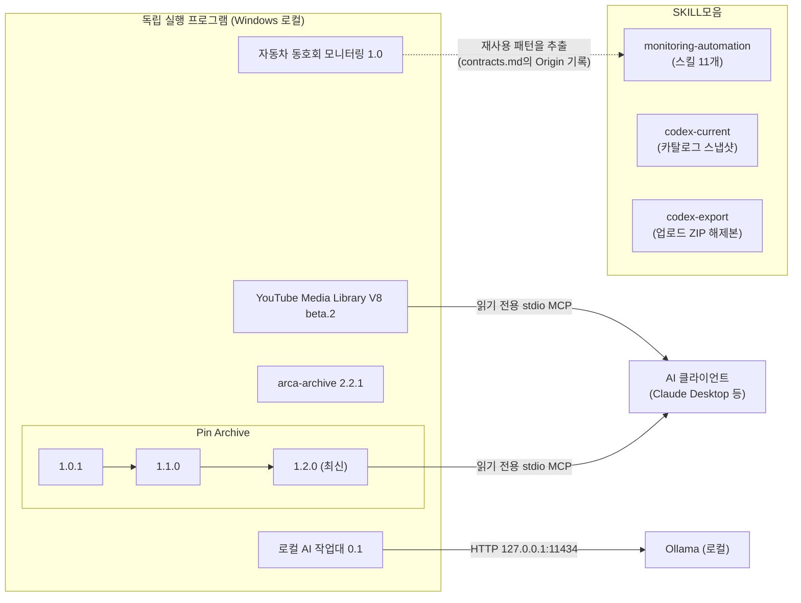

# 26_-AI- · 26_잡다한AI제작

AI로 이것저것 만들어 보는 저장소입니다. 지금까지 **Windows용 로컬 프로그램 5종** 과 **스킬 모음 1종**이 올라와 있으며, 대부분 소스가 풀린 폴더가 아니라 **배포용 ZIP + 안내 문서(README)** 형태로 보관되어 있습니다.

> 이 문서는 2026-10-02 기준으로 각 폴더의 README, 배포 ZIP 안의 소스·설정·변경 기록을 직접 열어 확인한 내용만 정리했습니다. 각 프로그램이 "실제로 검증된 범위"는 해당 프로젝트 README의 기록을 그대로 따랐고, 이 문서를 쓰면서 프로그램을 새로 실행해 검증한 것은 아닙니다.

## 목차

1. [전체 프로젝트 목록](#1-전체-프로젝트-목록)
2. [저장소 구조](#2-저장소-구조)
3. [프로젝트 간 관계](#3-프로젝트-간-관계)
4. [프로젝트별 상세](#4-프로젝트별-상세)
5. [공통 사항과 주의점](#5-공통-사항과-주의점)

---

## 1. 전체 프로젝트 목록

| 등록일 | 프로젝트 | 한 줄 요약 | 버전 | 형태 | 주요 기술 |
| --- | --- | --- | --- | --- | --- |
| 2026-10-01 | [자동차 동호회 모니터링](20261001_cafe_monitoring_v1.0/) | 네이버 카페 게시글 수집 → AI 분석 → PPT 보고서 → Outlook 발송 | 1.0 (내부 10.0.0) | 배포 ZIP + 압축 해제된 소스 | Python, SQLite, Playwright, Codex CLI/OpenAI API, PowerPoint·Outlook COM |
| 2026-10-01 | [arca-archive](20261001_arca_archive_v2.2.1/) | 아카라이브·디시인사이드·네이버 카페 게시글/미디어 로컬 보관 | 2.2.1 | 배포 ZIP | Python, FastAPI, SQLite, httpx, Playwright |
| 2026-10-01 | [로컬 AI 작업대](20261001_local_ai_workbench_v0.1/) | Ollama 모델로 대화·두 모델 비교·로컬 문서 질문(RAG) | 0.1 | 배포 ZIP | React 19, Vite, FastAPI, Ollama, SQLite |
| 2026-10-01 | [YouTube Media Library](20261001_youtube_media_library_v8_beta2/) | YouTube 영상·음원·자막 수집, 태그·검색·재생 관리 | V8 beta.2 | 배포 ZIP | Python, FastAPI, yt-dlp, FFmpeg, Chrome 확장, MCP |
| 2026-10-02 | [Pin Archive](20261002_pin_archive/) | Pinterest·로컬 이미지 시각 레퍼런스 라이브러리 (1.0.1 → 1.1.0 → 1.2.0 배포본을 한 폴더에 보관) | 1.2.0 (최신) | 배포 ZIP | Python, FastAPI, SQLite(FTS5), Playwright, MCP |
| 2026-10-02 | [SKILL모음](SKILL모음/) | Codex 스킬 보관 모음(자동화 스킬 11개 + 카탈로그 스냅샷 + 업로드 ZIP 해제본) | — | 폴더·문서 모음 | Markdown(`SKILL.md`), 일부 Python 스크립트 |

등록일은 폴더명 접두어(`YYYYMMDD`)와 git 최초 커밋 날짜가 일치하는 값입니다.

---

## 2. 저장소 구조

배포 ZIP 안의 파일은 트리에 펼치지 않고 요약해 두었습니다. `SKILL모음/codex-current/`처럼 파일이 매우 많은 폴더는 하위를 생략했습니다.

```text
26_-AI-/
├── README.md                                  ← 이 문서
│
├── 20261001_cafe_monitoring_v1.0/             ← 자동차 동호회 모니터링 1.0
│   ├── README.md · SHA256SUMS.txt
│   ├── cafe_monitoring/                       ← 배포 ZIP을 그대로 푼 프로그램(356개 파일)
│   │   ├── 01_setup_v10.bat · 02_start_v10.bat · 03_verify_v10.bat
│   │   ├── v10/                               ← 서버·DB·예약·Office 연동 등 운영 코드
│   │   ├── engine/                            ← V5~V9 계열 수집·AI·PPT 엔진
│   │   ├── web/                               ← 웹 화면(index.html, base.js, integration.js)
│   │   ├── tests/ · docs/
│   ├── docs/                                  ← 결과보고서(.docx), 화면 안내, README 검토 기록
│   ├── releases/cafe_monitoring_1.0_20260930.zip
│   └── screenshots/                           ← 실행 화면 18장
│
├── 20261001_arca_archive_v2.2.1/              ← arca-archive 2.2.1
│   ├── README.md · SHA256SUMS.txt
│   ├── releases/arca-archive-2.2.1-share-20261002.zip
│   └── screenshots/                           ← 가상 데이터 화면 8장
│
├── 20261001_local_ai_workbench_v0.1/          ← 로컬 AI 작업대 0.1
│   ├── README.md · SHA256SUMS.txt
│   └── local-ai-workbench-share-2026-10-01.zip
│
├── 20261001_youtube_media_library_v8_beta2/   ← YouTube Media Library V8 beta.2
│   ├── README.md · SHA256SUMS.txt
│   ├── youtube_media_library_v8_beta2_share_20261001.zip
│   └── screenshots/                           ← 실행 화면 5장
│
├── 20261002_pin_archive/                      ← Pin Archive (버전별 배포본을 한 폴더에 모음)
│   ├── README.md                              ← 버전 안내
│   ├── v1.0.1/                                ← ZIP 4종
│   ├── v1.1.0/                                ← ZIP 1종
│   └── v1.2.0/                                ← ZIP 1종 (최신)
│       └── (각 버전 폴더: README.md · SHA256SUMS.txt · *.zip)
│
└── SKILL모음/                                 ← Codex 스킬 보관 모음
    ├── README.md · CATALOG.json · CATALOG_SHA256SUMS.txt
    ├── monitoring-automation/                 ← 모니터링·업무 자동화 스킬 11개 + ZIP
    ├── codex-current/                         ← 2026-10-02 카탈로그 스냅샷(234개 항목)
    │   ├── plugins/                           ← 플러그인 제공 스킬 (25개 플러그인)
    │   └── standalone/                        ← 독립 항목 (49개 폴더)
    └── codex-export/                          ← 업로드한 skills.zip 해제본(16개 스킬 폴더)
```

각 배포 폴더의 `SHA256SUMS.txt`는 ZIP의 무결성 확인용 해시입니다.

---

## 3. 프로젝트 간 관계

저장소 문서·코드에서 **명시적으로 확인되는 관계만** 그렸습니다. 확인되지 않은 연결(예: 프로그램 간 데이터 공유)은 넣지 않았습니다.



| 관계 | 근거 |
| --- | --- |
| **Pin Archive 1.0.1 → 1.1.0 → 1.2.0** — 같은 프로그램의 버전 이력 | 1.1.0·1.2.0 README가 "이전 배포본을 보관했다"고 명시하고, 1.2.0 `CHANGELOG.md`에 1.0.1부터의 변경이 이어서 기록되어 있음 |
| **자동차 동호회 모니터링 ⇢ monitoring-automation 스킬** | `SKILL모음/monitoring-automation/build-monitoring-pipeline/references/contracts.md`에 *"reusable patterns extracted from cafe_monitoring V10 …"* 라고 출처가 적혀 있음. 단, 자동차 필드·사이트 선택자·수신자·예약 기본값은 가져오지 않는다고 명시 |
| **YouTube Media Library · Pin Archive → AI 클라이언트** | 두 프로그램 모두 **읽기 전용 stdio MCP 서버**(`ai_plugin/mcp_server.py`, `mcp_bridge.py`)를 포함. 서로 호출하는 관계는 아니며 같은 방식을 쓴다는 의미입니다 |
| **로컬 AI 작업대 → Ollama** | `backend/config.py`의 `OLLAMA_URL` 기본값 `http://127.0.0.1:11434` |

이 밖에 확인된 **공통 구현 방식**(서로 연결된 것은 아님):

- 자동차 동호회 모니터링과 arca-archive는 모두 **Playwright + Chrome 전용 프로필**로 로그인 세션을 쓰고 **SQLite**에 이력을 저장합니다. arca-archive는 네이버 카페도 지원하지만, 문서상 자동차 동호회 모니터링과 코드를 공유한다는 기록은 없습니다.
- 모든 프로그램이 `127.0.0.1`(내 PC)에서만 동작하는 로컬 웹 앱이고, 데이터(DB·미디어·로그인 프로필)는 배포 ZIP에 포함하지 않습니다.

---

## 4. 프로젝트별 상세

### 4.1 자동차 동호회 모니터링 · Version 1.0

📁 [`20261001_cafe_monitoring_v1.0/`](20261001_cafe_monitoring_v1.0/) · [프로젝트 README](20261001_cafe_monitoring_v1.0/README.md)

- **목적**: 네이버 자동차 동호회 카페에서 차량 이상 증상 게시글을 찾고, 원문을 캡처해 보고서를 만드는 **반복 업무를 줄이는 것**. 수집부터 PowerPoint 보고서 생성, Outlook 메일 발송까지 한 흐름으로 연결합니다.
- **주요 기능**
  - 카페·키워드 관리(기본 카페 9개·키워드 18개), 제목 키워드 검색 기반 수집, 수집 기간 지정(최근 24/48시간·이전 실행 이후·직접 지정)
  - Codex CLI 또는 OpenAI API로 AI 분석(분류·구조화·원문 근거 연결), 원문 버전·검토 기록 보존
  - PPT 보고서 생성, **PPT만 재생성**(재수집·AI·메일 없이), Outlook 발송
  - 실행 이력, 데이터 분석 및 Excel 내보내기, 서버 내부 예약 실행(한국 시간, 주말 제외)
- **기술 스택**: Python(표준 라이브러리 HTTP 서버 + 별도 작업 프로세스), SQLite, HTML/JavaScript 웹 화면, Playwright + Chrome, Pillow, jsonschema, PowerPoint·Outlook COM(Windows 전용), Windows DPAPI
- **실행**: `01_setup_v10.bat` → `02_start_v10.bat` → `http://127.0.0.1:8766` · Python 3.11+, Chrome, 데스크톱 PowerPoint, Classic Outlook 필요
- **현재 상태**: 정식 배포 1.0(내부 버전 10.0.0)
  - 기록된 검증: 2026-09-30 사용자 Windows에서 RC1.7 오프라인 검사 75개 통과, 같은 날 9개 카페·게시글 16건·PPT 30장 통합 실행. 2026-10-02 Linux 재검사에서 Python 74개 통과(Windows 전용 1개 제외)·JavaScript 49개 통과(외부 수집·AI·Office는 테스트 대역 사용)
  - README에 따르면 **정식 1.0 변경본을 Windows에서 다시 실행한 결과, 새 PC 최초 설치, 장시간 예약은 아직 확인 전**입니다.
- **유의**: AI 분석은 고객이 보고한 내용을 정리하는 자료이며, 특정 부품의 불량·원인을 확정하지 않습니다(담당자 검토 전제).

### 4.2 arca-archive 2.2.1

📁 [`20261001_arca_archive_v2.2.1/`](20261001_arca_archive_v2.2.1/) · [프로젝트 README](20261001_arca_archive_v2.2.1/README.md)

- **목적**: 아카라이브, 디시인사이드 공개 마이너 갤러리, 네이버 카페의 게시글과 미디어를 **내 PC에 증분 수집·보관**.
- **주요 기능**: 채널 등록과 주기 수집(서버 내 스케줄러), 목록 탐색 → 본문 수집 → 재확인 → 대기 작업 파이프라인, 게시글·미디어·북마크 열람 화면, 대기(backlog) 진단, 실행 기록, DB 백업·JSONL 내보내기, CLI(`serve`·`run`·`login`·`add-channel`·`backup`·`export` 등). HTTP로 시작해 HTTP 451·로그인 필요·Cloudflare 확인 화면을 만나면 브라우저(Playwright)로 전환합니다.
- **기술 스택**: Python 3.11+, FastAPI·Uvicorn·Jinja2, httpx, lxml, Playwright 1.62, SQLite(WAL)
- **실행**: `install.bat` → `start.bat` → `http://127.0.0.1:8766`
- **현재 상태**: 2.2.1 공개본(미디어 대기 처리량 조정과 HTTP 451 별도 분류). 릴리스 노트상 처리량 향상은 **운영 측정 전**이며, **네이버 회원 전용 본문의 실제 수집 검증은 완료되지 않았습니다.** 화면 캡처는 가상 게시글 12개와 도형 이미지로 만든 테스트 인스턴스 기준입니다.
- **배포 범위**: 소스·설치 파일·예제 설정 포함, 수집 DB·미디어·로그·로그인 세션·테스트 fixture 제외.

### 4.3 로컬 AI 작업대 0.1

📁 [`20261001_local_ai_workbench_v0.1/`](20261001_local_ai_workbench_v0.1/) · [프로젝트 README](20261001_local_ai_workbench_v0.1/README.md)

- **목적**: 설치된 Ollama 모델로 **일반 대화, 두 모델 비교, 선택한 폴더의 문서 질문(출처 표시)** 을 한 화면에서 해 보는 로컬 웹 앱.
- **주요 기능**
  - 일반 대화: Gemma 4(`gemma4:26b-a4b-it-qat`), Qwen 3.6(`qwen3.6:27b-coding`), 선택적으로 Qwen 3 8B
  - 모델 비교: 같은 질문을 두 모델에 순서대로 실행, 첫 토큰 시간·총 시간·토큰 속도 표시
  - 폴더 질문: 임베딩(`qwen3-embedding:0.6b`) 기반 검색 + 키워드 보정, 최대 5개 구간을 근거로 답변과 원문 출처 표시. TXT·MD·코드/설정·CSV·JSON·HTML·PDF·DOCX 지원(이미지 PDF OCR 미지원)
  - 실행 로그 화면(서버 메모리에 최근 500건)
- **기술 스택**: React 19 + Vite(프런트엔드), FastAPI + httpx(백엔드), pypdf, python-docx, SQLite(색인·비교 기록), Ollama
- **실행**: PowerShell에서 `start.ps1` → `http://127.0.0.1:8768` (종료는 `stop.ps1`) · Python, Node.js/npm, Ollama와 모델 3종 사전 설치 필요
- **현재 상태**: v0.1 공유 패키지. README의 설명은 개발 PC(GPU 메모리 6GB) 기준으로, 큰 모델은 CPU와 GPU를 함께 써서 느릴 수 있다고 안내합니다. 답변의 인용 번호는 모델이 쓴 것이라 원문 대조가 필요하며, 색인은 자동 갱신되지 않습니다.

### 4.4 YouTube Media Library V8 beta.2

📁 [`20261001_youtube_media_library_v8_beta2/`](20261001_youtube_media_library_v8_beta2/) · [프로젝트 README](20261001_youtube_media_library_v8_beta2/README.md)

- **목적**: YouTube 영상·음원·자막을 수집하고 **태그·검색·재생으로 관리**하는 로컬 웹 프로그램.
- **주요 기능**: URL 수집 대기열(영상·음원·자막, 화질·형식 선택), 영상/재생목록 확장, 브라우저·모바일 호환 재생본 생성, 타임스탬프·자막 열람, 태그·즐겨찾기 검색, 기존 폴더 가져오기, 로그인·CSRF 등 요청 검사, Chrome 확장(현재 탭 URL 전달), **읽기 전용 AI MCP 서버**(검색·조회·자막 읽기·작업 목록 4개 도구)
- **기술 스택**: Python 3.10+, FastAPI·Uvicorn, yt-dlp, youtube-transcript-api, imageio-ffmpeg(FFmpeg), Pillow, SQLite, 바닐라 JS 웹 화면, Chrome 확장(Manifest V3)
- **실행**: `01_setup_beta.bat` → `run_v8.bat` → `http://127.0.0.1:8765`
- **현재 상태**: beta.2. README 기록상 Windows/Python 3.13에서 회귀 검사 **76 passed, 5 skipped**. ChatGPT 웹 연결과 원격 접속(Tailscale·Cloudflare)은 사용자가 별도로 구성해야 하며 패키지에 포함되지 않습니다. 다운로드할 권한이 있는 자료에만 사용하도록 안내합니다.

### 4.5 Pin Archive (1.0.1 → 1.1.0 → 1.2.0)

📁 [`20261002_pin_archive/`](20261002_pin_archive/) — [`v1.2.0`](20261002_pin_archive/v1.2.0/) · [`v1.1.0`](20261002_pin_archive/v1.1.0/) · [`v1.0.1`](20261002_pin_archive/v1.0.1/)

- **목적**: Pinterest와 로컬 이미지를 메타데이터와 함께 보관·검색하는 **개인용 시각 레퍼런스 라이브러리**. AI가 읽기 전용 MCP로 이미지 후보를 검색하고 실제 썸네일을 읽을 수 있습니다.
- **주요 기능(1.2.0 기준)**
  - 이미지 가져오기(파일·폴더·URL·기존 크롤러 JSON), 중복 병합(SHA-256·픽셀 비교), 한글·영문 키워드 검색(SQLite FTS5), 보드·즐겨찾기·ZIP 내보내기
  - Pinterest 전용 프로필 로그인, 보드·검색 키워드별 **반복 수집**(간격·탐색 상한·실행 시간 상한 설정, 실패 재시도, 핀 상세 변경 이력), 원본 확대 보기
  - 선택형 AI 태깅(OpenAI API/로컬 Ollama), 선택형 의미 검색(CLIP 임베딩 + RRF 하이브리드)
  - 읽기 전용 MCP 도구 6개(`search_images`·`show_images`·`get_image`·`get_image_metadata`·`list_collections`·`library_status`)
- **기술 스택**: Python(3.13에서 검증), FastAPI·Uvicorn, SQLite, Playwright, Pillow, NumPy, 선택 설치 sentence-transformers
- **실행**: ZIP을 완전히 푼 뒤 `pinterest_reference_v1/01_setup.bat` → `02_start.bat` (기본 포트 8765, 사용 중이면 다음 빈 포트 자동 선택)
- **버전별 상태**

| 버전 | 추가된 것 | README에 기록된 검증 |
| --- | --- | --- |
| 1.0.1 | 안정화본 + 패치 ZIP 3종(ChatGPT 갤러리 `show_images`, Pinterest 로그인 수정, 보드 수집 검증) | 오프라인 회귀 검사 88→92개 통과, 공개 보드에서 핀 1개 실수집 |
| 1.1.0 | 보드별 반복 수집, 핀 상세 변경 이력, 재시도 | 회귀 검사 99개 통과, 공개 보드에서 핀 53개 발견·이미지 4개 신규 저장 |
| **1.2.0 (최신)** | 검색 키워드 반복 수집, 처리 상한 기본 100개, 원본 확대 보기, 동영상 핀 대표 이미지 구분 | 회귀 검사 104개 통과, 신규 이미지 43개·99개 저장 기록 |

- **현재 상태**: 활발히 갱신 중인 프로젝트(3개 버전이 하루 사이 등록됨). **장기간 무인 수집, 비공개 보드, 계정 전체 보드 자동 동기화, 이미지 이용 권한은 검증·지원 범위 밖**이라고 README에 명시되어 있습니다. 실제 Pinterest 로그인 수집과 별개로 OpenAI/Ollama 추론·CLIP 추론은 1.0.1 기준 미검증으로 기록되어 있습니다.

### 4.6 SKILL모음

📁 [`SKILL모음/`](SKILL모음/) · [모음 README](SKILL모음/README.md)

- **목적**: Codex에서 확인한 스킬 자료와 사용자가 올린 `skills.zip`의 해제본을 한곳에 보관. README에 "보관했다는 것이 Codex에 설치·활성화했다는 뜻은 아니다"라고 명시되어 있습니다.
- **구성**

| 폴더 | 내용 | 규모(직접 확인) |
| --- | --- | --- |
| [`monitoring-automation/`](SKILL모음/monitoring-automation/) | 수집·분석·보고·발송 등 모니터링 업무 자동화 스킬 묶음 + ZIP | `SKILL.md` 11개 |
| [`codex-current/`](SKILL모음/codex-current/) | 2026-10-02 카탈로그 스냅샷(시스템·플러그인 제공 스킬 포함). `plugins/`(플러그인 25개)와 `standalone/`(독립 항목 49개 폴더)로 분류 | `SKILL.md` 249개 (카탈로그 항목 234개) |
| [`codex-export/`](SKILL모음/codex-export/) | 업로드한 `skills.zip` 해제본 | `SKILL.md` 16개 |
| [`CATALOG.json`](SKILL모음/CATALOG.json) | 스킬 이름·설명·원 패키지 경로·저장 경로 색인 | JSON |

- **monitoring-automation의 11개 스킬**: 모니터링 자동화 설계 · 증분 웹 수집 · 원문/버전 이력 보존 · 근거 연결 AI 분석 · CLI AI 연동 · 근거 PPT 보고서 · 보고서 이미지 최적화 · Outlook 보고서 발송 · 로컬 운영 화면과 예약 실행 · 통계와 Excel 내보내기 · Windows 자동화 배포·검증. 실행 스크립트 6개(Python 표준 라이브러리 중심, 이미지 최적화는 Pillow, Excel은 openpyxl 필요)가 포함됩니다.
- **현재 상태**: README 기준으로 11개 스킬은 제작 시 41개 동작 검사와 가상 자료 시나리오를 확인했으나, **Windows·Office·실제 메일 발송까지의 종단 간 검증은 아닙니다.** `codex-current`·`codex-export`는 파일을 찾아보기 위한 정리본이며 호환성·동작을 새로 검증한 자료가 아닙니다.

---

## 5. 공통 사항과 주의점

- **실행 환경**: 모든 프로그램이 Windows 사용을 전제로 합니다(BAT·PowerShell 스크립트, Office COM 등). Pin Archive만 `setup.sh`·`start.sh`로 macOS/Linux 실행 방법도 제공합니다.
- **로컬 전용**: 웹 서버는 `127.0.0.1`에서 동작합니다. 외부 공개용 서비스가 아닙니다.
- **기본 포트가 겹칩니다**: 자동차 동호회 모니터링·arca-archive는 `8766`, YouTube Media Library·Pin Archive는 `8765`를 기본으로 씁니다. 여러 개를 동시에 켤 때는 포트를 확인하세요(Pin Archive는 사용 중이면 자동으로 다음 포트를 고릅니다).
- **개인 데이터는 저장소에 없습니다**: 수집한 DB·미디어·로그·로그인 세션·API 키는 배포본에 포함하지 않았다고 각 README가 밝히고 있습니다. 업데이트할 때는 사용 중인 `data/` 폴더를 보존하세요.
- **무결성 확인**: 각 배포 폴더의 `SHA256SUMS.txt`로 ZIP 해시를 확인할 수 있습니다.
- **수집 대상 이용 권한**: 웹 수집 도구들은 접근·이용 권한이 있는 자료에만 쓰도록 안내하고 있습니다. 각 서비스의 약관과 저작권은 사용자가 확인해야 합니다.
- **개별 README 우선**: 설치·사용법과 검증 범위의 세부 내용은 각 프로젝트 README(및 ZIP 안의 `docs/`)가 기준입니다.
