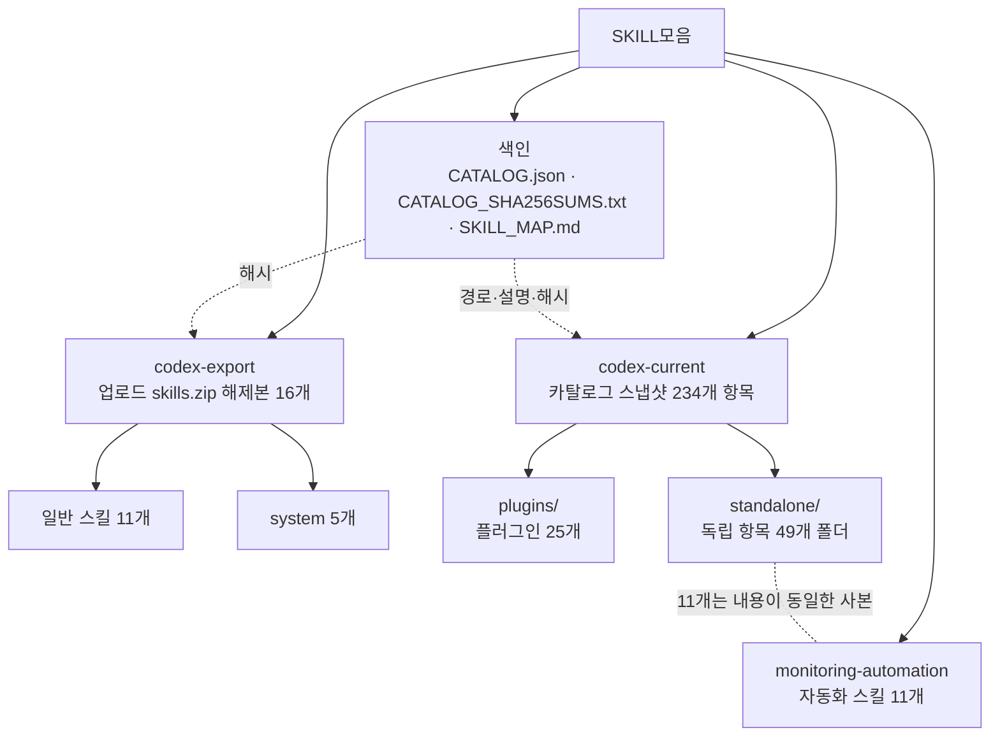

# Codex 스킬 모음

Codex에서 확인한 스킬 자료와 사용자가 올린 `skills.zip`의 압축 해제본을 한곳에서 찾아볼 수 있도록 정리한 보관 모음입니다. 스킬별 안내와 리소스를 원본 폴더 구조에 가깝게 보존했습니다. 이 저장소에 보관했다는 뜻은 Codex에 새로 설치하거나 활성화했다는 뜻은 아닙니다.

> 🗺️ **스킬별 노드 그림과 설명 표는 [스킬 지도(SKILL_MAP.md)](SKILL_MAP.md)에서 볼 수 있습니다.**

## 구성 한눈에 보기



## 한눈에 보기

| 위치 | 내용 | 규모 |
|---|---|---:|
| [`monitoring-automation/`](monitoring-automation/) | 기존에 보관하던 모니터링·자동화 스킬 묶음. 기존 파일을 그대로 유지했습니다. | 11개 스킬 |
| [`codex-current/`](codex-current/) | 2026-10-02에 현재 세션의 스킬 카탈로그에서 수집한 스냅샷. 각 항목의 전체 폴더와 함께 복사했고, `plugins/`(플러그인별)와 `standalone/`(단독 항목)으로 나눠 두었습니다. | 카탈로그 234개 항목, `SKILL.md` 파일 249개 |
| [`codex-export/`](codex-export/) | 이번 대화에서 받은 `skills.zip`을 풀어 둔 자료. `SKILL.md`가 있는 개별 스킬 폴더를 모두 보존했습니다. | 16개 스킬 폴더 |
| [`SKILL_MAP.md`](SKILL_MAP.md) | 스킬 이름·한 줄 설명을 노드 그림(Mermaid)과 표로 정리한 색인 | 마크다운 |
| [`CATALOG.json`](CATALOG.json) | 현재 카탈로그 항목의 표시 이름, 설명, 원래 패키지 경로, 이 모음 안의 경로와 ZIP 스킬 폴더 목록 | JSON 색인 |
| [`CATALOG_SHA256SUMS.txt`](CATALOG_SHA256SUMS.txt) | `codex-current/`, `codex-export/`, `CATALOG.json` 파일의 무결성 확인용 SHA-256 목록 | 파일별 해시 |

`codex-current`의 항목 수와 실제 `SKILL.md` 수가 다른 까닭은 일부 상위 스킬에 하위 스킬이나 예제 스킬이 함께 들어 있기 때문입니다. 두 수치는 중복을 제거한 전체 고유 스킬 수를 뜻하지 않습니다.

## 폴더 안내

### `monitoring-automation/`

이번 정리 전부터 있던 모음입니다. 기존 README, `CONTENTS.json`, `SHA256SUMS.txt`, ZIP 파일과 11개 스킬 폴더를 그 위치에 남겨 두었습니다. 이 폴더의 체크섬은 기존 11개 배포본을 대상으로 하며, 새 스냅샷 체크섬과 별개입니다.

### `codex-current/`

현재 세션에서 조회된 스킬 카탈로그 234개 항목의 스냅샷입니다. 찾기 쉽도록 두 갈래로 나눠 저장했습니다.

```text
codex-current/
├── plugins/      ← 플러그인이 제공한 스킬. plugins/<플러그인>/<스킬>/ (25개 플러그인)
└── standalone/   ← 플러그인 접두어가 없는 독립 항목 49개 폴더 (standalone/<스킬>/)
```

- 이름에 `패키지:` 접두어가 붙은 항목은 `plugins/<패키지>/<스킬이름>/`에 있습니다. 예: `figma:…` → `plugins/figma/…`
- 접두어가 없는 항목은 `standalone/<이름>/`에 있습니다. 단, `understand-anything`은 자체 `SKILL.md`와 하위 스킬 9개가 한 폴더에 함께 있어 `plugins/understand-anything/`에 두었습니다.
- 원래 이름, 패키지 URI, 저장 경로는 [`CATALOG.json`](CATALOG.json)의 `current_skills` 배열에서 찾을 수 있습니다. 경로는 모두 이 구조를 기준으로 갱신되어 있습니다.
- `standalone/` 안의 모니터링·자동화 스킬 11개(`analyze-evidence-records` 등)는 [`monitoring-automation/`](monitoring-automation/)의 같은 이름 폴더와 **내용이 동일한 사본**입니다(차이 비교로 확인). 카탈로그 스냅샷의 완전성을 위해 그대로 남겨 두었습니다.

이 목록은 당시 로드된 카탈로그의 스냅샷입니다. 개인이 직접 작성한 스킬만을 의미하지 않으며, 기본·시스템 스킬과 플러그인 제공 스킬도 포함합니다. 카탈로그가 갱신되면 이 스냅샷의 수와 현재 UI의 목록이 달라질 수 있습니다.

카탈로그의 플러그인별 항목 수는 다음과 같습니다. 접두어가 없는 카탈로그 항목은 50개이며, 이 중 `understand-anything` 1개는 위 설명대로 `plugins/`에 있습니다.

| 카탈로그 접두어 | 항목 수 |
|---|---:|
| `understand-anything` | 9 |
| `build-web-apps` | 6 |
| `build-web-data-visualization` | 1 |
| `cloud-environment` | 1 |
| `data-analytics` | 15 |
| `app-6a3c278c93ac8191b29768648d63a754` | 1 |
| `fal` | 15 |
| `figma` | 14 |
| `game-studio` | 9 |
| `google-drive` | 5 |
| `life-science-research` | 50 |
| `notion` | 4 |
| `openai-developers` | 4 |
| `pages` | 4 |
| `work-pets` | 3 |
| `plugin-management` | 1 |
| `product-design` | 5 |
| `remotion` | 12 |
| `sites` | 4 |
| `superpowers` | 15 |
| `write-like-me` | 1 |
| `defense-factory` | 1 |
| `demos` | 2 |
| `openai-library` | 1 |
| `template-creator` | 1 |
| **접두어가 없는 항목** | **50** |
| **합계** | **234** |

### `codex-export/`

업로드한 ZIP에서 16개 `SKILL.md` 폴더를 추출했습니다. 일반 스킬 11개와 `.system` 아래의 시스템 스킬 5개가 포함됩니다. 숨김 디렉터리 `.system`은 내용을 유지한 채 알아보기 쉬운 `system/` 이름으로 정리했습니다. ZIP에서 이름이 겹치는 스킬도 출처별 내용을 보존하도록 현재 카탈로그 스냅샷과 별도 경로에 두었습니다.

각 스킬의 안내는 해당 폴더의 `SKILL.md`에서 시작합니다. `references/`, `scripts/`, `assets/`, `tests/` 같은 하위 폴더가 있으면 해당 스킬의 보조 자료이므로 함께 확인하세요.

## 전체 스킬 목록

모든 스킬의 이름과 한 줄 설명입니다. 설명은 각 스킬의 `SKILL.md`(또는 `CATALOG.json`)에 적힌 원문의 **첫 문장**이며, 영어는 번역하지 않고 그대로 두었습니다. 이름을 누르면 해당 `SKILL.md`로 이동합니다. 노드 그림은 [스킬 지도](SKILL_MAP.md)를 보세요.

### 1. monitoring-automation

| 분야 | 스킬 | 설명 |
|---|---|---|
| AI 분석 | [`analyze-evidence-records`](monitoring-automation/analyze-evidence-records/SKILL.md) | 문서·게시글·리뷰를 AI로 분류·요약하면서 각 판단을 원문 근거와 연결해야 할 때 사용한다. |
| 운영 도구 | [`build-local-automation-console`](monitoring-automation/build-local-automation-console/SKILL.md) | 반복 자동화를 로컬 웹 화면에서 실행·중지·예약하고 상태와 로그를 조회하는 운영 도구를 만들 때 사용한다. |
| 자동화 설계 | [`build-monitoring-pipeline`](monitoring-automation/build-monitoring-pipeline/SKILL.md) | 지속적인 모니터링·수집·AI 분석·보고·발송을 연결하는 자동화를 설계하거나 기존 파이프라인을 분리할 때 사용한다. |
| 웹 수집 | [`collect-incremental-web`](monitoring-automation/collect-incremental-web/SKILL.md) | 웹사이트·게시판·뉴스의 반복 수집, 마지막 성공 이후 증분 수집, 로그인 세션 유지, 원문과 캡처 연결이 필요할 때 사용한다. |
| 보고서 | [`create-evidence-ppt`](monitoring-automation/create-evidence-ppt/SKILL.md) | 수집 원문 캡처와 분석을 함께 담은 PowerPoint 보고서, 원문 발표자 노트, 요약본·미리보기 또는 이전 실행 기반 PPT 재생성이 필요할 때 사용한다. |
| 메일 자동화 | [`deliver-outlook-reports`](monitoring-automation/deliver-outlook-reports/SKILL.md) | Windows Classic Outlook COM으로 보고서 메일 초안을 만들거나 사용자가 승인한 발송 자동화를 구현할 때 사용한다. |
| 통계·내보내기 | [`export-monitoring-analytics`](monitoring-automation/export-monitoring-analytics/SKILL.md) | 수집 문서의 출처·키워드·기간별 통계, 추이, 상세 목록과 Excel 내보내기를 만들 때 사용한다. |
| AI 연동 | [`integrate-cli-ai`](monitoring-automation/integrate-cli-ai/SKILL.md) | Codex 등 CLI 기반 AI 도구를 Python·데스크톱 자동화에 연결하거나 로그인·프로세스 종료·JSON 응답 문제를 해결할 때 사용한다. |
| 이미지 처리 | [`optimize-report-images`](monitoring-automation/optimize-report-images/SKILL.md) | PowerPoint·문서에 넣을 긴 화면 캡처나 고해상도 이미지의 용량을 줄일 때 사용한다. |
| 배포·검증 | [`package-windows-automation`](monitoring-automation/package-windows-automation/SKILL.md) | Python·브라우저·Office를 사용하는 Windows 자동화 프로그램을 소스 폴더·ZIP으로 배포하거나 설치 안내를 정비할 때 사용한다. |
| 데이터 관리 | [`preserve-versioned-records`](monitoring-automation/preserve-versioned-records/SKILL.md) | 수집 문서의 원문 보존, 변경 감지, SQLite 실행 이력, 검토 이력, 산출물 해시, 기존 데이터 가져오기와 백업이 필요할 때 사용한다. |

### 2. codex-export

| 구분 | 스킬 | 설명 |
|---|---|---|
| 일반 | [`anime-video-upscale`](codex-export/anime-video-upscale/SKILL.md) | 로컬 애니메이션·일러스트 영상의 화질 개선과 2배·3배·4배 AI 업스케일에 사용합니다. |
| 일반 | [`chatgpt-local-mcp`](codex-export/chatgpt-local-mcp/SKILL.md) | Windows의 로컬 프로그램·저장 자료를 ChatGPT MCP 플러그인으로 연결하거나 연결 장애를 해결할 때 사용합니다. |
| 일반 | [`chatgpt-mcp-image-gallery`](codex-export/chatgpt-mcp-image-gallery/SKILL.md) | Add a visible multi-image gallery to a ChatGPT-connected MCP server using MCP Apps UI. |
| 일반 | [`github-drive-update-check`](codex-export/github-drive-update-check/SKILL.md) | 깃헙 구드 업로드 해", "깃허브 드라이브에 올려", "공유용 ZIP 배포"처럼 현재 작업한 프로젝트의 업로드를 요청할 때 사용합니다. |
| 일반 | [`hatch-pet`](codex-export/hatch-pet/SKILL.md) | Create, repair, validate, visually QA, and package Codex-compatible v2 animated pets from character art, generated images, company or prospect brand c… |
| 일반 | [`nai-v5-prompting`](codex-export/nai-v5-prompting/SKILL.md) | Create, convert, optimize, analyze, or troubleshoot NovelAI Diffusion V5 (NAI V5) prompts. |
| 일반 | [`pixel-art-rigging`](codex-export/pixel-art-rigging/SKILL.md) | Create editable pixel-art character cutout rigs and looping animations from supplied layered sprites, transparent PNG parts, or an illustration that n… |
| 일반 | [`playwright-interactive`](codex-export/playwright-interactive/SKILL.md) | Persistent browser and Electron interaction through `js_repl` for fast iterative UI debugging. |
| 일반 | [`playwright`](codex-export/playwright/SKILL.md) | Use when the task requires automating a real browser from the terminal (navigation, form filling, snapshots, screenshots, data extraction, UI-flow deb… |
| 일반 | [`procedural-motion-video`](codex-export/procedural-motion-video/SKILL.md) | Create and edit videos from local photos, illustrations, existing video clips, or procedural motion graphics using Remotion. |
| 일반 | [`screenshot`](codex-export/screenshot/SKILL.md) | Use when the user explicitly asks for a desktop or system screenshot (full screen, specific app or window, or a pixel region), or when tool-specific c… |
| system | [`imagegen`](codex-export/system/imagegen/SKILL.md) | Generate or edit raster images when the task benefits from AI-created bitmap visuals such as photos, illustrations, textures, sprites, mockups, or tra… |
| system | [`openai-docs`](codex-export/system/openai-docs/SKILL.md) | Use for Codex models/pricing, scheduled tasks, skills, settings, setup, troubleshooting, customization, automations, and self-knowledge—including 'you… |
| system | [`review-agent`](codex-export/system/review-agent/SKILL.md) | Perform a read-only, defect-first review of a specified code change and return every actionable finding. |
| system | [`skill-creator`](codex-export/system/skill-creator/SKILL.md) | Create or update a Codex skill with appropriately scoped instructions and any needed supporting resources. |
| system | [`skill-installer`](codex-export/system/skill-installer/SKILL.md) | Install Codex skills into $CODEX_HOME/skills from a curated list or a GitHub repo path. |

### 3. codex-current / standalone

플러그인 접두어가 없는 항목 49개입니다(이 중 `understand-anything`은 폴더가 `plugins/`에 있어 아래 4번에도 나옵니다).

| 스킬 | 설명 |
|---|---|
| [`analyze-evidence-records`](codex-current/standalone/analyze-evidence-records/SKILL.md) | 문서·게시글·리뷰를 AI로 분류·요약하면서 각 판단을 원문 근거와 연결해야 할 때 사용한다. |
| [`analyze-web-workflow`](codex-current/standalone/analyze-web-workflow/SKILL.md) | Analyze a website's actual UI structure, input events, loading states, and permitted request/response evidence to explain workflows, build repeatable… |
| [`answers-charts`](codex-current/standalone/answers-charts/SKILL.md) | Use when a chart would communicate a categorical comparison, trend, composition, or numeric relationship more clearly than prose. |
| [`answers-images`](codex-current/standalone/answers-images/SKILL.md) | Use when retrieved images would visually ground or meaningfully improve an answer. |
| [`answers-learning`](codex-current/standalone/answers-learning/SKILL.md) | Use when the user explicitly requests an objective multiple-choice knowledge quiz or pronunciation help. |
| [`atlas-review`](codex-current/standalone/atlas-review/SKILL.md) | Use when atlas-check.mjs reports stale or ungrounded pages, or when the user asks to verify an existing visual atlas against current code. |
| [`build-local-automation-console`](codex-current/standalone/build-local-automation-console/SKILL.md) | 반복 자동화를 로컬 웹 화면에서 실행·중지·예약하고 상태와 로그를 조회하는 운영 도구를 만들 때 사용한다. |
| [`build-monitoring-pipeline`](codex-current/standalone/build-monitoring-pipeline/SKILL.md) | 지속적인 모니터링·수집·AI 분석·보고·발송을 연결하는 자동화를 설계하거나 기존 파이프라인을 분리할 때 사용한다. |
| [`cloud-browser-start`](codex-current/standalone/cloud-browser-start/SKILL.md) | 클라우드 브라우저 시작, 연결 확인, 브라우저로 사이트 열기 요청에서 현재 control-browser 지침과 실행 도구를 발견하고 실제 연결·접속을 검증한다. |
| [`collect-incremental-web`](codex-current/standalone/collect-incremental-web/SKILL.md) | 웹사이트·게시판·뉴스의 반복 수집, 마지막 성공 이후 증분 수집, 로그인 세션 유지, 원문과 캡처 연결이 필요할 때 사용한다. |
| [`crawl-web-content`](codex-current/standalone/crawl-web-content/SKILL.md) | Collect website and blog content into verifiable datasets or build and repair crawlers for that work. |
| [`create-evidence-ppt`](codex-current/standalone/create-evidence-ppt/SKILL.md) | 수집 원문 캡처와 분석을 함께 담은 PowerPoint 보고서, 원문 발표자 노트, 요약본·미리보기 또는 이전 실행 기반 PPT 재생성이 필요할 때 사용한다. |
| [`deliver-outlook-reports`](codex-current/standalone/deliver-outlook-reports/SKILL.md) | Windows Classic Outlook COM으로 보고서 메일 초안을 만들거나 사용자가 승인한 발송 자동화를 구현할 때 사용한다. |
| [`documents`](codex-current/standalone/documents/SKILL.md) | Create, edit, redline, and comment on `.docx`, Word, and Google Docs-targeted document artifacts inside the container, with a strict render-and-verify… |
| [`eli5`](codex-current/standalone/eli5/SKILL.md) | Explain complex topics or unfamiliar code with large diagrams and concise text in a visual HTML page. |
| [`evidence-driven-debugging`](codex-current/standalone/evidence-driven-debugging/SKILL.md) | 실제 실행 증거를 바탕으로 오류 원인을 단계적으로 추적하는 디버깅 스킬. |
| [`evidence-gate`](codex-current/standalone/evidence-gate/SKILL.md) | 외부 정보, 웹 자료, GitHub 프로젝트, 코드, 라이브러리, 논문, 데이터셋, 모델, 프롬프트, 도구 또는 방법을 신뢰·추천·도입·통합하기 전에 출처, 실제 시험, 독립 검증, 재현성, 최신성 및 사용자 환경 적합성을 유연하게 확인한다. |
| [`export-monitoring-analytics`](codex-current/standalone/export-monitoring-analytics/SKILL.md) | 수집 문서의 출처·키워드·기간별 통계, 추이, 상세 목록과 Excel 내보내기를 만들 때 사용한다. |
| [`flexible-thinking`](codex-current/standalone/flexible-thinking/SKILL.md) | 막히거나 지나치게 복잡해졌을 때, 기존 방식에 얽매이지 않고 더 나은 접근으로 전환하기 위한 스킬. |
| [`genius-thinking-formula`](codex-current/standalone/genius-thinking-formula/SKILL.md) | 사용자가 '천재적 사고', '천재적 사고 공식화', '천재적 사고 공식화 프롬프트', 'Genius Thinking Formula'를 요청할 때 사용한다. |
| [`github-deep-search`](codex-current/standalone/github-deep-search/SKILL.md) | GitHub를 중심으로 오픈소스 프로젝트, 코드, 구현 사례를 심층 탐색한다. |
| [`imagegen`](codex-current/standalone/imagegen/SKILL.md) | Generate or edit raster images when the task benefits from AI-created bitmap visuals such as photos, illustrations, textures, sprites, mockups, or tra… |
| [`integrate-cli-ai`](codex-current/standalone/integrate-cli-ai/SKILL.md) | Codex 등 CLI 기반 AI 도구를 Python·데스크톱 자동화에 연결하거나 로그인·프로세스 종료·JSON 응답 문제를 해결할 때 사용한다. |
| [`interview-me`](codex-current/standalone/interview-me/SKILL.md) | Extracts what the user actually wants instead of what they think they should want. |
| [`mermaid-workflow-diagram`](codex-current/standalone/mermaid-workflow-diagram/SKILL.md) | 워크플로우, 흐름도, 에이전트 구조와 작업 경로를 ChatGPT에서 바로 렌더링되는 Mermaid 다이어그램으로 표현한다. |
| [`novelai-v5-image-production`](codex-current/standalone/novelai-v5-image-production/SKILL.md) | NovelAI Diffusion V5 기준으로 이미지 요구를 분석하고, 프레임·해상도·가시성·구도·캐릭터별 위치·자연어·태그·텍스트 렌더링·UC·설정값·편집 루프를 상황에 맞게 설계하는 실전 이미지 제작 스킬. |
| [`openai-docs`](codex-current/standalone/openai-docs/SKILL.md) | Use for Codex models/pricing, scheduled tasks, skills, settings, setup, troubleshooting, customization, automations, and self-knowledge—including 'you… |
| [`optimize-report-images`](codex-current/standalone/optimize-report-images/SKILL.md) | PowerPoint·문서에 넣을 긴 화면 캡처나 고해상도 이미지의 용량을 줄일 때 사용한다. |
| [`package-windows-automation`](codex-current/standalone/package-windows-automation/SKILL.md) | Python·브라우저·Office를 사용하는 Windows 자동화 프로그램을 소스 폴더·ZIP으로 배포하거나 설치 안내를 정비할 때 사용한다. |
| [`pdf`](codex-current/standalone/pdf/SKILL.md) | Read, create, inspect, render, and verify PDF files where visual layout matters, including fillable AcroForms. |
| [`personal-context`](codex-current/standalone/personal-context/SKILL.md) | Use this skill when either of the following situations are true. |
| [`pixel-art-rigging`](codex-current/standalone/pixel-art-rigging/SKILL.md) | Create editable pixel-art character cutout rigs and looping animations from supplied layered sprites, transparent PNG parts, or an illustration that n… |
| [`Presentations`](codex-current/standalone/Presentations/SKILL.md) | Read, create or edit PowerPoint or Google Slides decks. |
| [`preserve-versioned-records`](codex-current/standalone/preserve-versioned-records/SKILL.md) | 수집 문서의 원문 보존, 변경 감지, SQLite 실행 이력, 검토 이력, 산출물 해시, 기존 데이터 가져오기와 백업이 필요할 때 사용한다. |
| [`procedural-motion-video`](codex-current/standalone/procedural-motion-video/SKILL.md) | Create and edit videos from local photos, illustrations, existing video clips, or procedural motion graphics using Remotion. |
| [`quiz`](codex-current/standalone/quiz/SKILL.md) | Use when the user asks to be quizzed on — or to verify their understanding of — a PR, commit, branch, diff, spec, plan, or a generated visual-skills d… |
| [`resolve-recipients`](codex-current/standalone/resolve-recipients/SKILL.md) | Resolve and verify the correct people before sending Slack messages, emails, invitations, meeting requests, calendar events, or other person-directed… |
| [`search-images`](codex-current/standalone/search-images/SKILL.md) | Search the web for relevant images and display them directly in chat. |
| [`skill-creator`](codex-current/standalone/skill-creator/SKILL.md) | Guide for creating, installing, updating, uninstalling, and deleting effective skills. |
| [`Spreadsheets`](codex-current/standalone/Spreadsheets/SKILL.md) | Use skill when user requests to create, modify, analyze, visualize, or work with spreadsheet files (`.xlsx`, `.xls`, `.csv`, `.tsv`) or Google Sheets… |
| [`suno-v6-music-creation`](codex-current/standalone/suno-v6-music-creation/SKILL.md) | SUNO v6 음악 제작과 기존 곡 수정을 돕는다. |
| [`text-box`](codex-current/standalone/text-box/SKILL.md) | 텍박, ㅌㅂ, 텍스트 박스, 텍스트박스, 텍스트상자 요청을 받으면 내용을 복사하기 쉬운 텍스트 박스 형식으로 출력한다. |
| [`visual-atlas`](codex-current/standalone/visual-atlas/SKILL.md) | Use when the user asks to map, document, or make sense of a whole codebase as a standing self-contained HTML atlas. |
| [`visual-doc`](codex-current/standalone/visual-doc/SKILL.md) | Use when the user asks to turn a spec, plan, or design markdown into a self-contained, visually readable HTML document grounded in the real codebase —… |
| [`visual-recap`](codex-current/standalone/visual-recap/SKILL.md) | Use when the user asks to visualize, render, recap, or "make readable" a pull request, commit, branch, or git diff as a self-contained HTML review doc… |
| [`visual-skills`](codex-current/standalone/visual-skills/SKILL.md) | Create visual-atlas code maps, atlas-review drift updates, visual-recap PR or commit walkthroughs, visual-spec design reviews, visual-doc illustrated… |
| [`visual-spec`](codex-current/standalone/visual-spec/SKILL.md) | Use when the user asks to visualize, render, or "make readable" a design spec / design doc / RFC / proposal as a self-contained HTML page — to get a r… |
| [`visualize`](codex-current/standalone/visualize/SKILL.md) | Create visualizations and interactive tools directly in conversation. |
| [`writing-blocks`](codex-current/standalone/writing-blocks/SKILL.md) | Present complete drafts of requested text in a writing block, including emails, messages, social posts, bios, blurbs, statements, and individual parag… |

### 4. codex-current / plugins

플러그인별로 나눈 표입니다. 노드 그림은 [스킬 지도](SKILL_MAP.md)에 있습니다.

#### understand-anything · 10개

| 스킬 | 설명 |
|---|---|
| [`understand-anything`](codex-current/plugins/understand-anything/SKILL.md) | Analyze a repository with Understand Anything into a searchable interactive knowledge graph; explore architecture, launch its dashboard, explain code,… |
| [`understand-anything:understand`](codex-current/plugins/understand-anything/understand/SKILL.md) | Analyze a codebase to produce an interactive knowledge graph for understanding architecture, components, and relationships |
| [`understand-anything:understand-chat`](codex-current/plugins/understand-anything/understand-chat/SKILL.md) | Use when you need to ask questions about a codebase or understand code using a knowledge graph |
| [`understand-anything:understand-dashboard`](codex-current/plugins/understand-anything/understand-dashboard/SKILL.md) | Launch the interactive web dashboard to visualize a codebase's knowledge graph |
| [`understand-anything:understand-diff`](codex-current/plugins/understand-anything/understand-diff/SKILL.md) | Use when you need to analyze git diffs or pull requests to understand what changed, affected components, and risks |
| [`understand-anything:understand-domain`](codex-current/plugins/understand-anything/understand-domain/SKILL.md) | Extract business domain knowledge from a codebase and generate an interactive domain flow graph. |
| [`understand-anything:understand-explain`](codex-current/plugins/understand-anything/understand-explain/SKILL.md) | Use when you need a deep-dive explanation of a specific file, function, or module in the codebase |
| [`understand-anything:understand-figma`](codex-current/plugins/understand-anything/understand-figma/SKILL.md) | Analyze a Figma file via the Figma REST API and generate an interactive design knowledge graph (pages, screens, components, component sets, instances,… |
| [`understand-anything:understand-knowledge`](codex-current/plugins/understand-anything/understand-knowledge/SKILL.md) | Analyze a Karpathy-pattern LLM wiki knowledge base and generate an interactive knowledge graph with entity extraction, implicit relationships, and top… |
| [`understand-anything:understand-onboard`](codex-current/plugins/understand-anything/understand-onboard/SKILL.md) | Use when you need to generate an onboarding guide for new team members joining a project |

#### build-web-apps · 6개

| 스킬 | 설명 |
|---|---|
| [`build-web-apps:frontend-app-builder`](codex-current/plugins/build-web-apps/frontend-app-builder/SKILL.md) | Use for new frontend applications, dashboards, games, creative websites, hero sections, and visually driven UI from scratch, or when the user explicit… |
| [`build-web-apps:frontend-testing-debugging`](codex-current/plugins/build-web-apps/frontend-testing-debugging/SKILL.md) | Use when testing, debugging, or making targeted improvements to rendered frontend apps through the Build Web Apps or web dev plugin: local dev servers… |
| [`build-web-apps:react-best-practices`](codex-current/plugins/build-web-apps/react-best-practices/SKILL.md) | React and Next.js performance optimization guidelines from Vercel Engineering. |
| [`build-web-apps:shadcn`](codex-current/plugins/build-web-apps/shadcn/SKILL.md) | Manages shadcn components and projects — adding, searching, fixing, debugging, styling, and composing UI. |
| [`build-web-apps:stripe-best-practices`](codex-current/plugins/build-web-apps/stripe-best-practices/SKILL.md) | Guides Stripe integration decisions — API selection (Checkout Sessions vs PaymentIntents), Connect platform setup (Accounts v2, controller properties)… |
| [`build-web-apps:supabase-postgres-best-practices`](codex-current/plugins/build-web-apps/supabase-postgres-best-practices/SKILL.md) | Postgres performance optimization and best practices from Supabase. |

#### build-web-data-visualization · 1개

| 스킬 | 설명 |
|---|---|
| [`build-web-data-visualization:data-visualization`](codex-current/plugins/build-web-data-visualization/data-visualization/SKILL.md) | Route web data visualization work. |

#### cloud-environment · 1개

| 스킬 | 설명 |
|---|---|
| [`cloud-environment:cloud-environment-runtime`](codex-current/plugins/cloud-environment/cloud-environment-runtime/SKILL.md) | Read at the start of work in a managed cloud environment. |

#### data-analytics · 15개

| 스킬 | 설명 |
|---|---|
| [`data-analytics:analyze-data-quality`](codex-current/plugins/data-analytics/analyze-data-quality/SKILL.md) | Investigate whether structured datasets and query results are trustworthy enough to use. |
| [`data-analytics:build-dashboard`](codex-current/plugins/data-analytics/build-dashboard/SKILL.md) | Build or update a source-backed interactive dashboard for monitoring, exploration, and operational decisions from connected data, uploaded spreadsheet… |
| [`data-analytics:build-report`](codex-current/plugins/data-analytics/build-report/SKILL.md) | Build polished analytical reports for executive, product, business, or technical audiences. |
| [`data-analytics:create-data-context`](codex-current/plugins/data-analytics/create-data-context/SKILL.md) | Create, update, or share reusable context for analysis, reports, and dashboards, including tool preferences, look and feel, analysis practices, and da… |
| [`data-analytics:design-kpis`](codex-current/plugins/data-analytics/design-kpis/SKILL.md) | Design KPI frameworks, metric definitions, targets, guardrails, and measurement plans for product or business decisions. |
| [`data-analytics:gather-business-context`](codex-current/plugins/data-analytics/gather-business-context/SKILL.md) | Gather business context from connected or provided sources so downstream analysis starts with the right framing. |
| [`data-analytics:index`](codex-current/plugins/data-analytics/index/SKILL.md) | Answer product and business questions with data and route data-related work to the right focused workflow. |
| [`data-analytics:jupyter-notebooks`](codex-current/plugins/data-analytics/jupyter-notebooks/SKILL.md) | Create, edit, or validate reproducible SQL or Python notebooks. |
| [`data-analytics:kpi-reporting`](codex-current/plugins/data-analytics/kpi-reporting/SKILL.md) | Prepare KPI readouts, scorecards, WBR/MBR/QBR updates, and executive summaries from quantitative business or product metrics; use when the task is to… |
| [`data-analytics:market-sizing`](codex-current/plugins/data-analytics/market-sizing/SKILL.md) | Estimate market, segment, or opportunity size with transparent assumptions and uncertainty. |
| [`data-analytics:metric-diagnostics`](codex-current/plugins/data-analytics/metric-diagnostics/SKILL.md) | Diagnose why a metric changed or differs from expectation. |
| [`data-analytics:product-business-analysis`](codex-current/plugins/data-analytics/product-business-analysis/SKILL.md) | Analyze product or business data to support a decision or recommendation. |
| [`data-analytics:publish-artifact-to-sites`](codex-current/plugins/data-analytics/publish-artifact-to-sites/SKILL.md) | Publish an existing Data report or dashboard to Sites, automatically for web/cloud tasks or when the user requests publication. |
| [`data-analytics:validate-data`](codex-current/plugins/data-analytics/validate-data/SKILL.md) | Validate analysis methodology, sources, calculations, visuals, and conclusions, including report and dashboard completeness, usability, and supported… |
| [`data-analytics:visualize-data`](codex-current/plugins/data-analytics/visualize-data/SKILL.md) | Design, build, revise, and verify quantitative charts and figures while authoring reports, dashboards, notebooks, and other durable artifacts. |

#### app-6a3c278c93ac8191b29768648d63a754 · 1개

| 스킬 | 설명 |
|---|---|
| [`app-6a3c278c93ac8191b29768648d63a754:provision-droplet`](codex-current/plugins/app-6a3c278c93ac8191b29768648d63a754/provision-droplet/SKILL.md) | Use when the user wants to spin up / create / launch / provision a DigitalOcean droplet (or "a remote dev box on DO") and connect to it from Codex as… |

#### fal · 15개

| 스킬 | 설명 |
|---|---|
| [`fal:character-design`](codex-current/plugins/fal/character-design/SKILL.md) | Build consistent character designs and character media with fal.ai. |
| [`fal:cinematography`](codex-current/plugins/fal/cinematography/SKILL.md) | Design cinematic image and video prompts for fal.ai. |
| [`fal:commercial`](codex-current/plugins/fal/commercial/SKILL.md) | Plan and produce commercial image or video assets with fal.ai. |
| [`fal:fal-gamedev`](codex-current/plugins/fal/fal-gamedev/SKILL.md) | Generate 2D game assets with fal.ai. |
| [`fal:fal-media`](codex-current/plugins/fal/fal-media/SKILL.md) | Generate, edit, or process media through fal.ai. |
| [`fal:fal-models-catalog`](codex-current/plugins/fal/fal-models-catalog/SKILL.md) | Navigate fal.ai model families by media modality and production role. |
| [`fal:fal-prompting`](codex-current/plugins/fal/fal-prompting/SKILL.md) | Apply model-family-specific prompting for fal.ai endpoints after an endpoint has been selected. |
| [`fal:fal-recipes`](codex-current/plugins/fal/fal-recipes/SKILL.md) | Use-case-driven fal.ai production recipes. |
| [`fal:fal-regenerate-3d`](codex-current/plugins/fal/fal-regenerate-3d/SKILL.md) | Build a polished 3D character-selector experience with fal.ai assets. |
| [`fal:fal-workflow`](codex-current/plugins/fal/fal-workflow/SKILL.md) | Design multi-step fal.ai media workflows for MCP execution. |
| [`fal:fan-cam`](codex-current/plugins/fal/fan-cam/SKILL.md) | Create personalized live sports broadcast fan-cam videos with fal.ai. |
| [`fal:marketing`](codex-current/plugins/fal/marketing/SKILL.md) | Plan campaign-level marketing asset production with fal.ai. |
| [`fal:model-routing`](codex-current/plugins/fal/model-routing/SKILL.md) | Choose production-ready fal.ai endpoint IDs for MCP media workflows. |
| [`fal:storytelling`](codex-current/plugins/fal/storytelling/SKILL.md) | Build multi-shot narrative image, video, and audio workflows with fal.ai. |
| [`fal:ugc`](codex-current/plugins/fal/ugc/SKILL.md) | Plan and produce UGC-style creator ads and social videos with fal.ai. |

#### figma · 14개

| 스킬 | 설명 |
|---|---|
| [`figma:figma-code-connect`](codex-current/plugins/figma/figma-code-connect/SKILL.md) | Creates and maintains Figma Code Connect template files that map Figma components to code snippets. |
| [`figma:figma-create-new-file`](codex-current/plugins/figma/figma-create-new-file/SKILL.md) | Always use this skill when the user wants to create a new Figma Design, FigJam, or Slides file. |
| [`figma:figma-design-to-code`](codex-current/plugins/figma/figma-design-to-code/SKILL.md) | **MANDATORY prerequisite** — you MUST invoke this skill BEFORE calling the `get_design_context` Figma MCP tool. |
| [`figma:figma-generate-design`](codex-current/plugins/figma/figma-generate-design/SKILL.md) | Use this skill alongside figma-use when the task involves translating an application page, view, or multi-section layout into Figma. |
| [`figma:figma-generate-diagram`](codex-current/plugins/figma/figma-generate-diagram/SKILL.md) | MANDATORY prerequisite — load this skill BEFORE every `generate_diagram` tool call. |
| [`figma:figma-generate-library`](codex-current/plugins/figma/figma-generate-library/SKILL.md) | Build or update a professional-grade design system in Figma from a codebase. |
| [`figma:figma-generative-plugins`](codex-current/plugins/figma/figma-generative-plugins/SKILL.md) | **MANDATORY prerequisite** — load this skill before calling `create_generative_plugin` or `update_generative_plugin`. |
| [`figma:figma-implement-motion`](codex-current/plugins/figma/figma-implement-motion/SKILL.md) | Translates Figma motion and animations into production-ready application code. |
| [`figma:figma-shaders`](codex-current/plugins/figma/figma-shaders/SKILL.md) | **MANDATORY prerequisite** — load this skill before calling `create_shader` or `update_shader`. |
| [`figma:figma-swiftui`](codex-current/plugins/figma/figma-swiftui/SKILL.md) | SwiftUI ↔ Figma translation. |
| [`figma:figma-use`](codex-current/plugins/figma/figma-use/SKILL.md) | **MANDATORY prerequisite** — you MUST invoke this skill BEFORE every `use_figma` tool call. |
| [`figma:figma-use-figjam`](codex-current/plugins/figma/figma-use-figjam/SKILL.md) | This skill helps agents use Figma's use_figma MCP tool in the FigJam context. |
| [`figma:figma-use-motion`](codex-current/plugins/figma/figma-use-motion/SKILL.md) | Motion / animation context for the `use_figma` MCP tool — animating Figma nodes via manual keyframes, animation styles, easing, and timeline duration. |
| [`figma:figma-use-slides`](codex-current/plugins/figma/figma-use-slides/SKILL.md) | This skill helps agents use Figma's use_figma MCP tool in the Slides context. |

#### game-studio · 9개

| 스킬 | 설명 |
|---|---|
| [`game-studio:game-playtest`](codex-current/plugins/game-studio/game-playtest/SKILL.md) | Run browser-game playtests and frontend QA. |
| [`game-studio:game-studio`](codex-current/plugins/game-studio/game-studio/SKILL.md) | Route early browser-game work. |
| [`game-studio:game-ui-frontend`](codex-current/plugins/game-studio/game-ui-frontend/SKILL.md) | Design UI surfaces for browser games. |
| [`game-studio:phaser-2d-game`](codex-current/plugins/game-studio/phaser-2d-game/SKILL.md) | Implement 2D browser games with Phaser. |
| [`game-studio:react-three-fiber-game`](codex-current/plugins/game-studio/react-three-fiber-game/SKILL.md) | Build React-hosted 3D browser games with React Three Fiber. |
| [`game-studio:sprite-pipeline`](codex-current/plugins/game-studio/sprite-pipeline/SKILL.md) | Generate and normalize 2D sprite animations. |
| [`game-studio:three-webgl-game`](codex-current/plugins/game-studio/three-webgl-game/SKILL.md) | Implement browser-game runtimes with plain Three.js. |
| [`game-studio:web-3d-asset-pipeline`](codex-current/plugins/game-studio/web-3d-asset-pipeline/SKILL.md) | Prepare and optimize browser-game 3D assets. |
| [`game-studio:web-game-foundations`](codex-current/plugins/game-studio/web-game-foundations/SKILL.md) | Set browser-game architecture before implementation. |

#### google-drive · 5개

| 스킬 | 설명 |
|---|---|
| [`google-drive:google-docs`](codex-current/plugins/google-drive/google-docs/SKILL.md) | Prompt- and template-complete Google Docs creation and editing with explicit-instruction-authoritative structural preservation, including semantic rol… |
| [`google-drive:google-drive`](codex-current/plugins/google-drive/google-drive/SKILL.md) | Use connected Google Drive as the single entrypoint for Drive, Docs, Sheets, and Slides work. |
| [`google-drive:google-drive-comments`](codex-current/plugins/google-drive/google-drive-comments/SKILL.md) | Write, reply to, and resolve Google Drive comments on Docs, Sheets, Slides, and Drive files with evidence-backed location context. |
| [`google-drive:google-sheets`](codex-current/plugins/google-drive/google-sheets/SKILL.md) | Analyze and edit connected Google Sheets with range precision. |
| [`google-drive:google-slides`](codex-current/plugins/google-drive/google-slides/SKILL.md) | Route Google Slides authoring requests and derive a design system from a native template or reference deck. |

#### life-science-research · 50개

| 스킬 | 설명 |
|---|---|
| [`life-science-research:alphafold-skill`](codex-current/plugins/life-science-research/alphafold-skill/SKILL.md) | Submit compact AlphaFold Protein Structure Database API requests for prediction, UniProt summary, sequence summary, and annotation lookups. |
| [`life-science-research:bgee-skill`](codex-current/plugins/life-science-research/bgee-skill/SKILL.md) | Submit compact Bgee SPARQL requests for healthy wild-type expression metadata and ontology-aware lookup patterns. |
| [`life-science-research:bindingdb-skill`](codex-current/plugins/life-science-research/bindingdb-skill/SKILL.md) | Submit compact BindingDB REST API requests for ligand-target binding lookups by PDB, UniProt, or similarity search. |
| [`life-science-research:biobankjapan-phewas-skill`](codex-current/plugins/life-science-research/biobankjapan-phewas-skill/SKILL.md) | Fetch compact BioBank Japan PheWAS summaries for single variants by accepting rsID, GRCh38, or GRCh37 input and resolving to the required GRCh37 query… |
| [`life-science-research:biorxiv-skill`](codex-current/plugins/life-science-research/biorxiv-skill/SKILL.md) | Submit compact bioRxiv and medRxiv API requests for details, publication-linkage, and DOI lookups. |
| [`life-science-research:biostudies-arrayexpress-skill`](codex-current/plugins/life-science-research/biostudies-arrayexpress-skill/SKILL.md) | Submit compact BioStudies and ArrayExpress API requests for free-text search and accession-based study retrieval. |
| [`life-science-research:cbioportal-skill`](codex-current/plugins/life-science-research/cbioportal-skill/SKILL.md) | Submit compact cBioPortal API requests for studies, molecular profiles, mutations, clinical data, and samples. |
| [`life-science-research:cellxgene-skill`](codex-current/plugins/life-science-research/cellxgene-skill/SKILL.md) | Submit compact CELLxGENE Discover API requests for public collection and dataset metadata. |
| [`life-science-research:chebi-skill`](codex-current/plugins/life-science-research/chebi-skill/SKILL.md) | Submit compact ChEBI 2.0 API requests for chemical search, compound lookup, ontology traversal, and structure metadata. |
| [`life-science-research:chembl-skill`](codex-current/plugins/life-science-research/chembl-skill/SKILL.md) | Submit compact ChEMBL API requests for activity, molecule, target, mechanism, and text-search endpoints. |
| [`life-science-research:civic-skill`](codex-current/plugins/life-science-research/civic-skill/SKILL.md) | Submit compact CIViC GraphQL requests for cancer variant interpretation schema inspection and targeted evidence retrieval. |
| [`life-science-research:clinicaltrials-skill`](codex-current/plugins/life-science-research/clinicaltrials-skill/SKILL.md) | Submit compact ClinicalTrials.gov API v2 requests for study search, metadata, enums, search areas, and field statistics. |
| [`life-science-research:clinvar-variation-skill`](codex-current/plugins/life-science-research/clinvar-variation-skill/SKILL.md) | Submit compact ClinVar Clinical Tables and NCBI Variation requests for search, VCV, RCV, SCV, and RefSNP lookups. |
| [`life-science-research:efo-ontology-skill`](codex-current/plugins/life-science-research/efo-ontology-skill/SKILL.md) | Submit compact EFO OLS4 requests for search, term lookup, children, and descendants. |
| [`life-science-research:encode-skill`](codex-current/plugins/life-science-research/encode-skill/SKILL.md) | Submit compact ENCODE REST API requests for object lookups, portal-style search, and metadata retrieval. |
| [`life-science-research:ensembl-skill`](codex-current/plugins/life-science-research/ensembl-skill/SKILL.md) | Submit compact Ensembl REST API requests for lookup, overlap, cross-reference, and variation endpoints. |
| [`life-science-research:epigraphdb-skill`](codex-current/plugins/life-science-research/epigraphdb-skill/SKILL.md) | Submit compact EpiGraphDB API requests for ontology, literature, MR, gene-drug, and support-path evidence. |
| [`life-science-research:eqtl-catalogue-skill`](codex-current/plugins/life-science-research/eqtl-catalogue-skill/SKILL.md) | Submit compact eQTL Catalogue API requests for association retrieval and documented metadata endpoints. |
| [`life-science-research:eva-skill`](codex-current/plugins/life-science-research/eva-skill/SKILL.md) | Submit compact EVA REST requests for species metadata and archived variant lookups. |
| [`life-science-research:finngen-phewas-skill`](codex-current/plugins/life-science-research/finngen-phewas-skill/SKILL.md) | Fetch compact FinnGen PheWAS summaries for single variants by accepting rsID, GRCh37, or GRCh38 input and resolving to the required GRCh38 query. |
| [`life-science-research:genebass-gene-burden-skill`](codex-current/plugins/life-science-research/genebass-gene-burden-skill/SKILL.md) | Submit compact Genebass gene burden requests for one Ensembl gene ID and one burden set. |
| [`life-science-research:gnomad-graphql-skill`](codex-current/plugins/life-science-research/gnomad-graphql-skill/SKILL.md) | Submit compact gnomAD GraphQL requests for frequency, gene constraint, and variant context queries. |
| [`life-science-research:gtex-eqtl-skill`](codex-current/plugins/life-science-research/gtex-eqtl-skill/SKILL.md) | Fetch GTEx single-tissue eQTL associations from one variant input by accepting rsID, GRCh37, or GRCh38 input and resolving to the required GRCh38 quer… |
| [`life-science-research:gwas-catalog-skill`](codex-current/plugins/life-science-research/gwas-catalog-skill/SKILL.md) | Submit compact GWAS Catalog REST API v2 requests for studies, associations, SNPs, EFO traits, genes, publications, loci, and metadata. |
| [`life-science-research:hmdb-skill`](codex-current/plugins/life-science-research/hmdb-skill/SKILL.md) | Submit compact HMDB search requests for metabolites, proteins, diseases, and pathways. |
| [`life-science-research:human-protein-atlas-skill`](codex-current/plugins/life-science-research/human-protein-atlas-skill/SKILL.md) | Submit compact Human Protein Atlas requests for gene JSON, search downloads, and page-level tissue or cell-line lookups. |
| [`life-science-research:ipd-skill`](codex-current/plugins/life-science-research/ipd-skill/SKILL.md) | Submit compact IPD REST requests for HLA allele and cell-level metadata using the public IPD query API. |
| [`life-science-research:locus-to-gene-mapper-skill`](codex-current/plugins/life-science-research/locus-to-gene-mapper-skill/SKILL.md) | Map GWAS loci to ranked candidate genes using a deterministic multi-skill chain (EFO -&gt; GWAS -&gt; coordinates -&gt; Open Targets L2G/coloc -&gt; e… |
| [`life-science-research:metabolights-skill`](codex-current/plugins/life-science-research/metabolights-skill/SKILL.md) | Submit compact MetaboLights requests for study discovery and study-level metabolomics metadata. |
| [`life-science-research:mgnify-skill`](codex-current/plugins/life-science-research/mgnify-skill/SKILL.md) | Submit compact MGnify API requests for microbiome studies, samples, and biome metadata. |
| [`life-science-research:ncbi-blast-skill`](codex-current/plugins/life-science-research/ncbi-blast-skill/SKILL.md) | Submit, poll, and summarize NCBI BLAST Common URL API jobs (Blast.cgi) for nucleotide or protein sequences. |
| [`life-science-research:ncbi-clinicaltables-skill`](codex-current/plugins/life-science-research/ncbi-clinicaltables-skill/SKILL.md) | Submit compact Clinical Tables NCBI Gene requests for human gene lookup, pagination, and field selection. |
| [`life-science-research:ncbi-datasets-skill`](codex-current/plugins/life-science-research/ncbi-datasets-skill/SKILL.md) | Submit compact NCBI Datasets v2 requests for assembly, genome, taxonomy, and related metadata endpoints. |
| [`life-science-research:ncbi-entrez-skill`](codex-current/plugins/life-science-research/ncbi-entrez-skill/SKILL.md) | Submit compact NCBI Entrez E-Utilities requests for PubMed, Gene, Protein, Nucleotide, PMC metadata, and GEO metadata workflows. |
| [`life-science-research:ncbi-pmc-skill`](codex-current/plugins/life-science-research/ncbi-pmc-skill/SKILL.md) | Submit compact NCBI PMC Open Access requests for article/file availability metadata. |
| [`life-science-research:opentargets-skill`](codex-current/plugins/life-science-research/opentargets-skill/SKILL.md) | Submit compact Open Targets Platform GraphQL requests for target, disease, drug, variant, study, and search data, including associated-disease datasou… |
| [`life-science-research:pharmgkb-skill`](codex-current/plugins/life-science-research/pharmgkb-skill/SKILL.md) | Submit compact PharmGKB API requests for genes, variants, clinical annotations, dosing guidelines, and search. |
| [`life-science-research:pride-skill`](codex-current/plugins/life-science-research/pride-skill/SKILL.md) | Submit compact PRIDE Archive API requests for proteomics project discovery and project-level metadata. |
| [`life-science-research:proteomexchange-skill`](codex-current/plugins/life-science-research/proteomexchange-skill/SKILL.md) | Submit compact ProteomeXchange PROXI requests for datasets, libraries, peptidoforms, proteins, PSMs, spectra, and USI examples. |
| [`life-science-research:pubchem-pug-skill`](codex-current/plugins/life-science-research/pubchem-pug-skill/SKILL.md) | Submit compact PubChem PUG REST requests for compound properties, descriptions, assay summaries, and substance metadata. |
| [`life-science-research:quickgo-skill`](codex-current/plugins/life-science-research/quickgo-skill/SKILL.md) | Submit compact QuickGO requests for GO terms, annotations, and ontology traversal. |
| [`life-science-research:rcsb-pdb-skill`](codex-current/plugins/life-science-research/rcsb-pdb-skill/SKILL.md) | Submit compact RCSB PDB requests for core metadata, Search API queries, and FASTA downloads. |
| [`life-science-research:reactome-skill`](codex-current/plugins/life-science-research/reactome-skill/SKILL.md) | Submit compact Reactome ContentService requests for pathway, event, participant, search, and diagram-related data. |
| [`life-science-research:research-router-skill`](codex-current/plugins/life-science-research/research-router-skill/SKILL.md) | Route broad or ambiguous life-sciences research requests to the right skills, normalize core entities, optionally parallelize independent evidence gat… |
| [`life-science-research:rhea-skill`](codex-current/plugins/life-science-research/rhea-skill/SKILL.md) | Submit compact Rhea reaction search requests for biochemical reactions and reaction IDs. |
| [`life-science-research:rnacentral-skill`](codex-current/plugins/life-science-research/rnacentral-skill/SKILL.md) | Submit compact RNAcentral API requests for RNA entry browsing, single-entry lookup, and cross-reference retrieval. |
| [`life-science-research:string-skill`](codex-current/plugins/life-science-research/string-skill/SKILL.md) | Submit compact STRING API requests for network, interaction partner, and enrichment endpoints. |
| [`life-science-research:tpmi-phewas-skill`](codex-current/plugins/life-science-research/tpmi-phewas-skill/SKILL.md) | Fetch compact TPMI PheWAS summaries for single variants by accepting rsID, GRCh37, or GRCh38 input and resolving to the required GRCh38 query. |
| [`life-science-research:ukb-topmed-phewas-skill`](codex-current/plugins/life-science-research/ukb-topmed-phewas-skill/SKILL.md) | Fetch compact UKB-TOPMed PheWAS summaries for single variants by accepting rsID, GRCh37, or GRCh38 input and resolving to the required GRCh38 query. |
| [`life-science-research:uniprot-skill`](codex-current/plugins/life-science-research/uniprot-skill/SKILL.md) | Submit compact UniProt REST API requests for UniProtKB, UniRef, UniParc, and FASTA stream endpoints. |

#### notion · 4개

| 스킬 | 설명 |
|---|---|
| [`notion:notion-knowledge-capture`](codex-current/plugins/notion/notion-knowledge-capture/SKILL.md) | Capture conversations and decisions into structured Notion pages; use when turning chats/notes into wiki entries, how-tos, decisions, or FAQs with pro… |
| [`notion:notion-meeting-intelligence`](codex-current/plugins/notion/notion-meeting-intelligence/SKILL.md) | Prepare meeting materials with Notion context and supplemental research; use when gathering context, drafting agendas/pre-reads, and tailoring materia… |
| [`notion:notion-research-documentation`](codex-current/plugins/notion/notion-research-documentation/SKILL.md) | Research across Notion and synthesize into structured documentation; use when gathering info from multiple Notion sources to produce briefs, compariso… |
| [`notion:notion-spec-to-implementation`](codex-current/plugins/notion/notion-spec-to-implementation/SKILL.md) | Turn Notion specs into implementation plans, tasks, and progress tracking; use when implementing PRDs/feature specs and creating Notion plans + tasks… |

#### openai-developers · 4개

| 스킬 | 설명 |
|---|---|
| [`openai-developers:agents`](codex-current/plugins/openai-developers/agents/SKILL.md) | Build agent apps with the Agents API or Agents SDK. |
| [`openai-developers:devday-guide`](codex-current/plugins/openai-developers/devday-guide/SKILL.md) | Help with OpenAI DevDay attendance, onsite logistics, session schedules, personal plans, livestreams, recordings, and DevDay Exchanges. |
| [`openai-developers:openai-api-troubleshooting`](codex-current/plugins/openai-developers/openai-api-troubleshooting/SKILL.md) | Use when an OpenAI API request fails and Codex needs to classify the likely cause, explain the next step, and route to the right follow-up. |
| [`openai-developers:openai-platform-api-key`](codex-current/plugins/openai-developers/openai-platform-api-key/SKILL.md) | Use when Codex is asked to build, run, test, debug, or configure an OpenAI-backed or provider-unspecified AI app, UI, script, CLI, generator, or tool,… |

#### pages · 4개

| 스킬 | 설명 |
|---|---|
| [`pages:maintain-space`](codex-current/plugins/pages/maintain-space/SKILL.md) | Reconcile new evidence into existing ChatGPT Pages or a Space when the user requests upkeep. |
| [`pages:manage-schedules`](codex-current/plugins/pages/manage-schedules/SKILL.md) | Review a ChatGPT Space page and its schedules, recommend useful recurring work, and create, update, or remove scheduled automations. |
| [`pages:organize-space`](codex-current/plugins/pages/organize-space/SKILL.md) | Organize existing ChatGPT Pages and Space structure when the user requests changes to that structure. |
| [`pages:write-page`](codex-current/plugins/pages/write-page/SKILL.md) | Create or edit requested Page/Space content, or use for prose you have already decided to save as a standalone Markdown file, only if the user did not… |

#### work-pets · 3개

| 스킬 | 설명 |
|---|---|
| [`work-pets:create-pet`](codex-current/plugins/work-pets/create-pet/SKILL.md) | Create, repair, validate, preview, upload, or activate an animated v2 pet in ChatGPT Work mode from a character idea, brand cue, or reference image. |
| [`work-pets:pets`](codex-current/plugins/work-pets/pets/SKILL.md) | List, inspect, select, download, or delete animated pets in ChatGPT Work mode. |
| [`work-pets:update-pet`](codex-current/plugins/work-pets/update-pet/SKILL.md) | Inspect, validate, preview, repair, or update a custom pet in ChatGPT Work mode, including its name, description, or sprite sheet. |

#### plugin-management · 1개

| 스킬 | 설명 |
|---|---|
| [`plugin-management:plugin-management`](codex-current/plugins/plugin-management/plugin-management/SKILL.md) | Discover and suggest relevant plugins, inspect app permissions and dependencies, and manage plugin connections or removal. |

#### product-design · 5개

| 스킬 | 설명 |
|---|---|
| [`product-design:audit`](codex-current/plugins/product-design/audit/SKILL.md) | Audit or critique a product flow, journey, workflow, funnel, onboarding path, checkout path, settings path, screen, or multi-step product experience b… |
| [`product-design:ideate`](codex-current/plugins/product-design/ideate/SKILL.md) | Generate image-based alternatives, remixes, or new design directions from a Product Design brief. |
| [`product-design:image-to-code`](codex-current/plugins/product-design/image-to-code/SKILL.md) | Implement a selected image, screenshot, mockup, or Image Gen reference as a faithful, responsive frontend. |
| [`product-design:index`](codex-current/plugins/product-design/index/SKILL.md) | Use when Product Design is explicitly invoked, or when the user's main goal is to explore a design, research UX, audit or critique a flow, faithfully… |
| [`product-design:url-to-code`](codex-current/plugins/product-design/url-to-code/SKILL.md) | Clone a live URL as a runnable frontend-only local app. |

#### remotion · 12개

| 스킬 | 설명 |
|---|---|
| [`remotion:remotion-best-practices`](codex-current/plugins/remotion/remotion-best-practices/SKILL.md) | Router for all Remotion skills |
| [`remotion:remotion-captions`](codex-current/plugins/remotion/remotion-captions/SKILL.md) | Transcribing, displaying and animating captions |
| [`remotion:remotion-create`](codex-current/plugins/remotion/remotion-create/SKILL.md) | Create a new Remotion video |
| [`remotion:remotion-docs`](codex-current/plugins/remotion/remotion-docs/SKILL.md) | Search Remotion documentation |
| [`remotion:remotion-interactivity`](codex-current/plugins/remotion/remotion-interactivity/SKILL.md) | Structure Remotion markup for interactivity |
| [`remotion:remotion-maps`](codex-current/plugins/remotion/remotion-maps/SKILL.md) | Remotion Map animation knowledge |
| [`remotion:remotion-markup`](codex-current/plugins/remotion/remotion-markup/SKILL.md) | Content, animation and effects best practices |
| [`remotion:remotion-multimedia`](codex-current/plugins/remotion/remotion-multimedia/SKILL.md) | Interacting with Mediabunny |
| [`remotion:remotion-render`](codex-current/plugins/remotion/remotion-render/SKILL.md) | Export a Remotion video |
| [`remotion:remotion-saas`](codex-current/plugins/remotion/remotion-saas/SKILL.md) | Build an app with Remotion |
| [`remotion:remotion-studio`](codex-current/plugins/remotion/remotion-studio/SKILL.md) | Preview a Remotion video |
| [`remotion:remotion-upgrade`](codex-current/plugins/remotion/remotion-upgrade/SKILL.md) | Upgrade Remotion, and related packages |

#### sites · 4개

| 스킬 | 설명 |
|---|---|
| [`sites:sites-building`](codex-current/plugins/sites/sites-building/SKILL.md) | Use Sites when the user wants a complete website built for them, such as a landing page, portfolio, dashboard, portal, tracker, hub, or internal tool,… |
| [`sites:sites-hosting`](codex-current/plugins/sites/sites-hosting/SKILL.md) | Host websites with Sites. |
| [`sites:sites-mcp`](codex-current/plugins/sites/sites-mcp/SKILL.md) | Build or update a Site-hosted MCP server and help users access its tools through the Site's plugin in ChatGPT or Codex. |
| [`sites:sites-preview-troubleshooting`](codex-current/plugins/sites/sites-preview-troubleshooting/SKILL.md) | Diagnose and recover failed supervised sites-preview sessions after sites-building. |

#### superpowers · 15개

| 스킬 | 설명 |
|---|---|
| [`superpowers:brainstorming`](codex-current/plugins/superpowers/brainstorming/SKILL.md) | You MUST use this before any creative work - creating features, building components, adding functionality, or modifying behavior. |
| [`superpowers:diagnosing-superpowers`](codex-current/plugins/superpowers/diagnosing-superpowers/SKILL.md) | Use when a superpowers session went wrong and your human partner wants to know why — repeated work, ignored plans, stumbles, poor results, a skill tha… |
| [`superpowers:dispatching-parallel-agents`](codex-current/plugins/superpowers/dispatching-parallel-agents/SKILL.md) | Use when facing 2+ independent tasks that can be worked on without shared state or sequential dependencies |
| [`superpowers:executing-plans`](codex-current/plugins/superpowers/executing-plans/SKILL.md) | Use when executing an implementation plan in the current session as the implementer yourself — your human partner chose inline execution, or no subage… |
| [`superpowers:finishing-a-development-branch`](codex-current/plugins/superpowers/finishing-a-development-branch/SKILL.md) | Use when implementation is complete, all tests pass, and you need to decide how to integrate the work |
| [`superpowers:receiving-code-review`](codex-current/plugins/superpowers/receiving-code-review/SKILL.md) | Use when receiving code review feedback, before implementing suggestions, especially if feedback seems unclear or technically questionable - requires… |
| [`superpowers:requesting-code-review`](codex-current/plugins/superpowers/requesting-code-review/SKILL.md) | Use when completing tasks, implementing major features, or before merging to verify work meets requirements |
| [`superpowers:subagent-driven-development`](codex-current/plugins/superpowers/subagent-driven-development/SKILL.md) | Use when executing implementation plans with independent tasks in the current session |
| [`superpowers:systematic-debugging`](codex-current/plugins/superpowers/systematic-debugging/SKILL.md) | Use when encountering any bug, test failure, or unexpected behavior, before proposing fixes |
| [`superpowers:test-driven-development`](codex-current/plugins/superpowers/test-driven-development/SKILL.md) | Use when implementing any feature or bugfix, before writing implementation code |
| [`superpowers:using-git-worktrees`](codex-current/plugins/superpowers/using-git-worktrees/SKILL.md) | Use when starting feature work that needs isolation from current workspace or before executing implementation plans - ensures an isolated workspace ex… |
| [`superpowers:using-superpowers`](codex-current/plugins/superpowers/using-superpowers/SKILL.md) | Use when starting any conversation - establishes how to find and use skills, requiring skill invocation before ANY response including clarifying quest… |
| [`superpowers:verification-before-completion`](codex-current/plugins/superpowers/verification-before-completion/SKILL.md) | Use when about to claim work is complete, fixed, or passing, before committing or creating PRs - requires running verification commands and confirming… |
| [`superpowers:writing-plans`](codex-current/plugins/superpowers/writing-plans/SKILL.md) | Use when you have a spec or requirements for a multi-step task, before touching code |
| [`superpowers:writing-skills`](codex-current/plugins/superpowers/writing-skills/SKILL.md) | Use when creating new skills, editing existing skills, or verifying skills work before deployment |

#### write-like-me · 1개

| 스킬 | 설명 |
|---|---|
| [`write-like-me:write-like-me`](codex-current/plugins/write-like-me/write-like-me/SKILL.md) | Use when creating documents, emails, reports, proposals, presentations, or messages on the user's behalf to ensure they match the user's writing style… |

#### defense-factory · 1개

| 스킬 | 설명 |
|---|---|
| [`defense-factory:open-defense-factory`](codex-current/plugins/defense-factory/open-defense-factory/SKILL.md) | Open Codex Security Cloud for cloud security findings, scans, and continuous repository monitoring. |

#### demos · 2개

| 스킬 | 설명 |
|---|---|
| [`demos:answers-ask-user-input`](codex-current/plugins/demos/answers-ask-user-input/SKILL.md) | Use when a small amount of missing context would materially improve the answer and tappable options plus a free-text answer can gather it efficiently. |
| [`demos:onboarding-setup-pet`](codex-current/plugins/demos/onboarding-setup-pet/SKILL.md) | Run a short, visual onboarding flow to choose a built-in ChatGPT Work pet or create a personalized custom pet. |

#### openai-library · 1개

| 스킬 | 설명 |
|---|---|
| [`openai-library:library`](codex-current/plugins/openai-library/library/SKILL.md) | Use ChatGPT Library when the user mentions their Library, asks to find or work with a Library-backed file, Site, or named file that may be in the Libr… |

#### template-creator · 1개

| 스킬 | 설명 |
|---|---|
| [`template-creator:template-creator`](codex-current/plugins/template-creator/template-creator/SKILL.md) | Create or update an installable personal ChatGPT artifact-template skill from a reference document, presentation, spreadsheet, Google Docs, Slides, or… |

## 스킬 찾는 법

1. 먼저 [`CATALOG.json`](CATALOG.json)에서 표시 이름이나 설명을 검색합니다.
2. 항목의 `path` 값을 따라가 해당 스킬 폴더를 엽니다.
3. 사용 목적과 지침은 `SKILL.md`를 읽고, 필요한 경우 연결된 참고자료와 스크립트를 확인합니다.
4. ZIP 출처 스킬은 `codex-export/`에서 폴더 이름을 찾습니다. `system/` 안에는 ZIP의 `.system` 묶음이 있습니다.

## 보존·제외 기준

- 스킬의 `SKILL.md`와 함께 제공된 참고 문서, 스크립트, 테스트, 예시, 이미지 및 기타 지원 파일을 보존했습니다.
- Python 캐시(`__pycache__/`, `*.pyc`, `*.pyo`)는 실행에 필요하지 않은 생성물이라 제외했습니다.
- `CATALOG_SHA256SUMS.txt`는 `codex-current/`, `codex-export/`, `CATALOG.json`의 파일별 체크섬을 담습니다. 체크섬 파일 자신과 이 README는 자체 검증 목록에서 제외합니다.
- 기존 `monitoring-automation/`은 기존의 `SHA256SUMS.txt`와 `CONTENTS.json`으로 따로 관리합니다.

## 출처와 시점

- 현재 카탈로그 스냅샷: 2026-10-02 세션에서 확인
- ZIP 스킬 자료: 이번 대화에서 업로드한 `skills.zip`
- 기존 자동화 모음: 이 폴더에 이미 있던 자료

원본 스킬의 작성자, 이용 조건, 외부 도구 요구사항은 각각의 스킬 파일과 원래 배포처를 확인하세요. 이 모음은 파일을 찾아보기 위한 정리본이며, 개별 스킬의 호환성이나 실행 동작을 새로 검증한 인증 자료는 아닙니다.
