# 스킬 지도

[← SKILL모음 README](README.md)

스킬 이름과 한 줄 설명을 노드 그림과 표로 볼 수 있게 정리한 색인입니다. 설명은 각 스킬의 `SKILL.md`(또는 `CATALOG.json`)에 적힌 원문의 **첫 문장**입니다. 영어 원문은 한국어로 옮겼으며(긴 문장은 요약), 한국어 원문은 그대로입니다. 정확한 원문은 각 `SKILL.md`를 확인하세요. 이 문서의 목록은 `CATALOG.json`과 각 폴더의 `SKILL.md`에서 생성한 것입니다.

## 한눈에 보기

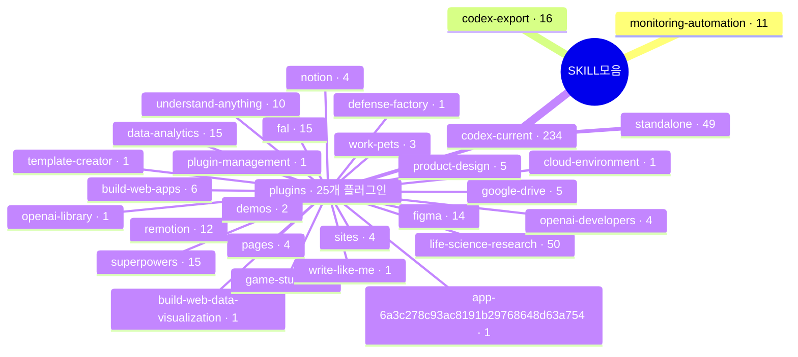

| 묶음 | 위치 | 항목 수 | 설명 |
|---|---|---:|---|
| monitoring-automation | [`monitoring-automation/`](monitoring-automation/) | 11 | 모니터링·업무 자동화 스킬 묶음 |
| codex-export | [`codex-export/`](codex-export/) | 16 | 업로드한 `skills.zip` 해제본(일반 11 + 시스템 5) |
| codex-current / standalone | [`codex-current/standalone/`](codex-current/standalone/) | 49 | 플러그인 접두어가 없는 카탈로그 항목 |
| codex-current / plugins | [`codex-current/plugins/`](codex-current/plugins/) | 185 | 플러그인 25개가 제공한 항목 |

---

## 1. monitoring-automation

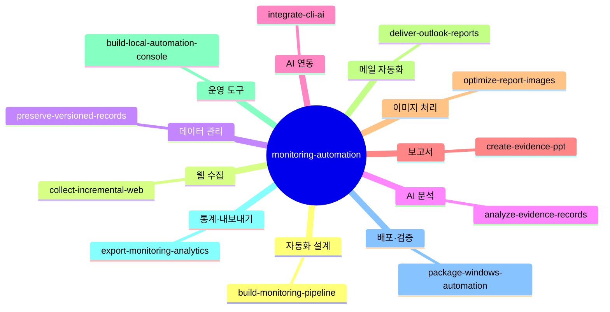

| 분야 | 스킬 | 설명 |
|---|---|---|
| AI 분석 | [`analyze-evidence-records`](monitoring-automation/analyze-evidence-records/SKILL.md) | 문서·게시글·리뷰를 AI로 분류·요약하면서 각 판단을 원문 근거와 연결해야 할 때 사용한다. |
| 운영 도구 | [`build-local-automation-console`](monitoring-automation/build-local-automation-console/SKILL.md) | 반복 자동화를 로컬 웹 화면에서 실행·중지·예약하고 상태와 로그를 조회하는 운영 도구를 만들 때 사용한다. |
| 자동화 설계 | [`build-monitoring-pipeline`](monitoring-automation/build-monitoring-pipeline/SKILL.md) | 지속적인 모니터링·수집·AI 분석·보고·발송을 연결하는 자동화를 설계하거나 기존 파이프라인을 분리할 때 사용한다. |
| 웹 수집 | [`collect-incremental-web`](monitoring-automation/collect-incremental-web/SKILL.md) | 웹사이트·게시판·뉴스의 반복 수집, 마지막 성공 이후 증분 수집, 로그인 세션 유지, 원문과 캡처 연결이 필요할 때 사용한다. |
| 보고서 | [`create-evidence-ppt`](monitoring-automation/create-evidence-ppt/SKILL.md) | 수집 원문 캡처와 분석을 함께 담은 PowerPoint 보고서, 원문 발표자 노트, 요약본·미리보기 또는 이전 실행 기반 PPT 재생성이 필요할 때 사용한다. |
| 메일 자동화 | [`deliver-outlook-reports`](monitoring-automation/deliver-outlook-reports/SKILL.md) | Windows Classic Outlook COM으로 보고서 메일 초안을 만들거나 사용자가 승인한 발송 자동화를 구현할 때 사용한다. |
| 통계·내보내기 | [`export-monitoring-analytics`](monitoring-automation/export-monitoring-analytics/SKILL.md) | 수집 문서의 출처·키워드·기간별 통계, 추이, 상세 목록과 Excel 내보내기를 만들 때 사용한다. |
| AI 연동 | [`integrate-cli-ai`](monitoring-automation/integrate-cli-ai/SKILL.md) | Codex 등 CLI 기반 AI 도구를 Python·데스크톱 자동화에 연결하거나 로그인·프로세스 종료·JSON 응답 문제를 해결할 때 사용한다. |
| 이미지 처리 | [`optimize-report-images`](monitoring-automation/optimize-report-images/SKILL.md) | PowerPoint·문서에 넣을 긴 화면 캡처나 고해상도 이미지의 용량을 줄일 때 사용한다. |
| 배포·검증 | [`package-windows-automation`](monitoring-automation/package-windows-automation/SKILL.md) | Python·브라우저·Office를 사용하는 Windows 자동화 프로그램을 소스 폴더·ZIP으로 배포하거나 설치 안내를 정비할 때 사용한다. |
| 데이터 관리 | [`preserve-versioned-records`](monitoring-automation/preserve-versioned-records/SKILL.md) | 수집 문서의 원문 보존, 변경 감지, SQLite 실행 이력, 검토 이력, 산출물 해시, 기존 데이터 가져오기와 백업이 필요할 때 사용한다. |

---

## 2. codex-export

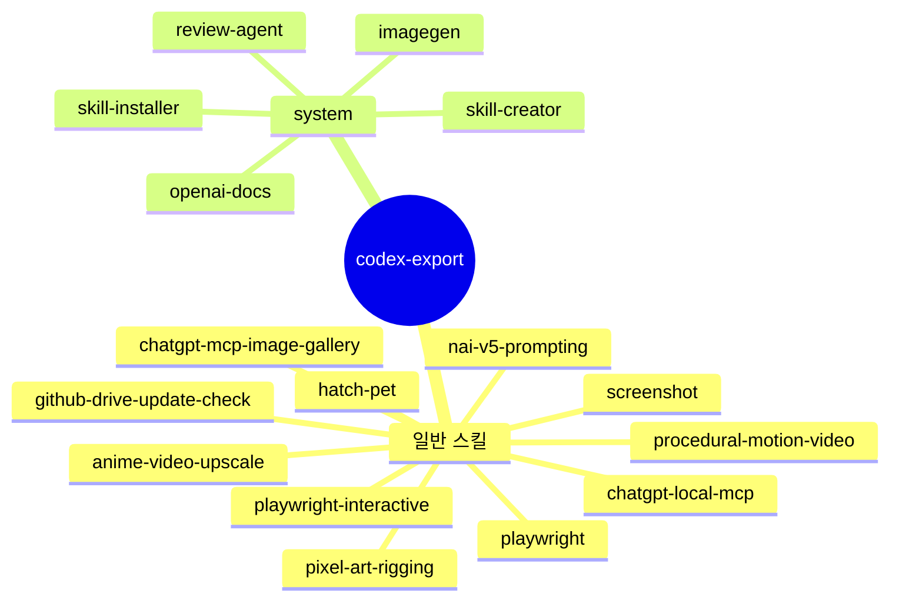

| 구분 | 스킬 | 설명 |
|---|---|---|
| 일반 | [`anime-video-upscale`](codex-export/anime-video-upscale/SKILL.md) | 로컬 애니메이션·일러스트 영상의 화질 개선과 2배·3배·4배 AI 업스케일에 사용합니다. |
| 일반 | [`chatgpt-local-mcp`](codex-export/chatgpt-local-mcp/SKILL.md) | Windows의 로컬 프로그램·저장 자료를 ChatGPT MCP 플러그인으로 연결하거나 연결 장애를 해결할 때 사용합니다. |
| 일반 | [`chatgpt-mcp-image-gallery`](codex-export/chatgpt-mcp-image-gallery/SKILL.md) | MCP Apps UI로 ChatGPT에 연결된 MCP 서버에 여러 이미지를 보여주는 갤러리를 추가합니다. |
| 일반 | [`github-drive-update-check`](codex-export/github-drive-update-check/SKILL.md) | 깃헙 구드 업로드 해", "깃허브 드라이브에 올려", "공유용 ZIP 배포"처럼 현재 작업한 프로젝트의 업로드를 요청할 때 사용합니다. |
| 일반 | [`hatch-pet`](codex-export/hatch-pet/SKILL.md) | 캐릭터 아트·생성 이미지·브랜드 단서·시각 자료로 Codex 호환 v2 애니메이션 펫을 만들고, 수리·검증·시각 QA·패키징합니다. |
| 일반 | [`nai-v5-prompting`](codex-export/nai-v5-prompting/SKILL.md) | NovelAI Diffusion V5(NAI V5) 프롬프트를 만들고, 변환·최적화·분석하거나 문제를 해결합니다. |
| 일반 | [`pixel-art-rigging`](codex-export/pixel-art-rigging/SKILL.md) | 레이어 스프라이트·투명 PNG 부품·부품 준비가 필요한 일러스트로 편집 가능한 픽셀아트 캐릭터 컷아웃 리그와 반복 애니메이션을 만듭니다. |
| 일반 | [`playwright-interactive`](codex-export/playwright-interactive/SKILL.md) | `js_repl`로 브라우저·Electron을 계속 띄워 두고 UI를 빠르게 반복 디버깅합니다. |
| 일반 | [`playwright`](codex-export/playwright/SKILL.md) | `playwright-cli`나 포함된 래퍼 스크립트로 터미널에서 실제 브라우저를 자동화할 때 사용합니다(이동·폼 입력·스냅샷·스크린샷·데이터 추출·UI 흐름 디버깅). |
| 일반 | [`procedural-motion-video`](codex-export/procedural-motion-video/SKILL.md) | Remotion으로 로컬 사진·일러스트·기존 영상 클립·절차적 모션 그래픽에서 영상을 만들고 편집합니다. |
| 일반 | [`screenshot`](codex-export/screenshot/SKILL.md) | 사용자가 데스크톱·시스템 스크린샷(전체 화면·특정 앱/창·픽셀 영역)을 명시적으로 요청하거나, 도구별 캡처 기능이 없어 OS 수준 캡처가 필요할 때 사용합니다. |
| system | [`imagegen`](codex-export/system/imagegen/SKILL.md) | 사진·일러스트·텍스처·스프라이트·목업·투명 배경 컷아웃처럼 AI가 만든 비트맵 이미지가 도움이 될 때 래스터 이미지를 생성·편집합니다. |
| system | [`openai-docs`](codex-export/system/openai-docs/SKILL.md) | Codex 모델·요금, 예약 작업, 스킬, 설정, 설치, 문제 해결, 사용자 지정, 자동화와 Codex 자체에 관한 질문, 그리고 OpenAI API·제품·ChatGPT Work 질문에 사용합니다. |
| system | [`review-agent`](codex-export/system/review-agent/SKILL.md) | 지정한 코드 변경을 읽기 전용으로, 결함 중심으로 검토하고 조치 가능한 모든 지적 사항을 반환합니다. |
| system | [`skill-creator`](codex-export/system/skill-creator/SKILL.md) | 적절한 범위의 지침과 필요한 보조 자료를 갖춘 Codex 스킬을 만들거나 수정합니다. |
| system | [`skill-installer`](codex-export/system/skill-installer/SKILL.md) | 큐레이션 목록이나 GitHub 저장소 경로에서 Codex 스킬을 `$CODEX_HOME/skills`에 설치합니다. |

---

## 3. codex-current / standalone

플러그인 접두어가 없는 항목 49개입니다(이 중 `understand-anything`은 폴더가 `plugins/`에 있어 아래 4번에도 나옵니다).

| 스킬 | 설명 |
|---|---|
| [`analyze-evidence-records`](codex-current/standalone/analyze-evidence-records/SKILL.md) | 문서·게시글·리뷰를 AI로 분류·요약하면서 각 판단을 원문 근거와 연결해야 할 때 사용한다. |
| [`analyze-web-workflow`](codex-current/standalone/analyze-web-workflow/SKILL.md) | 웹사이트의 실제 UI 구조·입력 이벤트·로딩 상태·허용된 요청/응답 근거를 분석해 워크플로를 설명하고, 반복 가능한 웹 자동화를 만들거나 불안정한 매크로를 고칩니다. |
| [`answers-charts`](codex-current/standalone/answers-charts/SKILL.md) | 범주 비교·추세·구성·수치 관계를 글보다 차트가 더 명확하게 전달할 때 사용합니다. |
| [`answers-images`](codex-current/standalone/answers-images/SKILL.md) | 검색한 이미지가 답변을 시각적으로 뒷받침하거나 의미 있게 개선할 때 사용합니다. |
| [`answers-learning`](codex-current/standalone/answers-learning/SKILL.md) | 사용자가 객관식 지식 퀴즈나 발음 도움을 명시적으로 요청할 때 사용합니다. |
| [`atlas-review`](codex-current/standalone/atlas-review/SKILL.md) | `atlas-check.mjs`가 오래되었거나 근거 없는 페이지를 보고하거나, 기존 시각 아틀라스를 현재 코드와 대조해 검증해 달라고 할 때 사용합니다. |
| [`build-local-automation-console`](codex-current/standalone/build-local-automation-console/SKILL.md) | 반복 자동화를 로컬 웹 화면에서 실행·중지·예약하고 상태와 로그를 조회하는 운영 도구를 만들 때 사용한다. |
| [`build-monitoring-pipeline`](codex-current/standalone/build-monitoring-pipeline/SKILL.md) | 지속적인 모니터링·수집·AI 분석·보고·발송을 연결하는 자동화를 설계하거나 기존 파이프라인을 분리할 때 사용한다. |
| [`cloud-browser-start`](codex-current/standalone/cloud-browser-start/SKILL.md) | 클라우드 브라우저 시작, 연결 확인, 브라우저로 사이트 열기 요청에서 현재 control-browser 지침과 실행 도구를 발견하고 실제 연결·접속을 검증한다. |
| [`collect-incremental-web`](codex-current/standalone/collect-incremental-web/SKILL.md) | 웹사이트·게시판·뉴스의 반복 수집, 마지막 성공 이후 증분 수집, 로그인 세션 유지, 원문과 캡처 연결이 필요할 때 사용한다. |
| [`crawl-web-content`](codex-current/standalone/crawl-web-content/SKILL.md) | 웹사이트·블로그 콘텐츠를 검증 가능한 데이터셋으로 수집하거나, 그 작업용 크롤러를 만들고 고칩니다. |
| [`create-evidence-ppt`](codex-current/standalone/create-evidence-ppt/SKILL.md) | 수집 원문 캡처와 분석을 함께 담은 PowerPoint 보고서, 원문 발표자 노트, 요약본·미리보기 또는 이전 실행 기반 PPT 재생성이 필요할 때 사용한다. |
| [`deliver-outlook-reports`](codex-current/standalone/deliver-outlook-reports/SKILL.md) | Windows Classic Outlook COM으로 보고서 메일 초안을 만들거나 사용자가 승인한 발송 자동화를 구현할 때 사용한다. |
| [`documents`](codex-current/standalone/documents/SKILL.md) | 컨테이너 안에서 `.docx`·Word·Google Docs용 문서를 만들고 편집하고 수정 제안·댓글을 달며, 렌더링 후 검증하는 엄격한 절차를 따릅니다. |
| [`eli5`](codex-current/standalone/eli5/SKILL.md) | 복잡한 주제나 낯선 코드를 큰 다이어그램과 간결한 글이 있는 시각적 HTML 페이지로 쉽게 설명합니다. |
| [`evidence-driven-debugging`](codex-current/standalone/evidence-driven-debugging/SKILL.md) | 실제 실행 증거를 바탕으로 오류 원인을 단계적으로 추적하는 디버깅 스킬. |
| [`evidence-gate`](codex-current/standalone/evidence-gate/SKILL.md) | 외부 정보, 웹 자료, GitHub 프로젝트, 코드, 라이브러리, 논문, 데이터셋, 모델, 프롬프트, 도구 또는 방법을 신뢰·추천·도입·통합하기 전에 출처, 실제 시험, 독립 검증, 재현성, 최신성 및 사용자 환경 적합성을 유연하게 확인한다. |
| [`export-monitoring-analytics`](codex-current/standalone/export-monitoring-analytics/SKILL.md) | 수집 문서의 출처·키워드·기간별 통계, 추이, 상세 목록과 Excel 내보내기를 만들 때 사용한다. |
| [`flexible-thinking`](codex-current/standalone/flexible-thinking/SKILL.md) | 막히거나 지나치게 복잡해졌을 때, 기존 방식에 얽매이지 않고 더 나은 접근으로 전환하기 위한 스킬. |
| [`genius-thinking-formula`](codex-current/standalone/genius-thinking-formula/SKILL.md) | 사용자가 '천재적 사고', '천재적 사고 공식화', '천재적 사고 공식화 프롬프트', 'Genius Thinking Formula'를 요청할 때 사용한다. |
| [`github-deep-search`](codex-current/standalone/github-deep-search/SKILL.md) | GitHub를 중심으로 오픈소스 프로젝트, 코드, 구현 사례를 심층 탐색한다. |
| [`imagegen`](codex-current/standalone/imagegen/SKILL.md) | 사진·일러스트·텍스처·스프라이트·목업·투명 배경 컷아웃처럼 AI가 만든 비트맵 이미지가 도움이 될 때 래스터 이미지를 생성·편집합니다. |
| [`integrate-cli-ai`](codex-current/standalone/integrate-cli-ai/SKILL.md) | Codex 등 CLI 기반 AI 도구를 Python·데스크톱 자동화에 연결하거나 로그인·프로세스 종료·JSON 응답 문제를 해결할 때 사용한다. |
| [`interview-me`](codex-current/standalone/interview-me/SKILL.md) | 사용자가 '해야 한다고 생각하는 것'이 아니라 실제로 원하는 것을 끌어냅니다. |
| [`mermaid-workflow-diagram`](codex-current/standalone/mermaid-workflow-diagram/SKILL.md) | 워크플로우, 흐름도, 에이전트 구조와 작업 경로를 ChatGPT에서 바로 렌더링되는 Mermaid 다이어그램으로 표현한다. |
| [`novelai-v5-image-production`](codex-current/standalone/novelai-v5-image-production/SKILL.md) | NovelAI Diffusion V5 기준으로 이미지 요구를 분석하고, 프레임·해상도·가시성·구도·캐릭터별 위치·자연어·태그·텍스트 렌더링·UC·설정값·편집 루프를 상황에 맞게 설계하는 실전 이미지 제작 스킬. |
| [`openai-docs`](codex-current/standalone/openai-docs/SKILL.md) | Codex 모델·요금, 예약 작업, 스킬, 설정, 설치, 문제 해결, 사용자 지정, 자동화와 Codex 자체에 관한 질문, 그리고 OpenAI API·제품·ChatGPT Work 질문에 사용합니다. |
| [`optimize-report-images`](codex-current/standalone/optimize-report-images/SKILL.md) | PowerPoint·문서에 넣을 긴 화면 캡처나 고해상도 이미지의 용량을 줄일 때 사용한다. |
| [`package-windows-automation`](codex-current/standalone/package-windows-automation/SKILL.md) | Python·브라우저·Office를 사용하는 Windows 자동화 프로그램을 소스 폴더·ZIP으로 배포하거나 설치 안내를 정비할 때 사용한다. |
| [`pdf`](codex-current/standalone/pdf/SKILL.md) | 시각적 레이아웃이 중요한 PDF(작성 가능한 AcroForm 포함)를 읽고 만들고 점검·렌더링·검증합니다. |
| [`personal-context`](codex-current/standalone/personal-context/SKILL.md) | 다음 두 상황 중 하나에 해당할 때 사용합니다(상황의 구체적 내용은 해당 SKILL.md 참고). |
| [`pixel-art-rigging`](codex-current/standalone/pixel-art-rigging/SKILL.md) | 레이어 스프라이트·투명 PNG 부품·부품 준비가 필요한 일러스트로 편집 가능한 픽셀아트 캐릭터 컷아웃 리그와 반복 애니메이션을 만듭니다. |
| [`Presentations`](codex-current/standalone/Presentations/SKILL.md) | PowerPoint 또는 Google Slides 프레젠테이션을 읽고 만들거나 편집합니다. |
| [`preserve-versioned-records`](codex-current/standalone/preserve-versioned-records/SKILL.md) | 수집 문서의 원문 보존, 변경 감지, SQLite 실행 이력, 검토 이력, 산출물 해시, 기존 데이터 가져오기와 백업이 필요할 때 사용한다. |
| [`procedural-motion-video`](codex-current/standalone/procedural-motion-video/SKILL.md) | Remotion으로 로컬 사진·일러스트·기존 영상 클립·절차적 모션 그래픽에서 영상을 만들고 편집합니다. |
| [`quiz`](codex-current/standalone/quiz/SKILL.md) | PR·커밋·브랜치·diff·명세·계획·생성된 visual-skills 문서에 대해 퀴즈를 내거나 이해도를 확인하고 싶을 때 사용합니다. |
| [`resolve-recipients`](codex-current/standalone/resolve-recipients/SKILL.md) | Slack 메시지·이메일·초대·회의 요청·캘린더 일정 등 사람을 대상으로 한 작업을 보내기 전에 올바른 사람을 찾아 확인합니다. |
| [`search-images`](codex-current/standalone/search-images/SKILL.md) | 웹에서 관련 이미지를 검색해 채팅에 바로 표시합니다. |
| [`skill-creator`](codex-current/standalone/skill-creator/SKILL.md) | 효과적인 스킬을 만들고 설치·수정·제거·삭제하는 방법을 안내합니다. |
| [`Spreadsheets`](codex-current/standalone/Spreadsheets/SKILL.md) | 수식·서식·차트·표·재계산이 포함된 스프레드시트 파일(`.xlsx`, `.xls`, `.csv`, `.tsv`)이나 Google Sheets를 만들고 수정·분석·시각화할 때 사용합니다. |
| [`suno-v6-music-creation`](codex-current/standalone/suno-v6-music-creation/SKILL.md) | SUNO v6 음악 제작과 기존 곡 수정을 돕는다. |
| [`text-box`](codex-current/standalone/text-box/SKILL.md) | 텍박, ㅌㅂ, 텍스트 박스, 텍스트박스, 텍스트상자 요청을 받으면 내용을 복사하기 쉬운 텍스트 박스 형식으로 출력한다. |
| [`visual-atlas`](codex-current/standalone/visual-atlas/SKILL.md) | 코드베이스 전체를 상시 참고용 독립 HTML 아틀라스로 지도화·문서화해 달라고 할 때 사용합니다. |
| [`visual-doc`](codex-current/standalone/visual-doc/SKILL.md) | 명세·계획·설계 마크다운을 실제 코드베이스에 근거한 독립 HTML 문서(다이어그램·파일 트리·주석 코드·열린 질문 포함)로 바꿔 달라고 할 때 사용합니다. |
| [`visual-recap`](codex-current/standalone/visual-recap/SKILL.md) | PR·커밋·브랜치·git diff를 독립 HTML 리뷰 문서로 시각화·렌더링·요약("읽기 쉽게")해 달라고 할 때 사용합니다. |
| [`visual-skills`](codex-current/standalone/visual-skills/SKILL.md) | visual-atlas 코드 지도, atlas-review 드리프트 갱신, visual-recap PR·커밋 안내, visual-spec 설계 리뷰, visual-doc 삽화 HTML, quiz 이해도 점검을 만듭니다. |
| [`visual-spec`](codex-current/standalone/visual-spec/SKILL.md) | 설계 명세·설계 문서·RFC·제안서를 독립 HTML 페이지로 시각화해 독자가 빠르게 파악하고 승인할 수 있게 도울 때 사용합니다. |
| [`visualize`](codex-current/standalone/visualize/SKILL.md) | 대화 안에서 바로 시각화와 인터랙티브 도구를 만듭니다. |
| [`writing-blocks`](codex-current/standalone/writing-blocks/SKILL.md) | 이메일·메시지·소셜 게시글·소개글·성명·개별 문단 등 요청한 글의 완성 초안을 글쓰기 블록으로 보여줍니다. |

---

## 4. codex-current / plugins

플러그인마다 접어 둔 항목을 펼치면 노드 그림과 설명 표가 나옵니다.

<details>
<summary><b>understand-anything</b> · 10개</summary>

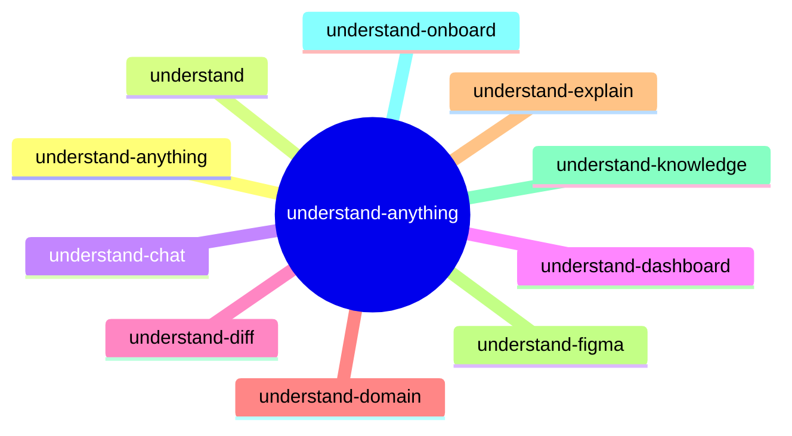

| 스킬 | 설명 |
|---|---|
| [`understand-anything`](codex-current/plugins/understand-anything/SKILL.md) | Understand Anything으로 저장소를 검색 가능한 인터랙티브 지식 그래프로 분석합니다. 아키텍처 탐색, 대시보드 실행, 코드 설명, diff 영향 확인, 온보딩 투어, 비즈니스 도메인·지식 베이스 지도화를 지원합니다. |
| [`understand-anything:understand`](codex-current/plugins/understand-anything/understand/SKILL.md) | 코드베이스를 분석해 아키텍처·구성 요소·관계를 이해할 수 있는 인터랙티브 지식 그래프를 만듭니다. |
| [`understand-anything:understand-chat`](codex-current/plugins/understand-anything/understand-chat/SKILL.md) | 지식 그래프를 이용해 코드베이스에 대해 질문하거나 코드를 이해하고 싶을 때 사용합니다. |
| [`understand-anything:understand-dashboard`](codex-current/plugins/understand-anything/understand-dashboard/SKILL.md) | 코드베이스의 지식 그래프를 시각화하는 인터랙티브 웹 대시보드를 실행합니다. |
| [`understand-anything:understand-diff`](codex-current/plugins/understand-anything/understand-diff/SKILL.md) | git diff나 PR을 분석해 무엇이 바뀌었고 어떤 구성 요소와 위험에 영향을 주는지 알고 싶을 때 사용합니다. |
| [`understand-anything:understand-domain`](codex-current/plugins/understand-anything/understand-domain/SKILL.md) | 코드베이스에서 비즈니스 도메인 지식을 추출해 인터랙티브 도메인 흐름 그래프를 만듭니다. |
| [`understand-anything:understand-explain`](codex-current/plugins/understand-anything/understand-explain/SKILL.md) | 코드베이스의 특정 파일·함수·모듈에 대한 깊이 있는 설명이 필요할 때 사용합니다. |
| [`understand-anything:understand-figma`](codex-current/plugins/understand-anything/understand-figma/SKILL.md) | Figma REST API로 Figma 파일을 분석해 페이지·화면·컴포넌트·컴포넌트 세트·인스턴스·디자인 토큰을 담은 인터랙티브 디자인 지식 그래프(`kind:"design"` 대시보드)를 만듭니다. |
| [`understand-anything:understand-knowledge`](codex-current/plugins/understand-anything/understand-knowledge/SKILL.md) | Karpathy 패턴의 LLM 위키 지식 베이스를 분석해 엔터티 추출·암묵적 관계·주제 군집이 포함된 인터랙티브 지식 그래프를 만듭니다. |
| [`understand-anything:understand-onboard`](codex-current/plugins/understand-anything/understand-onboard/SKILL.md) | 프로젝트에 새로 합류하는 팀원을 위한 온보딩 가이드를 만들고 싶을 때 사용합니다. |

</details>

<details>
<summary><b>build-web-apps</b> · 6개</summary>

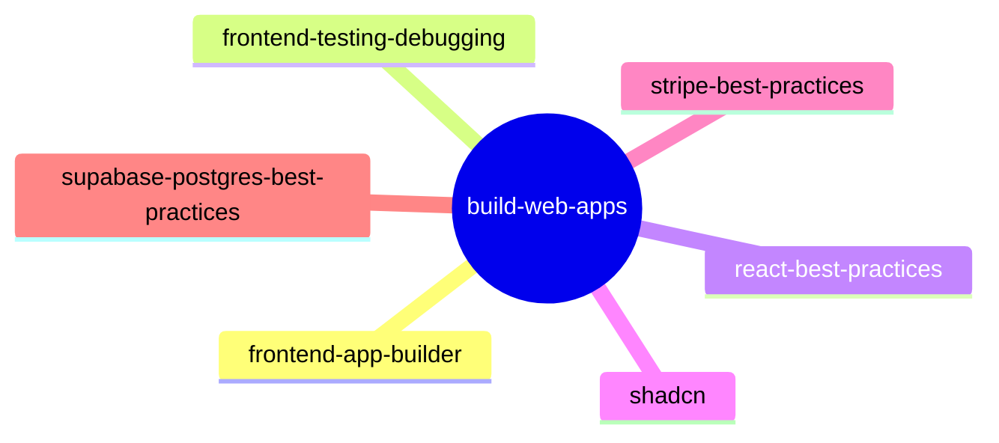

| 스킬 | 설명 |
|---|---|
| [`build-web-apps:frontend-app-builder`](codex-current/plugins/build-web-apps/frontend-app-builder/SKILL.md) | 새 프런트엔드 앱·대시보드·게임·크리에이티브 웹사이트·히어로 섹션·시각 중심 UI를 처음부터 만들거나, 리디자인·리스타일·현대화를 명시적으로 요청받았을 때 사용합니다. |
| [`build-web-apps:frontend-testing-debugging`](codex-current/plugins/build-web-apps/frontend-testing-debugging/SKILL.md) | 렌더링된 프런트엔드 앱의 테스트·디버깅·부분 개선(로컬 개발 서버, UI 회귀, 상호작용 버그, 콘솔 오류, 반응형 레이아웃, 시각 QA)에 사용합니다. |
| [`build-web-apps:react-best-practices`](codex-current/plugins/build-web-apps/react-best-practices/SKILL.md) | Vercel Engineering의 React·Next.js 성능 최적화 지침입니다. |
| [`build-web-apps:shadcn`](codex-current/plugins/build-web-apps/shadcn/SKILL.md) | shadcn 컴포넌트와 프로젝트를 관리합니다. 추가·검색·수정·디버깅·스타일링·UI 조합을 다룹니다. |
| [`build-web-apps:stripe-best-practices`](codex-current/plugins/build-web-apps/stripe-best-practices/SKILL.md) | Stripe 연동 결정을 안내합니다. API 선택(Checkout Sessions vs PaymentIntents), Connect 플랫폼 설정, 결제·구독, Treasury 금융 계정, 연동 방식(Checkout, Payment Element), 지원 중단된 Stripe API 이전을 다룹니다. |
| [`build-web-apps:supabase-postgres-best-practices`](codex-current/plugins/build-web-apps/supabase-postgres-best-practices/SKILL.md) | Supabase의 Postgres 성능 최적화와 모범 사례입니다. |

</details>

<details>
<summary><b>build-web-data-visualization</b> · 1개</summary>

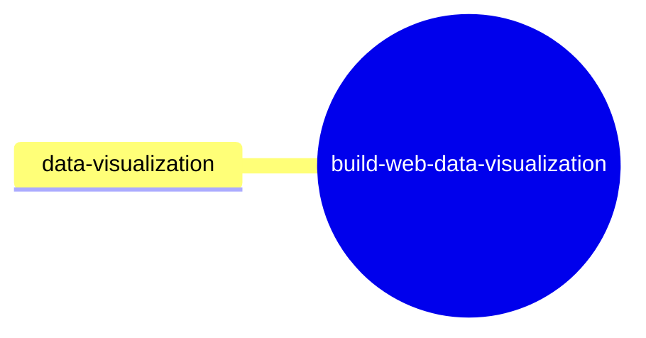

| 스킬 | 설명 |
|---|---|
| [`build-web-data-visualization:data-visualization`](codex-current/plugins/build-web-data-visualization/data-visualization/SKILL.md) | 웹 데이터 시각화 작업을 적절한 스킬로 연결합니다. |

</details>

<details>
<summary><b>cloud-environment</b> · 1개</summary>

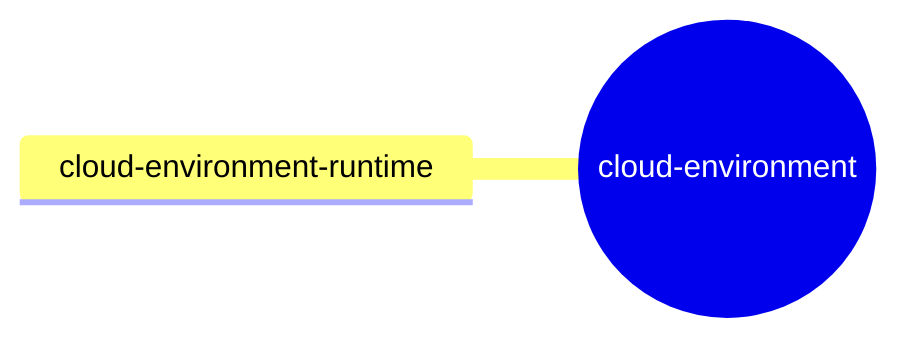

| 스킬 | 설명 |
|---|---|
| [`cloud-environment:cloud-environment-runtime`](codex-current/plugins/cloud-environment/cloud-environment-runtime/SKILL.md) | 관리형 클라우드 환경에서 작업을 시작할 때 가장 먼저 읽습니다. |

</details>

<details>
<summary><b>data-analytics</b> · 15개</summary>

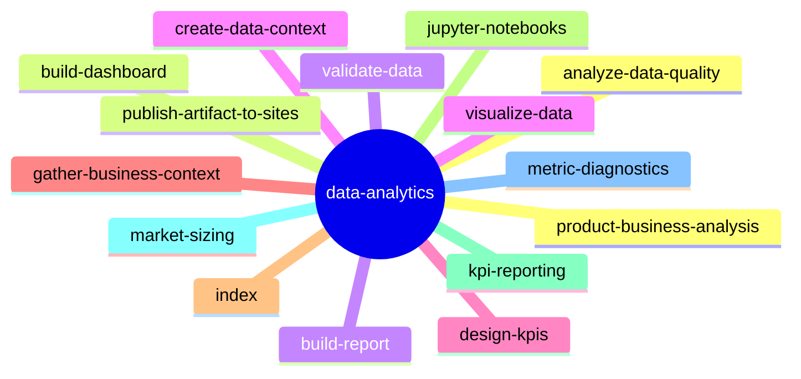

| 스킬 | 설명 |
|---|---|
| [`data-analytics:analyze-data-quality`](codex-current/plugins/data-analytics/analyze-data-quality/SKILL.md) | 구조화된 데이터셋과 쿼리 결과를 사용할 만큼 신뢰할 수 있는지 조사합니다. |
| [`data-analytics:build-dashboard`](codex-current/plugins/data-analytics/build-dashboard/SKILL.md) | 연결된 데이터·업로드한 스프레드시트·CSV 등 구조화된 소스를 기반으로 모니터링·탐색·운영 의사결정용 인터랙티브 대시보드를 만들거나 갱신합니다. |
| [`data-analytics:build-report`](codex-current/plugins/data-analytics/build-report/SKILL.md) | 경영진·제품·비즈니스·기술 독자를 위한 완성도 높은 분석 보고서를 만듭니다. |
| [`data-analytics:create-data-context`](codex-current/plugins/data-analytics/create-data-context/SKILL.md) | 도구 선호, 룩앤필, 분석 방식, 데이터 정의 등 분석·보고서·대시보드에 재사용할 컨텍스트를 만들고 갱신·공유합니다. |
| [`data-analytics:design-kpis`](codex-current/plugins/data-analytics/design-kpis/SKILL.md) | 제품·비즈니스 의사결정을 위한 KPI 체계, 지표 정의, 목표, 가드레일, 측정 계획을 설계합니다. |
| [`data-analytics:gather-business-context`](codex-current/plugins/data-analytics/gather-business-context/SKILL.md) | 연결되었거나 제공된 소스에서 비즈니스 컨텍스트를 모아, 이후 분석이 올바른 관점에서 시작되게 합니다. |
| [`data-analytics:index`](codex-current/plugins/data-analytics/index/SKILL.md) | 데이터로 제품·비즈니스 질문에 답하고, 데이터 관련 작업을 적절한 세부 워크플로로 연결합니다. |
| [`data-analytics:jupyter-notebooks`](codex-current/plugins/data-analytics/jupyter-notebooks/SKILL.md) | 재현 가능한 SQL·Python 노트북을 만들고 편집·검증합니다. |
| [`data-analytics:kpi-reporting`](codex-current/plugins/data-analytics/kpi-reporting/SKILL.md) | 정량 지표로 KPI 리드아웃·스코어카드·WBR/MBR/QBR 업데이트·경영진 요약을 준비합니다. 현황 보고, 목표 대비 비교, 검증된 요인 설명, 운영상 시사점 정리에 사용합니다. |
| [`data-analytics:market-sizing`](codex-current/plugins/data-analytics/market-sizing/SKILL.md) | 투명한 가정과 불확실성을 밝히며 시장·세그먼트·기회 규모를 추정합니다. |
| [`data-analytics:metric-diagnostics`](codex-current/plugins/data-analytics/metric-diagnostics/SKILL.md) | 지표가 왜 바뀌었는지, 또는 기대와 왜 다른지 진단합니다. |
| [`data-analytics:product-business-analysis`](codex-current/plugins/data-analytics/product-business-analysis/SKILL.md) | 의사결정이나 권고를 뒷받침하도록 제품·비즈니스 데이터를 분석합니다. |
| [`data-analytics:publish-artifact-to-sites`](codex-current/plugins/data-analytics/publish-artifact-to-sites/SKILL.md) | 기존 데이터 보고서나 대시보드를 Sites에 게시합니다. 웹·클라우드 작업에서는 자동으로, 그 외에는 사용자가 요청할 때 합니다. |
| [`data-analytics:validate-data`](codex-current/plugins/data-analytics/validate-data/SKILL.md) | 분석 방법론·출처·계산·시각화·결론을 검증하고, 보고서·대시보드의 완성도·사용성과 지원되는 수정까지 확인합니다. |
| [`data-analytics:visualize-data`](codex-current/plugins/data-analytics/visualize-data/SKILL.md) | 보고서·대시보드·노트북 등 오래 쓰는 산출물을 만들면서 정량 차트와 그림을 설계·제작·수정·검증합니다. |

</details>

<details>
<summary><b>app-6a3c278c93ac8191b29768648d63a754</b> · 1개</summary>

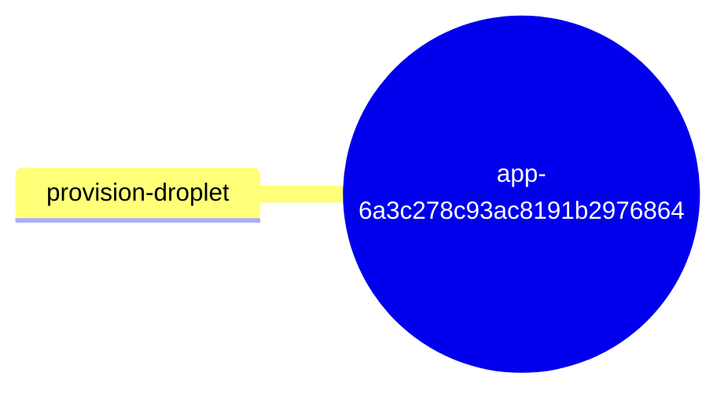

| 스킬 | 설명 |
|---|---|
| [`app-6a3c278c93ac8191b29768648d63a754:provision-droplet`](codex-current/plugins/app-6a3c278c93ac8191b29768648d63a754/provision-droplet/SKILL.md) | DigitalOcean 드롭릿(또는 DO의 원격 개발 박스)을 만들고 Codex에서 원격 SSH 작업 공간으로 연결하고 싶을 때 사용합니다. |

</details>

<details>
<summary><b>fal</b> · 15개</summary>

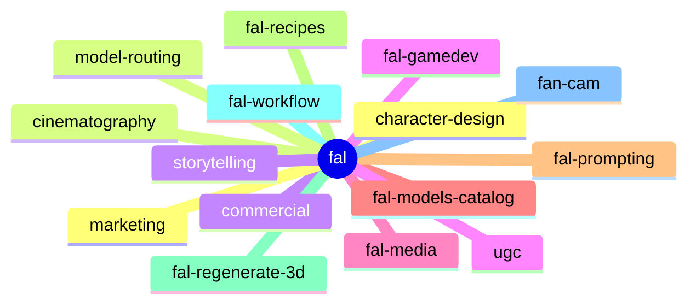

| 스킬 | 설명 |
|---|---|
| [`fal:character-design`](codex-current/plugins/fal/character-design/SKILL.md) | fal.ai로 일관된 캐릭터 디자인과 캐릭터 미디어를 만듭니다. |
| [`fal:cinematography`](codex-current/plugins/fal/cinematography/SKILL.md) | fal.ai용 영화적 이미지·영상 프롬프트를 설계합니다. |
| [`fal:commercial`](codex-current/plugins/fal/commercial/SKILL.md) | fal.ai로 광고용 이미지·영상 에셋을 기획하고 제작합니다. |
| [`fal:fal-gamedev`](codex-current/plugins/fal/fal-gamedev/SKILL.md) | fal.ai로 2D 게임 에셋을 생성합니다. |
| [`fal:fal-media`](codex-current/plugins/fal/fal-media/SKILL.md) | fal.ai로 미디어를 생성·편집·처리합니다. |
| [`fal:fal-models-catalog`](codex-current/plugins/fal/fal-models-catalog/SKILL.md) | fal.ai 모델 계열을 미디어 유형과 제작 역할별로 안내합니다. |
| [`fal:fal-prompting`](codex-current/plugins/fal/fal-prompting/SKILL.md) | 엔드포인트를 고른 뒤, 모델 계열에 맞는 프롬프트 방식을 적용합니다. |
| [`fal:fal-recipes`](codex-current/plugins/fal/fal-recipes/SKILL.md) | 사용 사례별 fal.ai 제작 레시피입니다. |
| [`fal:fal-regenerate-3d`](codex-current/plugins/fal/fal-regenerate-3d/SKILL.md) | fal.ai 에셋으로 세련된 3D 캐릭터 선택 경험을 만듭니다. |
| [`fal:fal-workflow`](codex-current/plugins/fal/fal-workflow/SKILL.md) | MCP로 실행할 여러 단계의 fal.ai 미디어 워크플로를 설계합니다. |
| [`fal:fan-cam`](codex-current/plugins/fal/fan-cam/SKILL.md) | fal.ai로 개인 맞춤형 스포츠 중계 팬캠 영상을 만듭니다. |
| [`fal:marketing`](codex-current/plugins/fal/marketing/SKILL.md) | fal.ai로 캠페인 단위 마케팅 에셋 제작을 기획합니다. |
| [`fal:model-routing`](codex-current/plugins/fal/model-routing/SKILL.md) | MCP 미디어 워크플로에 쓸 실전용 fal.ai 엔드포인트 ID를 고릅니다. |
| [`fal:storytelling`](codex-current/plugins/fal/storytelling/SKILL.md) | fal.ai로 여러 샷으로 이루어진 이야기형 이미지·영상·오디오 워크플로를 만듭니다. |
| [`fal:ugc`](codex-current/plugins/fal/ugc/SKILL.md) | fal.ai로 UGC 스타일 크리에이터 광고와 소셜 영상을 기획하고 제작합니다. |

</details>

<details>
<summary><b>figma</b> · 14개</summary>

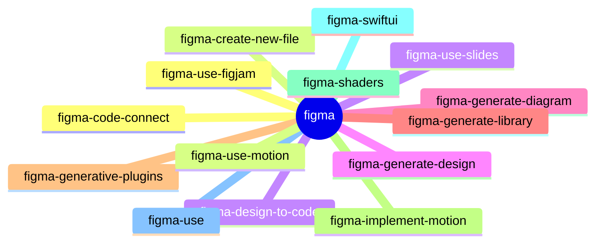

| 스킬 | 설명 |
|---|---|
| [`figma:figma-code-connect`](codex-current/plugins/figma/figma-code-connect/SKILL.md) | Figma 컴포넌트를 코드 스니펫에 연결하는 Figma Code Connect 템플릿 파일을 만들고 관리합니다. |
| [`figma:figma-create-new-file`](codex-current/plugins/figma/figma-create-new-file/SKILL.md) | 사용자가 새 Figma Design·FigJam·Slides 파일을 만들려 할 때 항상 사용합니다. |
| [`figma:figma-design-to-code`](codex-current/plugins/figma/figma-design-to-code/SKILL.md) | **필수 선행 스킬** — Figma MCP 도구 `get_design_context`를 호출하기 전에 반드시 먼저 호출해야 합니다. |
| [`figma:figma-generate-design`](codex-current/plugins/figma/figma-generate-design/SKILL.md) | 애플리케이션 페이지·뷰·여러 섹션 레이아웃을 Figma로 옮기는 작업에서 figma-use와 함께 사용합니다. |
| [`figma:figma-generate-diagram`](codex-current/plugins/figma/figma-generate-diagram/SKILL.md) | 필수 선행 스킬 — `generate_diagram` 도구를 호출하기 전에 매번 먼저 불러옵니다. |
| [`figma:figma-generate-library`](codex-current/plugins/figma/figma-generate-library/SKILL.md) | 코드베이스를 바탕으로 전문가 수준의 디자인 시스템을 Figma에 만들거나 갱신합니다. |
| [`figma:figma-generative-plugins`](codex-current/plugins/figma/figma-generative-plugins/SKILL.md) | **필수 선행 스킬** — `create_generative_plugin`·`update_generative_plugin` 호출 전에 먼저 불러옵니다. |
| [`figma:figma-implement-motion`](codex-current/plugins/figma/figma-implement-motion/SKILL.md) | Figma의 모션과 애니메이션을 실서비스용 애플리케이션 코드로 옮깁니다. |
| [`figma:figma-shaders`](codex-current/plugins/figma/figma-shaders/SKILL.md) | **필수 선행 스킬** — `create_shader`·`update_shader` 호출 전에 먼저 불러옵니다. |
| [`figma:figma-swiftui`](codex-current/plugins/figma/figma-swiftui/SKILL.md) | SwiftUI와 Figma 사이를 양방향으로 변환합니다. |
| [`figma:figma-use`](codex-current/plugins/figma/figma-use/SKILL.md) | **필수 선행 스킬** — `use_figma` 도구를 호출하기 전에 매번 먼저 호출해야 합니다. |
| [`figma:figma-use-figjam`](codex-current/plugins/figma/figma-use-figjam/SKILL.md) | 에이전트가 FigJam 환경에서 Figma의 `use_figma` MCP 도구를 사용하도록 돕습니다. |
| [`figma:figma-use-motion`](codex-current/plugins/figma/figma-use-motion/SKILL.md) | `use_figma` MCP 도구용 모션·애니메이션 컨텍스트입니다. 수동 키프레임·애니메이션 스타일·이징·타임라인 길이로 Figma 노드에 애니메이션을 적용합니다. |
| [`figma:figma-use-slides`](codex-current/plugins/figma/figma-use-slides/SKILL.md) | 에이전트가 Slides 환경에서 Figma의 `use_figma` MCP 도구를 사용하도록 돕습니다. |

</details>

<details>
<summary><b>game-studio</b> · 9개</summary>

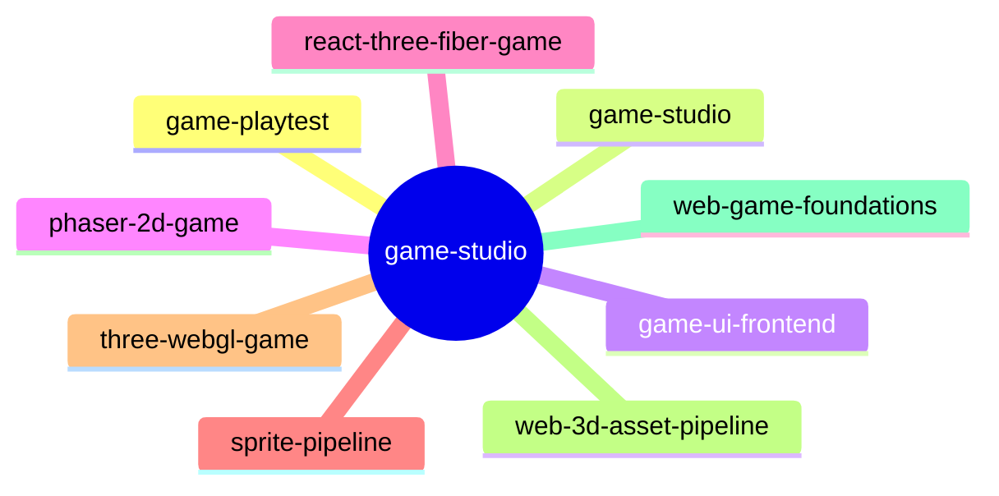

| 스킬 | 설명 |
|---|---|
| [`game-studio:game-playtest`](codex-current/plugins/game-studio/game-playtest/SKILL.md) | 브라우저 게임 플레이테스트와 프런트엔드 QA를 수행합니다. |
| [`game-studio:game-studio`](codex-current/plugins/game-studio/game-studio/SKILL.md) | 초기 단계의 브라우저 게임 작업을 적절한 스킬로 연결합니다. |
| [`game-studio:game-ui-frontend`](codex-current/plugins/game-studio/game-ui-frontend/SKILL.md) | 브라우저 게임의 UI 화면을 설계합니다. |
| [`game-studio:phaser-2d-game`](codex-current/plugins/game-studio/phaser-2d-game/SKILL.md) | Phaser로 2D 브라우저 게임을 구현합니다. |
| [`game-studio:react-three-fiber-game`](codex-current/plugins/game-studio/react-three-fiber-game/SKILL.md) | React Three Fiber로 React 기반 3D 브라우저 게임을 만듭니다. |
| [`game-studio:sprite-pipeline`](codex-current/plugins/game-studio/sprite-pipeline/SKILL.md) | 2D 스프라이트 애니메이션을 생성하고 정규화합니다. |
| [`game-studio:three-webgl-game`](codex-current/plugins/game-studio/three-webgl-game/SKILL.md) | 순수 Three.js로 브라우저 게임 런타임을 구현합니다. |
| [`game-studio:web-3d-asset-pipeline`](codex-current/plugins/game-studio/web-3d-asset-pipeline/SKILL.md) | 브라우저 게임용 3D 에셋을 준비하고 최적화합니다. |
| [`game-studio:web-game-foundations`](codex-current/plugins/game-studio/web-game-foundations/SKILL.md) | 구현에 앞서 브라우저 게임 아키텍처를 정합니다. |

</details>

<details>
<summary><b>google-drive</b> · 5개</summary>

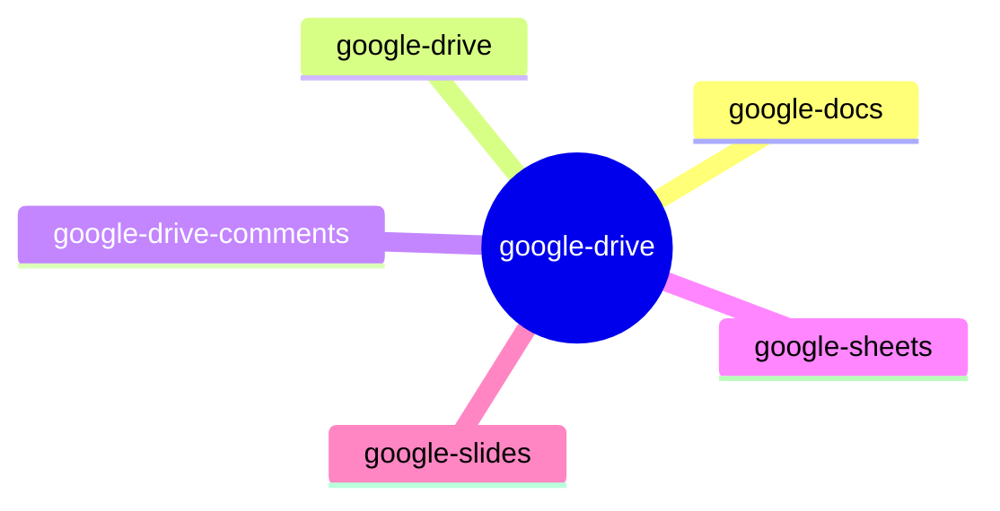

| 스킬 | 설명 |
|---|---|
| [`google-drive:google-docs`](codex-current/plugins/google-drive/google-docs/SKILL.md) | 구조 보존, 템플릿 복사, 스마트 칩 작성 등을 포함한 Google Docs 문서 작성·편집을 수행합니다(설명이 길어 요약). |
| [`google-drive:google-drive`](codex-current/plugins/google-drive/google-drive/SKILL.md) | 연결된 Google Drive를 Drive·Docs·Sheets·Slides 작업의 단일 진입점으로 사용합니다. |
| [`google-drive:google-drive-comments`](codex-current/plugins/google-drive/google-drive-comments/SKILL.md) | Docs·Sheets·Slides·Drive 파일의 댓글을 근거 있는 위치 맥락과 함께 작성·답글·해결 처리합니다. |
| [`google-drive:google-sheets`](codex-current/plugins/google-drive/google-sheets/SKILL.md) | 연결된 Google Sheets를 범위 단위로 정밀하게 분석·편집합니다. |
| [`google-drive:google-slides`](codex-current/plugins/google-drive/google-slides/SKILL.md) | Google Slides 작성 요청을 연결하고, 기본 템플릿이나 참고 덱에서 디자인 시스템을 도출합니다. |

</details>

<details>
<summary><b>life-science-research</b> · 50개</summary>

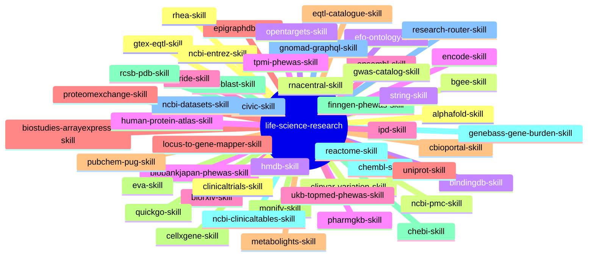

| 스킬 | 설명 |
|---|---|
| [`life-science-research:alphafold-skill`](codex-current/plugins/life-science-research/alphafold-skill/SKILL.md) | AlphaFold 단백질 구조 데이터베이스 API에 예측·UniProt 요약·서열 요약·주석 조회 요청을 간결하게 보냅니다. |
| [`life-science-research:bgee-skill`](codex-current/plugins/life-science-research/bgee-skill/SKILL.md) | Bgee SPARQL로 건강한 야생형 발현 메타데이터와 온톨로지 기반 조회 패턴을 간결하게 요청합니다. |
| [`life-science-research:bindingdb-skill`](codex-current/plugins/life-science-research/bindingdb-skill/SKILL.md) | BindingDB REST API로 PDB·UniProt·유사도 검색 기준의 리간드-표적 결합 정보를 간결하게 조회합니다. |
| [`life-science-research:biobankjapan-phewas-skill`](codex-current/plugins/life-science-research/biobankjapan-phewas-skill/SKILL.md) | 단일 변이에 대해 rsID·GRCh38·GRCh37 입력을 받아 필요한 GRCh37 질의로 변환해 BioBank Japan PheWAS 요약을 가져옵니다. |
| [`life-science-research:biorxiv-skill`](codex-current/plugins/life-science-research/biorxiv-skill/SKILL.md) | bioRxiv·medRxiv API로 상세 정보·출판 연결·DOI 조회를 간결하게 요청합니다. |
| [`life-science-research:biostudies-arrayexpress-skill`](codex-current/plugins/life-science-research/biostudies-arrayexpress-skill/SKILL.md) | BioStudies·ArrayExpress API로 자유 텍스트 검색과 accession 기반 연구 조회를 간결하게 요청합니다. |
| [`life-science-research:cbioportal-skill`](codex-current/plugins/life-science-research/cbioportal-skill/SKILL.md) | cBioPortal API로 연구·분자 프로파일·변이·임상 데이터·샘플을 간결하게 조회합니다. |
| [`life-science-research:cellxgene-skill`](codex-current/plugins/life-science-research/cellxgene-skill/SKILL.md) | CELLxGENE Discover API로 공개 컬렉션·데이터셋 메타데이터를 간결하게 조회합니다. |
| [`life-science-research:chebi-skill`](codex-current/plugins/life-science-research/chebi-skill/SKILL.md) | ChEBI 2.0 API로 화학물질 검색·화합물 조회·온톨로지 탐색·구조 메타데이터를 간결하게 요청합니다. |
| [`life-science-research:chembl-skill`](codex-current/plugins/life-science-research/chembl-skill/SKILL.md) | ChEMBL API로 활성·분자·표적·작용 기전·텍스트 검색 엔드포인트를 간결하게 요청합니다. |
| [`life-science-research:civic-skill`](codex-current/plugins/life-science-research/civic-skill/SKILL.md) | CIViC GraphQL로 암 변이 해석 스키마 확인과 목표 지향 근거 조회를 간결하게 요청합니다. |
| [`life-science-research:clinicaltrials-skill`](codex-current/plugins/life-science-research/clinicaltrials-skill/SKILL.md) | ClinicalTrials.gov API v2로 연구 검색·메타데이터·열거형·검색 영역·필드 통계를 간결하게 요청합니다. |
| [`life-science-research:clinvar-variation-skill`](codex-current/plugins/life-science-research/clinvar-variation-skill/SKILL.md) | ClinVar Clinical Tables와 NCBI Variation으로 검색 및 VCV·RCV·SCV·RefSNP 조회를 간결하게 요청합니다. |
| [`life-science-research:efo-ontology-skill`](codex-current/plugins/life-science-research/efo-ontology-skill/SKILL.md) | EFO OLS4로 검색·용어 조회·하위 용어·자손 용어를 간결하게 요청합니다. |
| [`life-science-research:encode-skill`](codex-current/plugins/life-science-research/encode-skill/SKILL.md) | ENCODE REST API로 객체 조회·포털식 검색·메타데이터 검색을 간결하게 요청합니다. |
| [`life-science-research:ensembl-skill`](codex-current/plugins/life-science-research/ensembl-skill/SKILL.md) | Ensembl REST API로 조회·중첩(overlap)·상호 참조·변이 엔드포인트를 간결하게 요청합니다. |
| [`life-science-research:epigraphdb-skill`](codex-current/plugins/life-science-research/epigraphdb-skill/SKILL.md) | EpiGraphDB API로 온톨로지·문헌·MR·유전자-약물·보조 경로 근거를 간결하게 요청합니다. |
| [`life-science-research:eqtl-catalogue-skill`](codex-current/plugins/life-science-research/eqtl-catalogue-skill/SKILL.md) | eQTL Catalogue API로 연관성 조회와 문서화된 메타데이터 엔드포인트를 간결하게 요청합니다. |
| [`life-science-research:eva-skill`](codex-current/plugins/life-science-research/eva-skill/SKILL.md) | EVA REST로 종 메타데이터와 보관된 변이 조회를 간결하게 요청합니다. |
| [`life-science-research:finngen-phewas-skill`](codex-current/plugins/life-science-research/finngen-phewas-skill/SKILL.md) | 단일 변이에 대해 rsID·GRCh37·GRCh38 입력을 받아 필요한 GRCh38 질의로 변환해 FinnGen PheWAS 요약을 가져옵니다. |
| [`life-science-research:genebass-gene-burden-skill`](codex-current/plugins/life-science-research/genebass-gene-burden-skill/SKILL.md) | Ensembl 유전자 ID 하나와 burden 세트 하나에 대한 Genebass 유전자 burden 요청을 간결하게 보냅니다. |
| [`life-science-research:gnomad-graphql-skill`](codex-current/plugins/life-science-research/gnomad-graphql-skill/SKILL.md) | gnomAD GraphQL로 빈도·유전자 제약·변이 맥락 질의를 간결하게 요청합니다. |
| [`life-science-research:gtex-eqtl-skill`](codex-current/plugins/life-science-research/gtex-eqtl-skill/SKILL.md) | 변이 하나의 rsID·GRCh37·GRCh38 입력을 받아 GTEx v2 API에 필요한 GRCh38 질의로 변환해 단일 조직 eQTL 연관성을 가져옵니다. |
| [`life-science-research:gwas-catalog-skill`](codex-current/plugins/life-science-research/gwas-catalog-skill/SKILL.md) | GWAS Catalog REST API v2로 연구·연관성·SNP·EFO 형질·유전자·출판물·유전자좌·메타데이터를 간결하게 요청합니다. |
| [`life-science-research:hmdb-skill`](codex-current/plugins/life-science-research/hmdb-skill/SKILL.md) | HMDB 검색으로 대사체·단백질·질병·경로를 간결하게 조회합니다. |
| [`life-science-research:human-protein-atlas-skill`](codex-current/plugins/life-science-research/human-protein-atlas-skill/SKILL.md) | Human Protein Atlas에서 유전자 JSON·검색 다운로드·페이지 단위 조직/세포주 조회를 간결하게 요청합니다. |
| [`life-science-research:ipd-skill`](codex-current/plugins/life-science-research/ipd-skill/SKILL.md) | 공개 IPD 쿼리 API로 HLA 대립유전자와 세포 수준 메타데이터를 간결하게 조회합니다. |
| [`life-science-research:locus-to-gene-mapper-skill`](codex-current/plugins/life-science-research/locus-to-gene-mapper-skill/SKILL.md) | 결정적인 다중 스킬 체인(EFO → GWAS → 좌표 → Open Targets L2G/coloc → eQTL → burden/코딩 맥락)으로 GWAS 유전자좌를 순위가 매겨진 후보 유전자에 매핑하고, 재현 가능한 표와 선택적 그림을 만듭니다. |
| [`life-science-research:metabolights-skill`](codex-current/plugins/life-science-research/metabolights-skill/SKILL.md) | MetaboLights로 연구 탐색과 연구 단위 대사체학 메타데이터를 간결하게 요청합니다. |
| [`life-science-research:mgnify-skill`](codex-current/plugins/life-science-research/mgnify-skill/SKILL.md) | MGnify API로 마이크로바이옴 연구·샘플·바이옴 메타데이터를 간결하게 요청합니다. |
| [`life-science-research:ncbi-blast-skill`](codex-current/plugins/life-science-research/ncbi-blast-skill/SKILL.md) | 뉴클레오타이드·단백질 서열에 대해 NCBI BLAST Common URL API(Blast.cgi) 작업을 제출·조회하고 결과를 요약합니다. |
| [`life-science-research:ncbi-clinicaltables-skill`](codex-current/plugins/life-science-research/ncbi-clinicaltables-skill/SKILL.md) | Clinical Tables NCBI Gene으로 사람 유전자 조회·페이지 처리·필드 선택을 간결하게 요청합니다. |
| [`life-science-research:ncbi-datasets-skill`](codex-current/plugins/life-science-research/ncbi-datasets-skill/SKILL.md) | NCBI Datasets v2로 어셈블리·게놈·분류·관련 메타데이터 엔드포인트를 간결하게 요청합니다. |
| [`life-science-research:ncbi-entrez-skill`](codex-current/plugins/life-science-research/ncbi-entrez-skill/SKILL.md) | NCBI Entrez E-Utilities로 PubMed·Gene·Protein·Nucleotide·PMC 메타데이터·GEO 메타데이터 워크플로를 간결하게 요청합니다. |
| [`life-science-research:ncbi-pmc-skill`](codex-current/plugins/life-science-research/ncbi-pmc-skill/SKILL.md) | NCBI PMC Open Access로 논문·파일 이용 가능 메타데이터를 간결하게 요청합니다. |
| [`life-science-research:opentargets-skill`](codex-current/plugins/life-science-research/opentargets-skill/SKILL.md) | Open Targets Platform GraphQL로 표적·질병·약물·변이·연구·검색 데이터(연관 질병 데이터소스 히트맵 행렬 포함)를 간결하게 요청합니다. |
| [`life-science-research:pharmgkb-skill`](codex-current/plugins/life-science-research/pharmgkb-skill/SKILL.md) | PharmGKB API로 유전자·변이·임상 주석·용량 지침·검색을 간결하게 요청합니다. |
| [`life-science-research:pride-skill`](codex-current/plugins/life-science-research/pride-skill/SKILL.md) | PRIDE Archive API로 프로테오믹스 프로젝트 탐색과 프로젝트 단위 메타데이터를 간결하게 요청합니다. |
| [`life-science-research:proteomexchange-skill`](codex-current/plugins/life-science-research/proteomexchange-skill/SKILL.md) | ProteomeXchange PROXI로 데이터셋·라이브러리·펩티도폼·단백질·PSM·스펙트럼·USI 예시를 간결하게 요청합니다. |
| [`life-science-research:pubchem-pug-skill`](codex-current/plugins/life-science-research/pubchem-pug-skill/SKILL.md) | PubChem PUG REST로 화합물 속성·설명·분석 요약·물질 메타데이터를 간결하게 요청합니다. |
| [`life-science-research:quickgo-skill`](codex-current/plugins/life-science-research/quickgo-skill/SKILL.md) | QuickGO로 GO 용어·주석·온톨로지 탐색을 간결하게 요청합니다. |
| [`life-science-research:rcsb-pdb-skill`](codex-current/plugins/life-science-research/rcsb-pdb-skill/SKILL.md) | RCSB PDB로 핵심 메타데이터·Search API 질의·FASTA 다운로드를 간결하게 요청합니다. |
| [`life-science-research:reactome-skill`](codex-current/plugins/life-science-research/reactome-skill/SKILL.md) | Reactome ContentService로 경로·이벤트·참여자·검색·다이어그램 관련 데이터를 간결하게 요청합니다. |
| [`life-science-research:research-router-skill`](codex-current/plugins/life-science-research/research-router-skill/SKILL.md) | 범위가 넓거나 모호한 생명과학 연구 요청을 적절한 스킬로 연결하고, 핵심 엔터티를 정규화하며, 가능하면 서브에이전트로 독립 근거 수집을 병렬화해 근거 기반의 간결한 답을 종합합니다. |
| [`life-science-research:rhea-skill`](codex-current/plugins/life-science-research/rhea-skill/SKILL.md) | Rhea 반응 검색으로 생화학 반응과 반응 ID를 간결하게 요청합니다. |
| [`life-science-research:rnacentral-skill`](codex-current/plugins/life-science-research/rnacentral-skill/SKILL.md) | RNAcentral API로 RNA 항목 탐색·단일 항목 조회·상호 참조 검색을 간결하게 요청합니다. |
| [`life-science-research:string-skill`](codex-current/plugins/life-science-research/string-skill/SKILL.md) | STRING API로 네트워크·상호작용 파트너·농축(enrichment) 엔드포인트를 간결하게 요청합니다. |
| [`life-science-research:tpmi-phewas-skill`](codex-current/plugins/life-science-research/tpmi-phewas-skill/SKILL.md) | 단일 변이에 대해 rsID·GRCh37·GRCh38 입력을 받아 필요한 GRCh38 질의로 변환해 TPMI PheWAS 요약을 가져옵니다. |
| [`life-science-research:ukb-topmed-phewas-skill`](codex-current/plugins/life-science-research/ukb-topmed-phewas-skill/SKILL.md) | 단일 변이에 대해 rsID·GRCh37·GRCh38 입력을 받아 필요한 GRCh38 질의로 변환해 UKB-TOPMed PheWAS 요약을 가져옵니다. |
| [`life-science-research:uniprot-skill`](codex-current/plugins/life-science-research/uniprot-skill/SKILL.md) | UniProt REST API로 UniProtKB·UniRef·UniParc·FASTA 스트림 엔드포인트를 간결하게 요청합니다. |

</details>

<details>
<summary><b>notion</b> · 4개</summary>

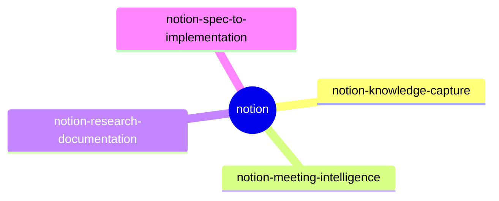

| 스킬 | 설명 |
|---|---|
| [`notion:notion-knowledge-capture`](codex-current/plugins/notion/notion-knowledge-capture/SKILL.md) | 대화와 결정을 구조화된 Notion 페이지로 기록합니다. 채팅·메모를 위키 항목·사용법·결정·FAQ로 바꾸고 적절히 연결할 때 사용합니다. |
| [`notion:notion-meeting-intelligence`](codex-current/plugins/notion/notion-meeting-intelligence/SKILL.md) | Notion 맥락과 추가 조사로 회의 자료를 준비합니다. 맥락 수집, 안건·사전 자료 초안, 참석자에 맞춘 자료 구성에 사용합니다. |
| [`notion:notion-research-documentation`](codex-current/plugins/notion/notion-research-documentation/SKILL.md) | Notion 전반을 조사해 구조화된 문서로 종합합니다. 여러 Notion 소스에서 정보를 모아 인용이 있는 브리프·비교·보고서를 만들 때 사용합니다. |
| [`notion:notion-spec-to-implementation`](codex-current/plugins/notion/notion-spec-to-implementation/SKILL.md) | Notion 명세를 구현 계획·작업·진행 추적으로 바꿉니다. PRD·기능 명세를 구현하며 Notion 계획과 작업을 만들 때 사용합니다. |

</details>

<details>
<summary><b>openai-developers</b> · 4개</summary>

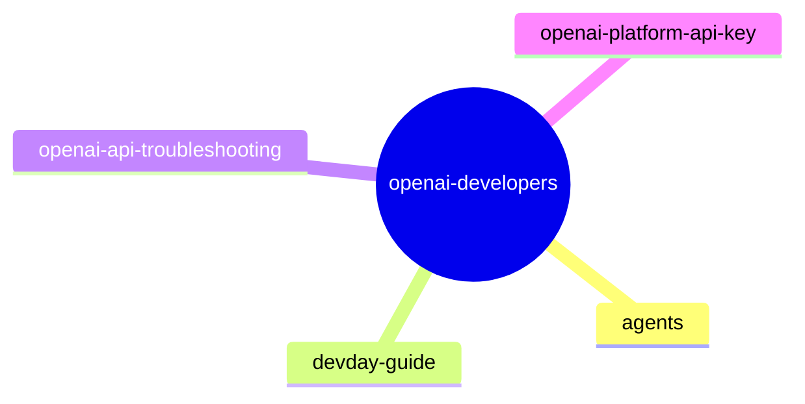

| 스킬 | 설명 |
|---|---|
| [`openai-developers:agents`](codex-current/plugins/openai-developers/agents/SKILL.md) | Agents API 또는 Agents SDK로 에이전트 앱을 만듭니다. |
| [`openai-developers:devday-guide`](codex-current/plugins/openai-developers/devday-guide/SKILL.md) | OpenAI DevDay 참석, 현장 안내, 세션 일정, 개인 일정, 라이브 스트림, 녹화, DevDay Exchanges를 돕습니다. |
| [`openai-developers:openai-api-troubleshooting`](codex-current/plugins/openai-developers/openai-api-troubleshooting/SKILL.md) | OpenAI API 요청이 실패했을 때 가능한 원인을 분류하고 다음 단계를 설명하며 적절한 후속 작업으로 연결합니다. |
| [`openai-developers:openai-platform-api-key`](codex-current/plugins/openai-developers/openai-platform-api-key/SKILL.md) | OpenAI 기반 또는 제공자가 지정되지 않은 AI 앱·UI·스크립트·CLI·생성기·도구를 만들고 실행·테스트·디버깅·구성할 때(특히 "AI로"라고만 요청한 경우나 폼/사용자 입력 기반 생성기) 사용하며, OPENAI_API_KEY·sk-proj 설정에도 사용합니다. |

</details>

<details>
<summary><b>pages</b> · 4개</summary>

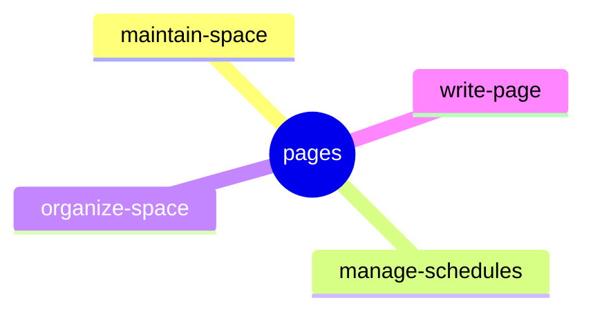

| 스킬 | 설명 |
|---|---|
| [`pages:maintain-space`](codex-current/plugins/pages/maintain-space/SKILL.md) | 사용자가 관리를 요청할 때, 새 근거를 기존 ChatGPT Pages나 Space에 반영합니다. |
| [`pages:manage-schedules`](codex-current/plugins/pages/manage-schedules/SKILL.md) | ChatGPT Space 페이지와 일정을 검토해 유용한 반복 작업을 제안하고, 예약 자동화를 만들고 수정·삭제합니다. |
| [`pages:organize-space`](codex-current/plugins/pages/organize-space/SKILL.md) | 사용자가 구조 변경을 요청할 때 기존 ChatGPT Pages와 Space 구조를 정리합니다. |
| [`pages:write-page`](codex-current/plugins/pages/write-page/SKILL.md) | 요청된 Page/Space 콘텐츠를 만들거나 편집합니다. 사용자가 Markdown 파일을 명시하지 않았을 때, 이미 저장하기로 한 글을 독립 Markdown 파일로 저장하는 데도 사용합니다. |

</details>

<details>
<summary><b>work-pets</b> · 3개</summary>

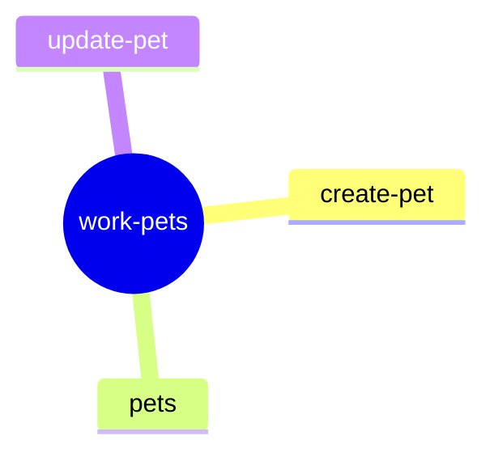

| 스킬 | 설명 |
|---|---|
| [`work-pets:create-pet`](codex-current/plugins/work-pets/create-pet/SKILL.md) | 캐릭터 아이디어·브랜드 단서·참고 이미지로 ChatGPT Work 모드의 애니메이션 v2 펫을 만들고 수리·검증·미리보기·업로드·활성화합니다. |
| [`work-pets:pets`](codex-current/plugins/work-pets/pets/SKILL.md) | ChatGPT Work 모드의 애니메이션 펫을 나열·조회·선택·다운로드·삭제합니다. |
| [`work-pets:update-pet`](codex-current/plugins/work-pets/update-pet/SKILL.md) | ChatGPT Work 모드의 사용자 지정 펫을 점검·검증·미리보기·수리하고 이름·설명·스프라이트 시트를 갱신합니다. |

</details>

<details>
<summary><b>plugin-management</b> · 1개</summary>

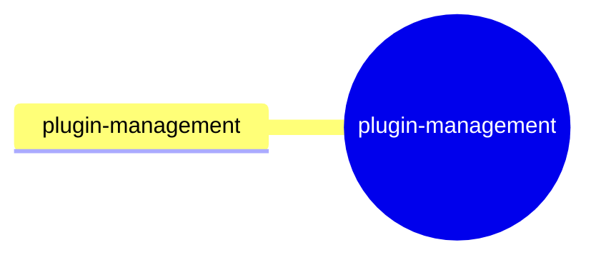

| 스킬 | 설명 |
|---|---|
| [`plugin-management:plugin-management`](codex-current/plugins/plugin-management/plugin-management/SKILL.md) | 관련 플러그인을 찾아 제안하고, 앱 권한과 의존성을 점검하며, 플러그인 연결과 제거를 관리합니다. |

</details>

<details>
<summary><b>product-design</b> · 5개</summary>

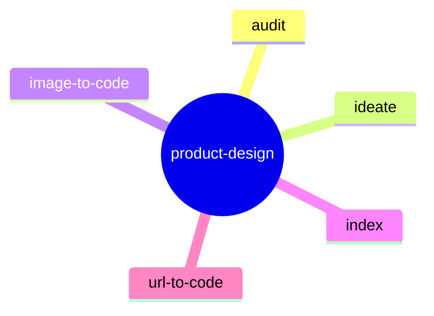

| 스킬 | 설명 |
|---|---|
| [`product-design:audit`](codex-current/plugins/product-design/audit/SKILL.md) | 제품 흐름·여정·퍼널·온보딩·결제·설정 경로·화면·다단계 경험을 먼저 스크린샷으로 캡처한 뒤, 그 근거로 UX·디자인·접근성 문제를 보고합니다. |
| [`product-design:ideate`](codex-current/plugins/product-design/ideate/SKILL.md) | Product Design 브리프에서 이미지 기반의 대안·리믹스·새 디자인 방향을 생성합니다. |
| [`product-design:image-to-code`](codex-current/plugins/product-design/image-to-code/SKILL.md) | 선택한 이미지·스크린샷·목업·Image Gen 참고안을 충실한 반응형 프런트엔드로 구현합니다. |
| [`product-design:index`](codex-current/plugins/product-design/index/SKILL.md) | Product Design을 명시적으로 호출했거나, 디자인 탐색·UX 조사·흐름 감사·시각 자료 충실 복제·완성 디자인 점검·프로토타입 공유가 주목적일 때 사용합니다. |
| [`product-design:url-to-code`](codex-current/plugins/product-design/url-to-code/SKILL.md) | 실제 URL을 실행 가능한 프런트엔드 전용 로컬 앱으로 복제합니다. |

</details>

<details>
<summary><b>remotion</b> · 12개</summary>

```mermaid
mindmap
  root((remotion))
    remotion-best-practices
    remotion-captions
    remotion-create
    remotion-docs
    remotion-interactivity
    remotion-maps
    remotion-markup
    remotion-multimedia
    remotion-render
    remotion-saas
    remotion-studio
    remotion-upgrade
```

| 스킬 | 설명 |
|---|---|
| [`remotion:remotion-best-practices`](codex-current/plugins/remotion/remotion-best-practices/SKILL.md) | 모든 Remotion 스킬로 연결하는 라우터입니다. |
| [`remotion:remotion-captions`](codex-current/plugins/remotion/remotion-captions/SKILL.md) | 자막을 전사하고 표시하며 애니메이션합니다. |
| [`remotion:remotion-create`](codex-current/plugins/remotion/remotion-create/SKILL.md) | 새 Remotion 영상을 만듭니다. |
| [`remotion:remotion-docs`](codex-current/plugins/remotion/remotion-docs/SKILL.md) | Remotion 문서를 검색합니다. |
| [`remotion:remotion-interactivity`](codex-current/plugins/remotion/remotion-interactivity/SKILL.md) | 인터랙티브 요소를 위해 Remotion 마크업을 구성합니다. |
| [`remotion:remotion-maps`](codex-current/plugins/remotion/remotion-maps/SKILL.md) | Remotion 지도 애니메이션 관련 지식입니다. |
| [`remotion:remotion-markup`](codex-current/plugins/remotion/remotion-markup/SKILL.md) | 콘텐츠·애니메이션·효과의 모범 사례입니다. |
| [`remotion:remotion-multimedia`](codex-current/plugins/remotion/remotion-multimedia/SKILL.md) | Mediabunny와 상호작용합니다. |
| [`remotion:remotion-render`](codex-current/plugins/remotion/remotion-render/SKILL.md) | Remotion 영상을 내보냅니다. |
| [`remotion:remotion-saas`](codex-current/plugins/remotion/remotion-saas/SKILL.md) | Remotion으로 앱을 만듭니다. |
| [`remotion:remotion-studio`](codex-current/plugins/remotion/remotion-studio/SKILL.md) | Remotion 영상을 미리 봅니다. |
| [`remotion:remotion-upgrade`](codex-current/plugins/remotion/remotion-upgrade/SKILL.md) | Remotion과 관련 패키지를 업그레이드합니다. |

</details>

<details>
<summary><b>sites</b> · 4개</summary>

```mermaid
mindmap
  root((sites))
    sites-building
    sites-hosting
    sites-mcp
    sites-preview-troubleshooting
```

| 스킬 | 설명 |
|---|---|
| [`sites:sites-building`](codex-current/plugins/sites/sites-building/SKILL.md) | 랜딩 페이지·포트폴리오·대시보드·포털·트래커·허브·내부 도구 같은 완성된 웹사이트를 만들어 달라거나, Sites로 만든 사이트를 수정하려 할 때 사용합니다. |
| [`sites:sites-hosting`](codex-current/plugins/sites/sites-hosting/SKILL.md) | Sites로 웹사이트를 호스팅합니다. |
| [`sites:sites-mcp`](codex-current/plugins/sites/sites-mcp/SKILL.md) | Site에서 호스팅하는 MCP 서버를 만들거나 갱신하고, 사용자가 ChatGPT·Codex의 Site 플러그인으로 그 도구에 접근하도록 돕습니다. |
| [`sites:sites-preview-troubleshooting`](codex-current/plugins/sites/sites-preview-troubleshooting/SKILL.md) | sites-building 이후 실패한 감독형 sites-preview 세션을 진단하고 복구합니다. |

</details>

<details>
<summary><b>superpowers</b> · 15개</summary>

```mermaid
mindmap
  root((superpowers))
    brainstorming
    diagnosing-superpowers
    dispatching-parallel-agents
    executing-plans
    finishing-a-development-branch
    receiving-code-review
    requesting-code-review
    subagent-driven-development
    systematic-debugging
    test-driven-development
    using-git-worktrees
    using-superpowers
    verification-before-completion
    writing-plans
    writing-skills
```

| 스킬 | 설명 |
|---|---|
| [`superpowers:brainstorming`](codex-current/plugins/superpowers/brainstorming/SKILL.md) | 기능 생성·컴포넌트 구축·기능 추가·동작 변경 같은 모든 창작 작업 전에 반드시 사용해야 합니다. |
| [`superpowers:diagnosing-superpowers`](codex-current/plugins/superpowers/diagnosing-superpowers/SKILL.md) | superpowers 세션이 잘못되어(반복 작업, 무시된 계획, 시행착오, 나쁜 결과, 실행되지 않은 스킬, "너무 오래 걸림", "왜 이렇게 비싼가" 등) 원인을 알고 싶거나 유지보수자용 버그 리포트를 만들고 싶을 때, 현재 또는 과거 세션을 대상으로 사용합니다. |
| [`superpowers:dispatching-parallel-agents`](codex-current/plugins/superpowers/dispatching-parallel-agents/SKILL.md) | 공유 상태나 순차 의존성 없이 처리할 수 있는 독립 작업이 2개 이상일 때 사용합니다. |
| [`superpowers:executing-plans`](codex-current/plugins/superpowers/executing-plans/SKILL.md) | 구현 계획을 현재 세션에서 직접 구현자로서 실행할 때(사용자가 인라인 실행을 선택했거나 서브에이전트 도구가 없을 때) 사용합니다. |
| [`superpowers:finishing-a-development-branch`](codex-current/plugins/superpowers/finishing-a-development-branch/SKILL.md) | 구현이 끝나고 모든 테스트가 통과했으며 작업을 어떻게 통합할지 결정해야 할 때 사용합니다. |
| [`superpowers:receiving-code-review`](codex-current/plugins/superpowers/receiving-code-review/SKILL.md) | 코드 리뷰 피드백을 받았을 때 제안을 구현하기 전에, 특히 피드백이 불분명하거나 기술적으로 의심스러울 때 사용합니다. 형식적 동의나 맹목적 구현이 아니라 기술적 엄밀함과 검증이 필요합니다. |
| [`superpowers:requesting-code-review`](codex-current/plugins/superpowers/requesting-code-review/SKILL.md) | 작업을 마쳤거나 주요 기능을 구현했을 때, 또는 병합 전에 요구 사항을 충족하는지 검증하기 위해 사용합니다. |
| [`superpowers:subagent-driven-development`](codex-current/plugins/superpowers/subagent-driven-development/SKILL.md) | 독립 작업으로 이루어진 구현 계획을 현재 세션에서 실행할 때 사용합니다. |
| [`superpowers:systematic-debugging`](codex-current/plugins/superpowers/systematic-debugging/SKILL.md) | 버그·테스트 실패·예상 밖 동작을 만났을 때, 수정안을 제시하기 전에 사용합니다. |
| [`superpowers:test-driven-development`](codex-current/plugins/superpowers/test-driven-development/SKILL.md) | 기능이나 버그 수정을 구현할 때, 구현 코드를 쓰기 전에 사용합니다. |
| [`superpowers:using-git-worktrees`](codex-current/plugins/superpowers/using-git-worktrees/SKILL.md) | 현재 작업 공간과 분리해야 하는 기능 작업을 시작하거나 구현 계획을 실행하기 전에 사용합니다. 기본 도구나 git worktree로 격리된 작업 공간을 확보합니다. |
| [`superpowers:using-superpowers`](codex-current/plugins/superpowers/using-superpowers/SKILL.md) | 모든 대화를 시작할 때 사용합니다. 스킬을 찾고 사용하는 방법을 정하며, 되묻기를 포함한 어떤 응답보다 먼저 스킬 호출을 요구합니다. |
| [`superpowers:verification-before-completion`](codex-current/plugins/superpowers/verification-before-completion/SKILL.md) | 작업이 완료·수정·통과되었다고 주장하기 전, 커밋하거나 PR을 만들기 전에 사용합니다. 성공을 주장하기 전에 검증 명령을 실행하고 출력을 확인해야 하며, 주장보다 증거가 먼저입니다. |
| [`superpowers:writing-plans`](codex-current/plugins/superpowers/writing-plans/SKILL.md) | 여러 단계 작업의 명세나 요구 사항이 있을 때, 코드를 건드리기 전에 사용합니다. |
| [`superpowers:writing-skills`](codex-current/plugins/superpowers/writing-skills/SKILL.md) | 새 스킬을 만들거나 기존 스킬을 수정하거나, 배포 전에 스킬이 동작하는지 검증할 때 사용합니다. |

</details>

<details>
<summary><b>write-like-me</b> · 1개</summary>

```mermaid
mindmap
  root((write-like-me))
    write-like-me
```

| 스킬 | 설명 |
|---|---|
| [`write-like-me:write-like-me`](codex-current/plugins/write-like-me/write-like-me/SKILL.md) | 사용자를 대신해 문서·이메일·보고서·제안서·프레젠테이션·메시지를 작성할 때, 사용자의 글쓰기 스타일에 맞추기 위해 사용합니다. |

</details>

<details>
<summary><b>defense-factory</b> · 1개</summary>

```mermaid
mindmap
  root((defense-factory))
    open-defense-factory
```

| 스킬 | 설명 |
|---|---|
| [`defense-factory:open-defense-factory`](codex-current/plugins/defense-factory/open-defense-factory/SKILL.md) | 클라우드 보안 발견 사항·스캔·저장소 상시 모니터링을 위해 Codex Security Cloud를 엽니다. |

</details>

<details>
<summary><b>demos</b> · 2개</summary>

```mermaid
mindmap
  root((demos))
    answers-ask-user-input
    onboarding-setup-pet
```

| 스킬 | 설명 |
|---|---|
| [`demos:answers-ask-user-input`](codex-current/plugins/demos/answers-ask-user-input/SKILL.md) | 부족한 맥락이 조금만 보완되어도 답변이 크게 좋아지고, 탭 가능한 선택지와 자유 입력으로 효율적으로 모을 수 있을 때 사용합니다. |
| [`demos:onboarding-setup-pet`](codex-current/plugins/demos/onboarding-setup-pet/SKILL.md) | 기본 제공 ChatGPT Work 펫을 고르거나 맞춤 펫을 만드는 짧고 시각적인 온보딩 흐름을 실행합니다. |

</details>

<details>
<summary><b>openai-library</b> · 1개</summary>

```mermaid
mindmap
  root((openai-library))
    library
```

| 스킬 | 설명 |
|---|---|
| [`openai-library:library`](codex-current/plugins/openai-library/library/SKILL.md) | 사용자가 Library를 언급하거나 Library에 있을 수 있는 파일·Site를 찾거나 다루려 할 때, 또는 Library 폴더 정리·이전 버전 복원·기본 제공 파일/폴더 공유를 원할 때 ChatGPT Library를 사용합니다. |

</details>

<details>
<summary><b>template-creator</b> · 1개</summary>

```mermaid
mindmap
  root((template-creator))
    template-creator
```

| 스킬 | 설명 |
|---|---|
| [`template-creator:template-creator`](codex-current/plugins/template-creator/template-creator/SKILL.md) | 참고 문서·프레젠테이션·스프레드시트·Google Docs/Slides/Sheets 링크·ImageGen 또는 Product Design 이미지·이메일·Slack 메시지·Site 프로젝트로 설치 가능한 개인용 ChatGPT 아티팩트 템플릿 스킬을 만들거나 갱신합니다. |

</details>
