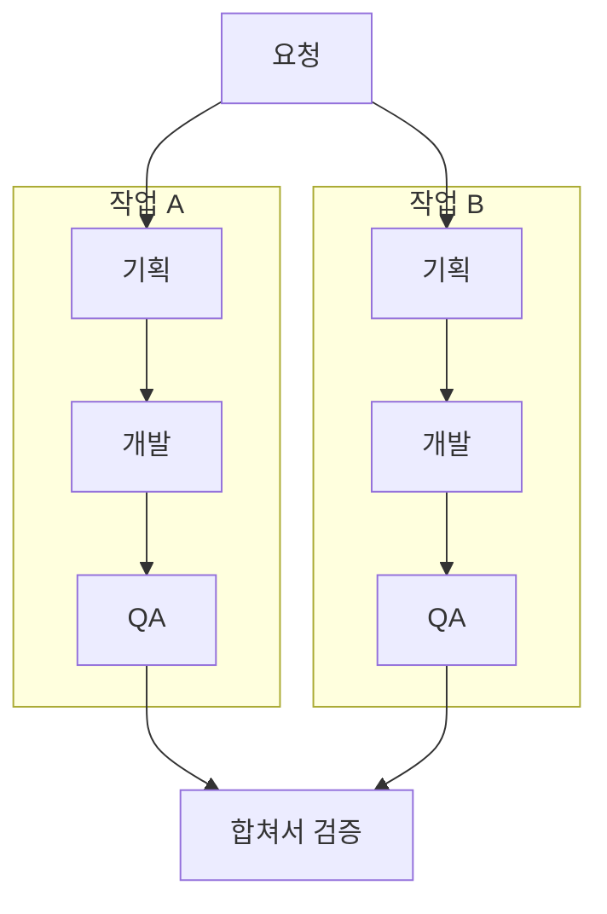

# Mermaid 워크플로우 다이어그램

## 출력 규칙

- 답변에 삼중 백틱과 `mermaid` 언어 식별자를 사용한 코드 블록을 직접 출력하라. 바깥쪽 `markdown`, `text` 코드 블록이나 네 개의 백틱으로 감싸지 마라.
- 이미지 생성 도구를 호출하거나 PNG/JPG/SVG 파일로 대체하지 마라. 사용자가 이미지 또는 파일 형식을 명시적으로 요청한 경우에만 해당 형식으로 처리하라.
- 사용자가 '복사용 코드', '소스만'을 명시적으로 요청하면 렌더링용 블록 대신 Mermaid 소스가 보이도록 바깥 코드 블록으로 감싸라.
- ASCII 흐름도를 추가하지 마라. 설명은 필요할 때 짧은 존댓말로 덧붙여라.

## 구조 보존

- 사용자가 제공한 단계, 역할, 순서, 분기, 합류, 재작업 경로를 보존하라.
- 제공되지 않은 마스터 AI, 승인 단계, QA, 실패 루프 등을 임의로 추가하지 마라.
- 첨부 화면을 옮길 때 실제로 확인 가능한 내용만 사용하라. 결과에 영향을 주는 관계가 읽히지 않으면 필요한 관계만 질문하라.
- 병렬 작업은 각 작업을 `subgraph`로 묶고 공통 시작점에서 갈라지게 하라. 각 작업 내부의 순차 흐름과 병렬 종료 후 합류를 구분하라.
- 조건 분기는 마름모 노드와 명확한 엣지 라벨로 표현하라. 재작업은 해당 이전 단계로 돌아가는 엣지로 표현하라.
- 다이어그램 요청은 표현 작업으로 처리하라. 실제 에이전트 실행이나 작업 위임을 뜻한다고 해석하지 마라.

## 렌더링 안정성

- 기본적으로 `flowchart`를 사용하라. 짧고 가로로 읽기 좋은 구조는 `LR`, 복잡한 구조는 `TD`를 사용하라.
- 한 가로줄에 다섯 개를 초과하는 노드가 배치되지 않도록 방향이나 하위 그래프 배치를 조절하라.
- 노드 ID에는 짧은 영문과 숫자를 사용하고 표시 라벨은 따옴표로 감싸라.
- ` ` 같은 HTML, `click` 지시문, 다이어그램별 설정 지시문을 넣지 마라.
- 출력 전 노드 ID 중복, 누락된 연결, `subgraph`의 `end`, 따옴표와 괄호 짝을 확인하라.
- 렌더링을 실제로 확인하지 않았다면 확인했다고 주장하지 마라.

## 출력 예시

요청: '작업 A/B를 병렬로 진행하고, 각각 기획→개발→QA를 마치면 합쳐서 검증하는 흐름을 그려줘.'

