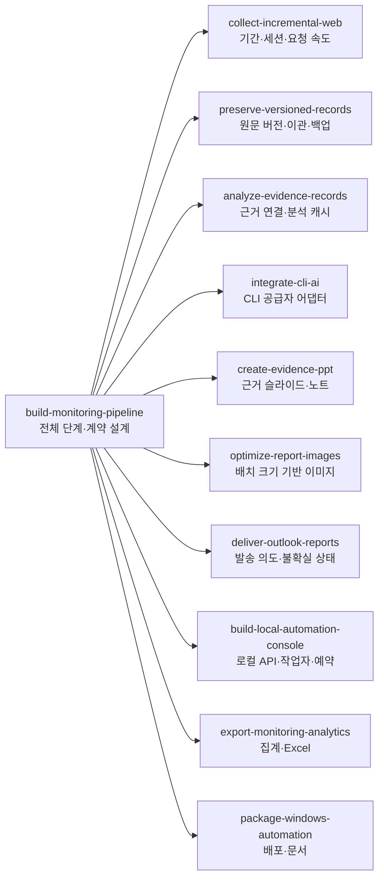

# 모니터링·업무 자동화 스킬

[전체 스킬 모음으로 돌아가기](../README.md)

자료 수집, 데이터 관리, AI 분석, 보고서 작성, 발송과 운영에 쓰는 스킬 묶음입니다. 특정 프로그램을 설치할 필요 없이 필요한 스킬을 골라 적용할 수 있습니다.

모니터링 전체 흐름을 다루는 스킬과 단독으로 재사용할 수 있는 스킬이 함께 있습니다. 이미지 최적화, 버전 저장, 근거 검사, Excel 내보내기, ZIP 검증은 각 입력 형식과 실행 조건만 갖추면 별도로 사용할 수 있습니다. 다른 스킬 전부를 설치할 필요는 없습니다.

각 스킬은 **독립 폴더**로 제공합니다. 아래 목록에서 지침을 바로 읽고, 폴더 안의 참고자료와 실행 스크립트를 확인할 수 있습니다.

## 스킬 관계

`build-monitoring-pipeline`이 전체 흐름을 설계하고, 영역별 작업은 나머지 10개 스킬로 넘깁니다(해당 스킬의 `SKILL.md` "Route specialist work" 표 기준). 나머지 스킬은 각각 단독으로도 쓸 수 있습니다.

## 스킬 목록

현재 11개 스킬을 제공합니다.

| 분야 | 스킬 | 주요 기능 | 폴더 |
|---|---|---|---|
| 자동화 설계 | [범용 모니터링 자동화 설계](build-monitoring-pipeline/SKILL.md) | 수집·분석·보고·발송 단계 구성, 부분 실패와 재실행 설계 | [build-monitoring-pipeline](build-monitoring-pipeline/) |
| 웹 수집 | [증분 웹 수집과 로그인 관리](collect-incremental-web/SKILL.md) | 기간·커서·중복·요청 속도·로그인 세션 관리 | [collect-incremental-web](collect-incremental-web/) |
| 데이터 관리 | [원문·버전·실행 이력 보존](preserve-versioned-records/SKILL.md) | 원문 보존, 변경 감지, SQLite 이력, 가져오기와 백업 | [preserve-versioned-records](preserve-versioned-records/) |
| AI 분석 | [근거가 연결된 AI 분석](analyze-evidence-records/SKILL.md) | 원문 해시·인용 위치 검증, 구조화 분석, 캐시 관리 | [analyze-evidence-records](analyze-evidence-records/) |
| AI 연동 | [CLI AI 실행 연동](integrate-cli-ai/SKILL.md) | 인증 상태, 프로세스 수명, 시간 제한, 응답 처리 | [integrate-cli-ai](integrate-cli-ai/) |
| 보고서 | [원문 근거가 담긴 PPT 보고서](create-evidence-ppt/SKILL.md) | 캡처·분석·원문 노트 연결, 요약본과 보고서 재생성 | [create-evidence-ppt](create-evidence-ppt/) |
| 이미지 처리 | [보고서 이미지 용량 최적화](optimize-report-images/SKILL.md) | 원본 보존, 실제 배치 크기 기반 해상도 조절 | [optimize-report-images](optimize-report-images/) |
| 메일 자동화 | [Outlook 보고서 발송 관리](deliver-outlook-reports/SKILL.md) | 수신자·첨부 확인, 발송 이력, 중복 발송 방지 | [deliver-outlook-reports](deliver-outlook-reports/) |
| 운영 도구 | [로컬 운영 화면과 예약 실행](build-local-automation-console/SKILL.md) | 로컬 제어 화면, 별도 작업 프로세스, 실행·중지·예약 관리 | [build-local-automation-console](build-local-automation-console/) |
| 통계·내보내기 | [모니터링 통계와 Excel 내보내기](export-monitoring-analytics/SKILL.md) | 고유 문서·키워드 매칭 집계, 필터 기록, Excel 출력 | [export-monitoring-analytics](export-monitoring-analytics/) |
| 배포·검증 | [Windows 자동화 배포와 검증](package-windows-automation/SKILL.md) | 설치·실행 안내, 배포 파일 정리, ZIP 내용·해시 검증 | [package-windows-automation](package-windows-automation/) |

## 사용 방법

1. 위 목록에서 필요한 스킬의 지침을 엽니다.
2. `SKILL.md`에 연결된 참고자료에서 입력 형식과 작업 조건을 확인합니다.
3. 스킬을 지원하는 도구에 해당 폴더 전체를 등록하거나, 에이전트에 폴더 위치와 작업을 함께 전달합니다. 폴더 구조를 유지해야 스크립트와 참고자료를 찾을 수 있습니다.
4. 실행 스크립트가 있는 경우 해당 스킬 폴더에서 `python scripts/스크립트명.py --help`로 인자를 확인합니다.

등록·호출 방식은 사용하는 에이전트 도구에 따라 다릅니다. 이 저장소를 내려받는 것만으로 스킬이 자동 설치되지는 않습니다.

요청 예시:

- “증분 웹 수집 스킬을 사용해 새로 올라온 공지만 수집하는 구조를 만들어 주세요.”
- “원문·버전 보존 스킬로 문서 변경 이력을 저장해 주세요.”
- “보고서 이미지 최적화 스킬로 원본을 유지하면서 삽입용 이미지를 줄여 주세요.”
- “통계·Excel 스킬로 이 데이터의 중복을 구분하고 집계표를 만들어 주세요.”

## 스킬 폴더 구성

| 경로 | 역할 |
|---|---|
| `SKILL.md` | 적용 상황, 작업 절차, 검증 기준 |
| `references/` | 상세 규칙, 입력·출력 형식, 실패 처리 |
| `scripts/` | 반복 계산·검증 등을 수행하는 실행 코드. 코드가 필요한 스킬에만 포함 |
| `agents/openai.yaml` | 지원 도구에서 사용하는 표시·호출 정보 |
| `assets/` | 아이콘 등 보조 자료 |

스킬에는 작업 지침 중심의 항목과 실행 코드가 포함된 항목이 함께 있습니다. 각 스킬의 제공 범위는 `SKILL.md`에서 확인할 수 있습니다.

## 실행 스크립트

| 스킬 | 스크립트 | 기능 | Python 외 추가 패키지 |
|---|---|---|---|
| 증분 웹 수집 | [plan_window.py](collect-incremental-web/scripts/plan_window.py) | 수집 기간 계산 | 없음 |
| 원문·버전 보존 | [version_store.py](preserve-versioned-records/scripts/version_store.py) | SQLite 버전 저장·백업 | 없음 |
| 근거 기반 분석 | [validate_evidence.py](analyze-evidence-records/scripts/validate_evidence.py) | 원문 해시·인용 위치 검사 | 없음 |
| 이미지 최적화 | [optimize_image.py](optimize-report-images/scripts/optimize_image.py) | 배치 크기와 목표 PPI에 맞춘 이미지 축소 | Pillow |
| 통계·Excel | [export_records.py](export-monitoring-analytics/scripts/export_records.py) | 데이터·집계·조회 조건을 Excel로 저장 | openpyxl |
| 배포 검증 | [verify_zip.py](package-windows-automation/scripts/verify_zip.py) | ZIP과 원본 폴더의 파일·내용 비교 | 없음 |

실제 웹 수집에는 대상 사이트에 맞는 연결과 접근 권한이 필요합니다. CLI AI 연동에는 해당 도구의 설치·인증이 필요하며, PowerPoint·Outlook COM 작업에는 해당 프로그램이 설치된 Windows 환경이 필요합니다. 스킬이 이러한 외부 실행 환경을 함께 설치하거나 제공하지는 않습니다.

## 다운로드와 무결성 확인

- [11개 스킬 묶음 ZIP](monitoring-skills-11_20261002.zip): 2026-10-02에 만든 배포 스냅샷입니다.
- [CONTENTS.json](CONTENTS.json): 압축에서 꺼낸 스킬 파일 50개의 크기와 SHA-256 목록입니다.
- [SHA256SUMS.txt](SHA256SUMS.txt): 스킬 파일·현재 안내·목록·ZIP의 체크섬입니다. 체크섬 파일 자신은 제외합니다.

GitHub에서는 폴더별로 내용을 확인하고, 한 번에 내려받을 때는 ZIP을 사용하세요. ZIP에 포함된 안내는 배포 시점의 문서이며, 이 페이지는 스킬 모음의 현재 안내입니다.

## 검증 범위

현재 등록된 11개 스킬은 제작 시 41개 동작 검사와 가상 자료 기반 사용 시나리오를 검증했습니다. 원문·버전 관리, 근거 검사, Excel 출력, 이미지 최적화, ZIP 비교, 실행 중단과 예약 복구를 확인했습니다.

Windows·Office·실제 메일 발송까지 이 스킬 묶음으로 종단 간 검증한 것은 아닙니다. 인용 위치·해시 검사는 원문과의 연결을 확인하며, AI 판단의 의미적 정확성은 별도로 검토해야 합니다.
